###### This document was generated by Kactus2 on 12.02.2024 16:47:36 by user   

**Table of contents**  

1. [Component tuni.fi - soc - Didactic - 1.0](#tuni.fi:soc:Didactic:1.0)  
	1.1. [Kactus2 attributes](#tuni.fi:soc:Didactic:1.0.attributes)  
	1.2. [Ports](#tuni.fi:soc:Didactic:1.0.ports)  
	1.3. [Bus interfaces](#tuni.fi:soc:Didactic:1.0.interfaces)  
	1.4. [Views](#tuni.fi:soc:Didactic:1.0.views)  
2. [Component tuni.fi - subsystem.wrapper - SysCtrl_SS_wrapper - 1.0](#tuni.fi:subsystem.wrapper:SysCtrl_SS_wrapper:1.0)  
	2.1. [Kactus2 attributes](#tuni.fi:subsystem.wrapper:SysCtrl_SS_wrapper:1.0.attributes)  
	2.2. [Ports](#tuni.fi:subsystem.wrapper:SysCtrl_SS_wrapper:1.0.ports)  
	2.3. [Bus interfaces](#tuni.fi:subsystem.wrapper:SysCtrl_SS_wrapper:1.0.interfaces)  
	2.4. [Views](#tuni.fi:subsystem.wrapper:SysCtrl_SS_wrapper:1.0.views)  
3. [Component tuni.fi - subsystem.io - i_io_cell_frame - 1.0](#tuni.fi:subsystem.io:i_io_cell_frame:1.0)  
	3.1. [Kactus2 attributes](#tuni.fi:subsystem.io:i_io_cell_frame:1.0.attributes)  
	3.2. [Ports](#tuni.fi:subsystem.io:i_io_cell_frame:1.0.ports)  
	3.3. [Bus interfaces](#tuni.fi:subsystem.io:i_io_cell_frame:1.0.interfaces)  
4. [Component tuni.fi - subsystem - SysCtrl_SS - 1.0](#tuni.fi:subsystem:SysCtrl_SS:1.0)  
	4.1. [Kactus2 attributes](#tuni.fi:subsystem:SysCtrl_SS:1.0.attributes)  
	4.2. [Ports](#tuni.fi:subsystem:SysCtrl_SS:1.0.ports)  
	4.3. [Bus interfaces](#tuni.fi:subsystem:SysCtrl_SS:1.0.interfaces)  
	4.4. [Views](#tuni.fi:subsystem:SysCtrl_SS:1.0.views)  
5. [Component tuni.fi - memory.simulation - sp_sram - 1.0](#tuni.fi:memory.simulation:sp_sram:1.0)  
	5.1. [Kactus2 attributes](#tuni.fi:memory.simulation:sp_sram:1.0.attributes)  
	5.2. [General parameters](#tuni.fi:memory.simulation:sp_sram:1.0.parameters)  
	5.3. [Memory maps](#tuni.fi:memory.simulation:sp_sram:1.0.memoryMaps)  
	5.4. [Ports](#tuni.fi:memory.simulation:sp_sram:1.0.ports)  
	5.5. [Bus interfaces](#tuni.fi:memory.simulation:sp_sram:1.0.interfaces)  
6. [Component tuni.fi - lowRISC - ibex_axi_bridge - 1.0](#tuni.fi:lowRISC:ibex_axi_bridge:1.0)  
	6.1. [Kactus2 attributes](#tuni.fi:lowRISC:ibex_axi_bridge:1.0.attributes)  
	6.2. [General parameters](#tuni.fi:lowRISC:ibex_axi_bridge:1.0.parameters)  
	6.3. [Ports](#tuni.fi:lowRISC:ibex_axi_bridge:1.0.ports)  
	6.4. [Bus interfaces](#tuni.fi:lowRISC:ibex_axi_bridge:1.0.interfaces)  
7. [Component tuni.fi - ip - SysCtrl_peripherals - 1.0](#tuni.fi:ip:SysCtrl_peripherals:1.0)  
	7.1. [Kactus2 attributes](#tuni.fi:ip:SysCtrl_peripherals:1.0.attributes)  
	7.2. [Ports](#tuni.fi:ip:SysCtrl_peripherals:1.0.ports)  
	7.3. [Bus interfaces](#tuni.fi:ip:SysCtrl_peripherals:1.0.interfaces)  
	7.4. [Views](#tuni.fi:ip:SysCtrl_peripherals:1.0.views)  
8. [Component tuni.fi - pulp.peripheral - apb_uart - 1.0](#tuni.fi:pulp.peripheral:apb_uart:1.0)  
	8.1. [Kactus2 attributes](#tuni.fi:pulp.peripheral:apb_uart:1.0.attributes)  
	8.2. [Ports](#tuni.fi:pulp.peripheral:apb_uart:1.0.ports)  
	8.3. [Bus interfaces](#tuni.fi:pulp.peripheral:apb_uart:1.0.interfaces)  
9. [Component tuni.fi - pulp.peripheral - APB_SPI_master - 1.0](#tuni.fi:pulp.peripheral:APB_SPI_master:1.0)  
	9.1. [Kactus2 attributes](#tuni.fi:pulp.peripheral:APB_SPI_master:1.0.attributes)  
	9.2. [Ports](#tuni.fi:pulp.peripheral:APB_SPI_master:1.0.ports)  
	9.3. [Bus interfaces](#tuni.fi:pulp.peripheral:APB_SPI_master:1.0.interfaces)  
10. [Component tuni.fi - pulp.peripheral - APB_GPIO - 1.0](#tuni.fi:pulp.peripheral:APB_GPIO:1.0)  
	10.1. [Kactus2 attributes](#tuni.fi:pulp.peripheral:APB_GPIO:1.0.attributes)  
	10.2. [Memory maps](#tuni.fi:pulp.peripheral:APB_GPIO:1.0.memoryMaps)  
	10.3. [Ports](#tuni.fi:pulp.peripheral:APB_GPIO:1.0.ports)  
	10.4. [Bus interfaces](#tuni.fi:pulp.peripheral:APB_GPIO:1.0.interfaces)  
11. [Component tuni.fi - pulp.peripheral - APB_SDIO - 1.0](#tuni.fi:pulp.peripheral:APB_SDIO:1.0)  
	11.1. [Kactus2 attributes](#tuni.fi:pulp.peripheral:APB_SDIO:1.0.attributes)  
	11.2. [Ports](#tuni.fi:pulp.peripheral:APB_SDIO:1.0.ports)  
	11.3. [Bus interfaces](#tuni.fi:pulp.peripheral:APB_SDIO:1.0.interfaces)  
12. [Component tuni.fi - communication - AX4LITE_APB_converter_wrapper - 1.0](#tuni.fi:communication:AX4LITE_APB_converter_wrapper:1.0)  
	12.1. [Kactus2 attributes](#tuni.fi:communication:AX4LITE_APB_converter_wrapper:1.0.attributes)  
	12.2. [Ports](#tuni.fi:communication:AX4LITE_APB_converter_wrapper:1.0.ports)  
	12.3. [Bus interfaces](#tuni.fi:communication:AX4LITE_APB_converter_wrapper:1.0.interfaces)  
	12.4. [File sets](#tuni.fi:communication:AX4LITE_APB_converter_wrapper:1.0.fileSets)  
13. [Component tuni.fi - ip - jtag_dbg_wrapper - 1.0](#tuni.fi:ip:jtag_dbg_wrapper:1.0)  
	13.1. [Kactus2 attributes](#tuni.fi:ip:jtag_dbg_wrapper:1.0.attributes)  
	13.2. [General parameters](#tuni.fi:ip:jtag_dbg_wrapper:1.0.parameters)  
	13.3. [Ports](#tuni.fi:ip:jtag_dbg_wrapper:1.0.ports)  
	13.4. [Bus interfaces](#tuni.fi:ip:jtag_dbg_wrapper:1.0.interfaces)  
14. [Component tuni.fi - ip - mem_axi_bridge - 1.0](#tuni.fi:ip:mem_axi_bridge:1.0)  
	14.1. [Kactus2 attributes](#tuni.fi:ip:mem_axi_bridge:1.0.attributes)  
	14.2. [General parameters](#tuni.fi:ip:mem_axi_bridge:1.0.parameters)  
	14.3. [Ports](#tuni.fi:ip:mem_axi_bridge:1.0.ports)  
	14.4. [Bus interfaces](#tuni.fi:ip:mem_axi_bridge:1.0.interfaces)  
15. [Component tuni.fi - ip - BootRom - 1.0](#tuni.fi:ip:BootRom:1.0)  
	15.1. [Kactus2 attributes](#tuni.fi:ip:BootRom:1.0.attributes)  
	15.2. [General parameters](#tuni.fi:ip:BootRom:1.0.parameters)  
	15.3. [Memory maps](#tuni.fi:ip:BootRom:1.0.memoryMaps)  
	15.4. [Ports](#tuni.fi:ip:BootRom:1.0.ports)  
	15.5. [Bus interfaces](#tuni.fi:ip:BootRom:1.0.interfaces)  
16. [Component tuni.fi - ip - SS_Ctrl_reg_array - 1.0](#tuni.fi:ip:SS_Ctrl_reg_array:1.0)  
	16.1. [Kactus2 attributes](#tuni.fi:ip:SS_Ctrl_reg_array:1.0.attributes)  
	16.2. [Ports](#tuni.fi:ip:SS_Ctrl_reg_array:1.0.ports)  
	16.3. [Bus interfaces](#tuni.fi:ip:SS_Ctrl_reg_array:1.0.interfaces)  
17. [Component tuni.fi - lowRISC - ibex - 1.0](#tuni.fi:lowRISC:ibex:1.0)  
	17.1. [Kactus2 attributes](#tuni.fi:lowRISC:ibex:1.0.attributes)  
	17.2. [General parameters](#tuni.fi:lowRISC:ibex:1.0.parameters)  
	17.3. [Ports](#tuni.fi:lowRISC:ibex:1.0.ports)  
	17.4. [Bus interfaces](#tuni.fi:lowRISC:ibex:1.0.interfaces)  
	17.5. [Views](#tuni.fi:lowRISC:ibex:1.0.views)  
18. [Component tuni.fi - interconnect - ICN_SS - 1.0](#tuni.fi:interconnect:ICN_SS:1.0)  
	18.1. [Kactus2 attributes](#tuni.fi:interconnect:ICN_SS:1.0.attributes)  
	18.2. [Ports](#tuni.fi:interconnect:ICN_SS:1.0.ports)  
	18.3. [Bus interfaces](#tuni.fi:interconnect:ICN_SS:1.0.interfaces)  
19. [Component tuni.fi - subsystem.wrapper - Student_SS_0 - 1.0](#tuni.fi:subsystem.wrapper:Student_SS_0:1.0)  
	19.1. [Kactus2 attributes](#tuni.fi:subsystem.wrapper:Student_SS_0:1.0.attributes)  
	19.2. [Ports](#tuni.fi:subsystem.wrapper:Student_SS_0:1.0.ports)  
	19.3. [Bus interfaces](#tuni.fi:subsystem.wrapper:Student_SS_0:1.0.interfaces)  
	19.4. [Views](#tuni.fi:subsystem.wrapper:Student_SS_0:1.0.views)  
20. [Component tuni.fi - tech - tech_cg - 1.0](#tuni.fi:tech:tech_cg:1.0)  
	20.1. [Kactus2 attributes](#tuni.fi:tech:tech_cg:1.0.attributes)  
	20.2. [Ports](#tuni.fi:tech:tech_cg:1.0.ports)  
	20.3. [Bus interfaces](#tuni.fi:tech:tech_cg:1.0.interfaces)  
	20.4. [Views](#tuni.fi:tech:tech_cg:1.0.views)  
21. [Component tuni.fi - subsystem.wrapper - Student_SS_1 - 1.0](#tuni.fi:subsystem.wrapper:Student_SS_1:1.0)  
	21.1. [Kactus2 attributes](#tuni.fi:subsystem.wrapper:Student_SS_1:1.0.attributes)  
	21.2. [Ports](#tuni.fi:subsystem.wrapper:Student_SS_1:1.0.ports)  
	21.3. [Bus interfaces](#tuni.fi:subsystem.wrapper:Student_SS_1:1.0.interfaces)  
22. [Component tuni.fi - subsystem.wrapper - Student_SS_2 - 1.0](#tuni.fi:subsystem.wrapper:Student_SS_2:1.0)  
	22.1. [Kactus2 attributes](#tuni.fi:subsystem.wrapper:Student_SS_2:1.0.attributes)  
	22.2. [Ports](#tuni.fi:subsystem.wrapper:Student_SS_2:1.0.ports)  
	22.3. [Bus interfaces](#tuni.fi:subsystem.wrapper:Student_SS_2:1.0.interfaces)  

# 1. Component tuni.fi:soc:Didactic:1.0<a id="tuni.fi:soc:Didactic:1.0">  

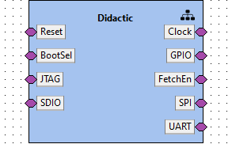

**Description:** Edu4Chip top level example SoC.  

**IP-Xact file:** [Didactic.1.0.xml](../ipxact/tuni.fi/soc/Didactic/1.0/Didactic.1.0.xml)  

## 1.1 Kactus2 attributes <a id="tuni.fi:soc:Didactic:1.0.attributes">  

**Product hierarchy:** SoC  
**Component implementation:** HW  
**Component firmness:** Fixed  

## 1.2 Ports <a id="tuni.fi:soc:Didactic:1.0.ports">  

|Name|Direction|Left bound|Right bound|Port type|Type definition|Default value|Array left|Array right|Description|  
|:----|:----|:----|:----|:----|:----|:----|:----|:----|:----|  
|uart_rx <a id="tuni.fi:soc:Didactic:1.0.port.uart_rx">|inout|0|0|||||||  
|uart_tx <a id="tuni.fi:soc:Didactic:1.0.port.uart_tx">|inout|0|0|||||||  
|spi_csn <a id="tuni.fi:soc:Didactic:1.0.port.spi_csn">|inout|1|0|||||||  
|spi_sck <a id="tuni.fi:soc:Didactic:1.0.port.spi_sck">|inout|0|0|||||||  
|spi_data <a id="tuni.fi:soc:Didactic:1.0.port.spi_data">|inout|3|0|||||||  
|sdio_clk <a id="tuni.fi:soc:Didactic:1.0.port.sdio_clk">|inout|0|0|||||||  
|sdio_cmd <a id="tuni.fi:soc:Didactic:1.0.port.sdio_cmd">|inout|0|0|||||||  
|sdio_data <a id="tuni.fi:soc:Didactic:1.0.port.sdio_data">|inout|3|0|||||||  
|reset <a id="tuni.fi:soc:Didactic:1.0.port.reset">|inout|0|0|||||||  
|gpio <a id="tuni.fi:soc:Didactic:1.0.port.gpio">|inout|3|0|||||||  
|fetch_en <a id="tuni.fi:soc:Didactic:1.0.port.fetch_en">|inout|0|0|||||||  
|boot_sel <a id="tuni.fi:soc:Didactic:1.0.port.boot_sel">|inout|0|0|||||||  
|jtag_tck <a id="tuni.fi:soc:Didactic:1.0.port.jtag_tck">|inout|0|0|||||||  
|jtag_tdi <a id="tuni.fi:soc:Didactic:1.0.port.jtag_tdi">|inout|0|0||||||Data can be daisy chained or routed directly back|  
|jtag_tdo <a id="tuni.fi:soc:Didactic:1.0.port.jtag_tdo">|inout|0|0||||||Data can be daisy chained or routed directly back|  
|jtag_tms <a id="tuni.fi:soc:Didactic:1.0.port.jtag_tms">|inout|0|0|||||||  
|jtag_trst <a id="tuni.fi:soc:Didactic:1.0.port.jtag_trst">|inout|0|0|||||||  
|clk_in <a id="tuni.fi:soc:Didactic:1.0.port.clk_in">|inout|||||||||  
## 1.3 Bus interfaces <a id="tuni.fi:soc:Didactic:1.0.interfaces">  

### 1.3.1 Bus interface Clock  

**Description:**   
**Interface mode:** system  
**System group:** external_io  
**Bus definition:** tuni.fi:interface:clock:1.0  
**Abstraction definitions:** tuni.fi:interface:clock.absDef:1.0  
**Ports used in this interface:**   

|Name|Direction|Left bound|Right bound|Port type|Type definition|Default value|Array left|Array right|Description|  
|:----|:----|:----|:----|:----|:----|:----|:----|:----|:----|  
|clk_in <a id="tuni.fi:soc:Didactic:1.0.port.clk_in">|inout|||||||||  
### 1.3.2 Bus interface Reset  

**Description:**   
**Interface mode:** system  
**System group:** external_io  
**Bus definition:** tuni.fi:interface:reset:1.0  
**Abstraction definitions:** tuni.fi:interface:reset.absDef:1.0  
**Ports used in this interface:**   

|Name|Direction|Left bound|Right bound|Port type|Type definition|Default value|Array left|Array right|Description|  
|:----|:----|:----|:----|:----|:----|:----|:----|:----|:----|  
|reset <a id="tuni.fi:soc:Didactic:1.0.port.reset">|inout|0|0|||||||  
### 1.3.3 Bus interface GPIO  

**Description:**   
**Interface mode:** system  
**System group:** external_io  
**Bus definition:** tuni.fi:interface:GPIO:1.0  
**Abstraction definitions:** tuni.fi:interface:GPIO.absDef:1.0  
**Ports used in this interface:**   

|Name|Direction|Left bound|Right bound|Port type|Type definition|Default value|Array left|Array right|Description|  
|:----|:----|:----|:----|:----|:----|:----|:----|:----|:----|  
|gpio <a id="tuni.fi:soc:Didactic:1.0.port.gpio">|inout|3|0|||||||  
### 1.3.4 Bus interface BootSel  

**Description:**   
**Interface mode:** system  
**System group:** external_io  
**Bus definition:** tuni.fi:interface:GPIO:1.0  
**Abstraction definitions:** tuni.fi:interface:GPIO.absDef:1.0  
**Ports used in this interface:**   

|Name|Direction|Left bound|Right bound|Port type|Type definition|Default value|Array left|Array right|Description|  
|:----|:----|:----|:----|:----|:----|:----|:----|:----|:----|  
|boot_sel <a id="tuni.fi:soc:Didactic:1.0.port.boot_sel">|inout|0|0|||||||  
### 1.3.5 Bus interface FetchEn  

**Description:**   
**Interface mode:** system  
**System group:** external_io  
**Bus definition:** tuni.fi:interface:GPIO:1.0  
**Abstraction definitions:** tuni.fi:interface:GPIO.absDef:1.0  
**Ports used in this interface:**   

|Name|Direction|Left bound|Right bound|Port type|Type definition|Default value|Array left|Array right|Description|  
|:----|:----|:----|:----|:----|:----|:----|:----|:----|:----|  
|fetch_en <a id="tuni.fi:soc:Didactic:1.0.port.fetch_en">|inout|0|0|||||||  
### 1.3.6 Bus interface JTAG  

**Description:**   
**Interface mode:** system  
**System group:** external_io  
**Bus definition:** tuni.fi:interface:JTAG:1.0  
**Abstraction definitions:** tuni.fi:interface:JTAG.absDef:1.0  
**Ports used in this interface:**   

|Name|Direction|Left bound|Right bound|Port type|Type definition|Default value|Array left|Array right|Description|  
|:----|:----|:----|:----|:----|:----|:----|:----|:----|:----|  
|jtag_tck <a id="tuni.fi:soc:Didactic:1.0.port.jtag_tck">|inout|0|0|||||||  
|jtag_tdi <a id="tuni.fi:soc:Didactic:1.0.port.jtag_tdi">|inout|0|0||||||Data can be daisy chained or routed directly back|  
|jtag_tdo <a id="tuni.fi:soc:Didactic:1.0.port.jtag_tdo">|inout|0|0||||||Data can be daisy chained or routed directly back|  
|jtag_tms <a id="tuni.fi:soc:Didactic:1.0.port.jtag_tms">|inout|0|0|||||||  
|jtag_trst <a id="tuni.fi:soc:Didactic:1.0.port.jtag_trst">|inout|0|0|||||||  
### 1.3.7 Bus interface SPI  

**Description:**   
**Interface mode:** system  
**System group:** external_io  
**Bus definition:** tuni.fi:interface:SPI:1.0  
**Abstraction definitions:** tuni.fi:interface:SPI.absDef:1.0  
**Ports used in this interface:**   

|Name|Direction|Left bound|Right bound|Port type|Type definition|Default value|Array left|Array right|Description|  
|:----|:----|:----|:----|:----|:----|:----|:----|:----|:----|  
|spi_csn <a id="tuni.fi:soc:Didactic:1.0.port.spi_csn">|inout|1|0|||||||  
|spi_sck <a id="tuni.fi:soc:Didactic:1.0.port.spi_sck">|inout|0|0|||||||  
|spi_data <a id="tuni.fi:soc:Didactic:1.0.port.spi_data">|inout|3|0|||||||  
### 1.3.8 Bus interface SDIO  

**Description:**   
**Interface mode:** system  
**System group:** external_io  
**Bus definition:** tuni.fi:interface:SDIO:1.0  
**Abstraction definitions:** tuni.fi:interface:SDIO.absDef:1.0  
**Ports used in this interface:**   

|Name|Direction|Left bound|Right bound|Port type|Type definition|Default value|Array left|Array right|Description|  
|:----|:----|:----|:----|:----|:----|:----|:----|:----|:----|  
|sdio_clk <a id="tuni.fi:soc:Didactic:1.0.port.sdio_clk">|inout|0|0|||||||  
|sdio_cmd <a id="tuni.fi:soc:Didactic:1.0.port.sdio_cmd">|inout|0|0|||||||  
|sdio_data <a id="tuni.fi:soc:Didactic:1.0.port.sdio_data">|inout|3|0|||||||  
### 1.3.9 Bus interface UART  

**Description:**   
**Interface mode:** system  
**System group:** external_io  
**Bus definition:** tuni.fi:interface:UART:1.0  
**Abstraction definitions:** tuni.fi:interface:UART.absDef:1.0  
**Ports used in this interface:**   

|Name|Direction|Left bound|Right bound|Port type|Type definition|Default value|Array left|Array right|Description|  
|:----|:----|:----|:----|:----|:----|:----|:----|:----|:----|  
|uart_rx <a id="tuni.fi:soc:Didactic:1.0.port.uart_rx">|inout|0|0|||||||  
|uart_tx <a id="tuni.fi:soc:Didactic:1.0.port.uart_tx">|inout|0|0|||||||  
## 1.4 Views <a id="tuni.fi:soc:Didactic:1.0.views">  

### 1.4.1 View: hierarchical  

#### 1.4.1.1 Design configuration instantiation: _design_configuration  

**Design configuration:** tuni.fi:soc:didactic.designcfg:1.0  
**IP-Xact file:** [didactic.designcfg.1.0.xml](../ipxact/tuni.fi/soc/Didactic/1.0/didactic.designcfg.1.0.xml)  
Diagram of design tuni.fi:soc:didactic.design:1.0:  
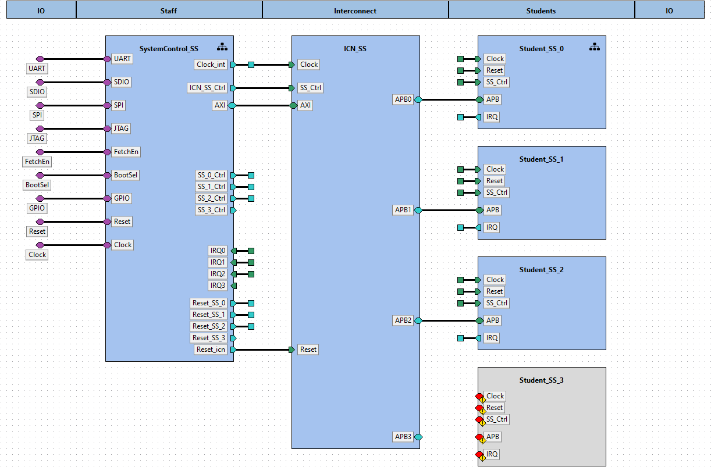  

Component instances within design tuni.fi:soc:didactic.design:1.0:  

|Instance name|Component type|Configurable values|Active view|Description|  
|:----|:----|:----|:----|:----|  
|SystemControl_SS|[tuni.fi - subsystem.wrapper - SysCtrl_SS_wrapper - 1.0](#tuni.fi:subsystem.wrapper:SysCtrl_SS_wrapper:1.0)|||  
|ICN_SS|[tuni.fi - interconnect - ICN_SS - 1.0](#tuni.fi:interconnect:ICN_SS:1.0)|||  
|Student_SS_0|[tuni.fi - subsystem.wrapper - Student_SS_0 - 1.0](#tuni.fi:subsystem.wrapper:Student_SS_0:1.0)|||  
|Student_SS_1|[tuni.fi - subsystem.wrapper - Student_SS_1 - 1.0](#tuni.fi:subsystem.wrapper:Student_SS_1:1.0)|||  
|Student_SS_2|[tuni.fi - subsystem.wrapper - Student_SS_2 - 1.0](#tuni.fi:subsystem.wrapper:Student_SS_2:1.0)|||  
|Student_SS_3|[ -  -  - ](#:::)|||  
# 2. Component tuni.fi:subsystem.wrapper:SysCtrl_SS_wrapper:1.0<a id="tuni.fi:subsystem.wrapper:SysCtrl_SS_wrapper:1.0">  

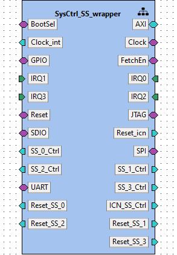

**IP-Xact file:** [SysCtrl_SS_wrapper.1.0.xml](../ipxact/tuni.fi/subsystem.wrapper/SysCtrl_SS_wrapper/1.0/SysCtrl_SS_wrapper.1.0.xml)  

## 2.1 Kactus2 attributes <a id="tuni.fi:subsystem.wrapper:SysCtrl_SS_wrapper:1.0.attributes">  

**Product hierarchy:** IP  
**Component implementation:** HW  
**Component firmness:** Mutable  

## 2.2 Ports <a id="tuni.fi:subsystem.wrapper:SysCtrl_SS_wrapper:1.0.ports">  

|Name|Direction|Left bound|Right bound|Port type|Type definition|Default value|Array left|Array right|Description|  
|:----|:----|:----|:----|:----|:----|:----|:----|:----|:----|  
|boot_sel <a id="tuni.fi:subsystem.wrapper:SysCtrl_SS_wrapper:1.0.port.boot_sel">|inout|0|0|||||||  
|fetch_en <a id="tuni.fi:subsystem.wrapper:SysCtrl_SS_wrapper:1.0.port.fetch_en">|inout|0|0|||||||  
|gpio <a id="tuni.fi:subsystem.wrapper:SysCtrl_SS_wrapper:1.0.port.gpio">|inout|3|0|||||||  
|jtag_tck <a id="tuni.fi:subsystem.wrapper:SysCtrl_SS_wrapper:1.0.port.jtag_tck">|inout|0|0|||||||  
|jtag_tdi <a id="tuni.fi:subsystem.wrapper:SysCtrl_SS_wrapper:1.0.port.jtag_tdi">|inout|0|0||||||Data can be daisy chained or routed directly back|  
|jtag_tdo <a id="tuni.fi:subsystem.wrapper:SysCtrl_SS_wrapper:1.0.port.jtag_tdo">|inout|0|0||||||Data can be daisy chained or routed directly back|  
|jtag_tms <a id="tuni.fi:subsystem.wrapper:SysCtrl_SS_wrapper:1.0.port.jtag_tms">|inout|0|0|||||||  
|jtag_trst <a id="tuni.fi:subsystem.wrapper:SysCtrl_SS_wrapper:1.0.port.jtag_trst">|inout|0|0|||||||  
|reset <a id="tuni.fi:subsystem.wrapper:SysCtrl_SS_wrapper:1.0.port.reset">|inout|0|0|||||||  
|sdio_clk <a id="tuni.fi:subsystem.wrapper:SysCtrl_SS_wrapper:1.0.port.sdio_clk">|inout|0|0|||||||  
|sdio_cmd <a id="tuni.fi:subsystem.wrapper:SysCtrl_SS_wrapper:1.0.port.sdio_cmd">|inout|0|0|||||||  
|sdio_data <a id="tuni.fi:subsystem.wrapper:SysCtrl_SS_wrapper:1.0.port.sdio_data">|inout|3|0|||||||  
|spi_csn <a id="tuni.fi:subsystem.wrapper:SysCtrl_SS_wrapper:1.0.port.spi_csn">|inout|1|0|||||||  
|spi_sck <a id="tuni.fi:subsystem.wrapper:SysCtrl_SS_wrapper:1.0.port.spi_sck">|inout|0|0|||||||  
|spi_data <a id="tuni.fi:subsystem.wrapper:SysCtrl_SS_wrapper:1.0.port.spi_data">|inout|3|0|||||||  
|uart_rx <a id="tuni.fi:subsystem.wrapper:SysCtrl_SS_wrapper:1.0.port.uart_rx">|inout|0|0|||||||  
|uart_tx <a id="tuni.fi:subsystem.wrapper:SysCtrl_SS_wrapper:1.0.port.uart_tx">|inout|0|0|||||||  
|clk <a id="tuni.fi:subsystem.wrapper:SysCtrl_SS_wrapper:1.0.port.clk">|out|||||||||  
|reset_int <a id="tuni.fi:subsystem.wrapper:SysCtrl_SS_wrapper:1.0.port.reset_int">|out|||||||||  
|ss_ctrl_icn <a id="tuni.fi:subsystem.wrapper:SysCtrl_SS_wrapper:1.0.port.ss_ctrl_icn">|out|7|0|||||||  
|ss_ctrl_0 <a id="tuni.fi:subsystem.wrapper:SysCtrl_SS_wrapper:1.0.port.ss_ctrl_0">|out|7|0|||||||  
|ss_ctrl_1 <a id="tuni.fi:subsystem.wrapper:SysCtrl_SS_wrapper:1.0.port.ss_ctrl_1">|out|7|0|||||||  
|ss_ctrl_2 <a id="tuni.fi:subsystem.wrapper:SysCtrl_SS_wrapper:1.0.port.ss_ctrl_2">|out|7|0|||||||  
|ss_ctrl_3 <a id="tuni.fi:subsystem.wrapper:SysCtrl_SS_wrapper:1.0.port.ss_ctrl_3">|out|7|0|||||||  
|irq_0 <a id="tuni.fi:subsystem.wrapper:SysCtrl_SS_wrapper:1.0.port.irq_0">|in|||||||||  
|irq_1 <a id="tuni.fi:subsystem.wrapper:SysCtrl_SS_wrapper:1.0.port.irq_1">|in|||||||||  
|irq_2 <a id="tuni.fi:subsystem.wrapper:SysCtrl_SS_wrapper:1.0.port.irq_2">|in|||||||||  
|irq_3 <a id="tuni.fi:subsystem.wrapper:SysCtrl_SS_wrapper:1.0.port.irq_3">|in|||||||||  
|irq_en_0 <a id="tuni.fi:subsystem.wrapper:SysCtrl_SS_wrapper:1.0.port.irq_en_0">|out|||||||||  
|irq_en_1 <a id="tuni.fi:subsystem.wrapper:SysCtrl_SS_wrapper:1.0.port.irq_en_1">|out|||||||||  
|irq_en_2 <a id="tuni.fi:subsystem.wrapper:SysCtrl_SS_wrapper:1.0.port.irq_en_2">|out|||||||||  
|irq_en_3 <a id="tuni.fi:subsystem.wrapper:SysCtrl_SS_wrapper:1.0.port.irq_en_3">|out|||||||||  
|AR_ADDR <a id="tuni.fi:subsystem.wrapper:SysCtrl_SS_wrapper:1.0.port.AR_ADDR">|out|31|0|||||||  
|AR_BURST <a id="tuni.fi:subsystem.wrapper:SysCtrl_SS_wrapper:1.0.port.AR_BURST">|out|1|0|||||||  
|AR_CACHE <a id="tuni.fi:subsystem.wrapper:SysCtrl_SS_wrapper:1.0.port.AR_CACHE">|out|3|0|||||||  
|AR_ID <a id="tuni.fi:subsystem.wrapper:SysCtrl_SS_wrapper:1.0.port.AR_ID">|out|9|0|||||||  
|AR_LEN <a id="tuni.fi:subsystem.wrapper:SysCtrl_SS_wrapper:1.0.port.AR_LEN">|out|7|0|||||||  
|AR_LOCK <a id="tuni.fi:subsystem.wrapper:SysCtrl_SS_wrapper:1.0.port.AR_LOCK">|out|||||||||  
|AR_PROT <a id="tuni.fi:subsystem.wrapper:SysCtrl_SS_wrapper:1.0.port.AR_PROT">|out|2|0|||||||  
|AR_QOS <a id="tuni.fi:subsystem.wrapper:SysCtrl_SS_wrapper:1.0.port.AR_QOS">|out|3|0|||||||  
|AR_READY <a id="tuni.fi:subsystem.wrapper:SysCtrl_SS_wrapper:1.0.port.AR_READY">|in|||||||||  
|AR_REGION <a id="tuni.fi:subsystem.wrapper:SysCtrl_SS_wrapper:1.0.port.AR_REGION">|out|2|0|||||||  
|AR_SIZE <a id="tuni.fi:subsystem.wrapper:SysCtrl_SS_wrapper:1.0.port.AR_SIZE">|out|2|0|||||||  
|AR_USER <a id="tuni.fi:subsystem.wrapper:SysCtrl_SS_wrapper:1.0.port.AR_USER">|out|||||||||  
|AR_VALID <a id="tuni.fi:subsystem.wrapper:SysCtrl_SS_wrapper:1.0.port.AR_VALID">|out|||||||||  
|AW_ADDR <a id="tuni.fi:subsystem.wrapper:SysCtrl_SS_wrapper:1.0.port.AW_ADDR">|out|31|0|||||||  
|AW_ATOP <a id="tuni.fi:subsystem.wrapper:SysCtrl_SS_wrapper:1.0.port.AW_ATOP">|out|5|0|||||||  
|AW_BURST <a id="tuni.fi:subsystem.wrapper:SysCtrl_SS_wrapper:1.0.port.AW_BURST">|out|1|0|||||||  
|AW_CACHE <a id="tuni.fi:subsystem.wrapper:SysCtrl_SS_wrapper:1.0.port.AW_CACHE">|out|3|0|||||||  
|AW_ID <a id="tuni.fi:subsystem.wrapper:SysCtrl_SS_wrapper:1.0.port.AW_ID">|out|9|0|||||||  
|AW_LEN <a id="tuni.fi:subsystem.wrapper:SysCtrl_SS_wrapper:1.0.port.AW_LEN">|out|7|0|||||||  
|AW_LOCK <a id="tuni.fi:subsystem.wrapper:SysCtrl_SS_wrapper:1.0.port.AW_LOCK">|out|||||||||  
|AW_PROT <a id="tuni.fi:subsystem.wrapper:SysCtrl_SS_wrapper:1.0.port.AW_PROT">|out|2|0|||||||  
|AW_QOS <a id="tuni.fi:subsystem.wrapper:SysCtrl_SS_wrapper:1.0.port.AW_QOS">|out|3|0|||||||  
|AW_READY <a id="tuni.fi:subsystem.wrapper:SysCtrl_SS_wrapper:1.0.port.AW_READY">|in|||||||||  
|AW_REGION <a id="tuni.fi:subsystem.wrapper:SysCtrl_SS_wrapper:1.0.port.AW_REGION">|out|3|0|||||||  
|AW_SIZE <a id="tuni.fi:subsystem.wrapper:SysCtrl_SS_wrapper:1.0.port.AW_SIZE">|out|2|0|||||||  
|AW_USER <a id="tuni.fi:subsystem.wrapper:SysCtrl_SS_wrapper:1.0.port.AW_USER">|out|||||||||  
|AW_VALID <a id="tuni.fi:subsystem.wrapper:SysCtrl_SS_wrapper:1.0.port.AW_VALID">|out|||||||||  
|B_ID <a id="tuni.fi:subsystem.wrapper:SysCtrl_SS_wrapper:1.0.port.B_ID">|in|10|0|||||||  
|B_READY <a id="tuni.fi:subsystem.wrapper:SysCtrl_SS_wrapper:1.0.port.B_READY">|out|||||||||  
|B_RESP <a id="tuni.fi:subsystem.wrapper:SysCtrl_SS_wrapper:1.0.port.B_RESP">|in|1|0|||||||  
|B_USER <a id="tuni.fi:subsystem.wrapper:SysCtrl_SS_wrapper:1.0.port.B_USER">|in|||||||||  
|B_VALID <a id="tuni.fi:subsystem.wrapper:SysCtrl_SS_wrapper:1.0.port.B_VALID">|in|||||||||  
|R_DATA <a id="tuni.fi:subsystem.wrapper:SysCtrl_SS_wrapper:1.0.port.R_DATA">|in|31|0|||||||  
|R_ID <a id="tuni.fi:subsystem.wrapper:SysCtrl_SS_wrapper:1.0.port.R_ID">|in|10|0|||||||  
|R_LAST <a id="tuni.fi:subsystem.wrapper:SysCtrl_SS_wrapper:1.0.port.R_LAST">|in|||||||||  
|R_READY <a id="tuni.fi:subsystem.wrapper:SysCtrl_SS_wrapper:1.0.port.R_READY">|out|||||||||  
|R_RESP <a id="tuni.fi:subsystem.wrapper:SysCtrl_SS_wrapper:1.0.port.R_RESP">|in|1|0|||||||  
|R_USER <a id="tuni.fi:subsystem.wrapper:SysCtrl_SS_wrapper:1.0.port.R_USER">|in|||||||||  
|R_VALID <a id="tuni.fi:subsystem.wrapper:SysCtrl_SS_wrapper:1.0.port.R_VALID">|in|||||||||  
|W_DATA <a id="tuni.fi:subsystem.wrapper:SysCtrl_SS_wrapper:1.0.port.W_DATA">|out|31|0|||||||  
|W_LAST <a id="tuni.fi:subsystem.wrapper:SysCtrl_SS_wrapper:1.0.port.W_LAST">|out|||||||||  
|W_READY <a id="tuni.fi:subsystem.wrapper:SysCtrl_SS_wrapper:1.0.port.W_READY">|in|||||||||  
|W_STROBE <a id="tuni.fi:subsystem.wrapper:SysCtrl_SS_wrapper:1.0.port.W_STROBE">|out|3|0|||||||  
|W_USER <a id="tuni.fi:subsystem.wrapper:SysCtrl_SS_wrapper:1.0.port.W_USER">|out|||||||||  
|W_VALID <a id="tuni.fi:subsystem.wrapper:SysCtrl_SS_wrapper:1.0.port.W_VALID">|out|||||||||  
|clock <a id="tuni.fi:subsystem.wrapper:SysCtrl_SS_wrapper:1.0.port.clock">|inout|||||||||  
|reset_ss_0 <a id="tuni.fi:subsystem.wrapper:SysCtrl_SS_wrapper:1.0.port.reset_ss_0">|out|0|0|||||||  
|reset_ss_1 <a id="tuni.fi:subsystem.wrapper:SysCtrl_SS_wrapper:1.0.port.reset_ss_1">|out|||||||||  
|reset_ss_2 <a id="tuni.fi:subsystem.wrapper:SysCtrl_SS_wrapper:1.0.port.reset_ss_2">|out|||||||||  
|reset_ss_3 <a id="tuni.fi:subsystem.wrapper:SysCtrl_SS_wrapper:1.0.port.reset_ss_3">|out|||||||||  
## 2.3 Bus interfaces <a id="tuni.fi:subsystem.wrapper:SysCtrl_SS_wrapper:1.0.interfaces">  

### 2.3.1 Bus interface AXI  

**Description:**   
**Interface mode:** initiator  
**Bus definition:** tuni.fi:interface:AXI4:1.0  
**Abstraction definitions:** tuni.fi:interface:AXI4.absDef:1.0  
**Ports used in this interface:**   

|Name|Direction|Left bound|Right bound|Port type|Type definition|Default value|Array left|Array right|Description|  
|:----|:----|:----|:----|:----|:----|:----|:----|:----|:----|  
|AR_ADDR <a id="tuni.fi:subsystem.wrapper:SysCtrl_SS_wrapper:1.0.port.AR_ADDR">|out|31|0|||||||  
|AR_BURST <a id="tuni.fi:subsystem.wrapper:SysCtrl_SS_wrapper:1.0.port.AR_BURST">|out|1|0|||||||  
|AR_CACHE <a id="tuni.fi:subsystem.wrapper:SysCtrl_SS_wrapper:1.0.port.AR_CACHE">|out|3|0|||||||  
|AR_ID <a id="tuni.fi:subsystem.wrapper:SysCtrl_SS_wrapper:1.0.port.AR_ID">|out|9|0|||||||  
|AR_LEN <a id="tuni.fi:subsystem.wrapper:SysCtrl_SS_wrapper:1.0.port.AR_LEN">|out|7|0|||||||  
|AR_LOCK <a id="tuni.fi:subsystem.wrapper:SysCtrl_SS_wrapper:1.0.port.AR_LOCK">|out|||||||||  
|AR_PROT <a id="tuni.fi:subsystem.wrapper:SysCtrl_SS_wrapper:1.0.port.AR_PROT">|out|2|0|||||||  
|AR_QOS <a id="tuni.fi:subsystem.wrapper:SysCtrl_SS_wrapper:1.0.port.AR_QOS">|out|3|0|||||||  
|AR_READY <a id="tuni.fi:subsystem.wrapper:SysCtrl_SS_wrapper:1.0.port.AR_READY">|in|||||||||  
|AR_REGION <a id="tuni.fi:subsystem.wrapper:SysCtrl_SS_wrapper:1.0.port.AR_REGION">|out|2|0|||||||  
|AR_SIZE <a id="tuni.fi:subsystem.wrapper:SysCtrl_SS_wrapper:1.0.port.AR_SIZE">|out|2|0|||||||  
|AR_USER <a id="tuni.fi:subsystem.wrapper:SysCtrl_SS_wrapper:1.0.port.AR_USER">|out|||||||||  
|AR_VALID <a id="tuni.fi:subsystem.wrapper:SysCtrl_SS_wrapper:1.0.port.AR_VALID">|out|||||||||  
|AW_ADDR <a id="tuni.fi:subsystem.wrapper:SysCtrl_SS_wrapper:1.0.port.AW_ADDR">|out|31|0|||||||  
|AW_ATOP <a id="tuni.fi:subsystem.wrapper:SysCtrl_SS_wrapper:1.0.port.AW_ATOP">|out|5|0|||||||  
|AW_BURST <a id="tuni.fi:subsystem.wrapper:SysCtrl_SS_wrapper:1.0.port.AW_BURST">|out|1|0|||||||  
|AW_CACHE <a id="tuni.fi:subsystem.wrapper:SysCtrl_SS_wrapper:1.0.port.AW_CACHE">|out|3|0|||||||  
|AW_ID <a id="tuni.fi:subsystem.wrapper:SysCtrl_SS_wrapper:1.0.port.AW_ID">|out|9|0|||||||  
|AW_LEN <a id="tuni.fi:subsystem.wrapper:SysCtrl_SS_wrapper:1.0.port.AW_LEN">|out|7|0|||||||  
|AW_LOCK <a id="tuni.fi:subsystem.wrapper:SysCtrl_SS_wrapper:1.0.port.AW_LOCK">|out|||||||||  
|AW_PROT <a id="tuni.fi:subsystem.wrapper:SysCtrl_SS_wrapper:1.0.port.AW_PROT">|out|2|0|||||||  
|AW_QOS <a id="tuni.fi:subsystem.wrapper:SysCtrl_SS_wrapper:1.0.port.AW_QOS">|out|3|0|||||||  
|AW_READY <a id="tuni.fi:subsystem.wrapper:SysCtrl_SS_wrapper:1.0.port.AW_READY">|in|||||||||  
|AW_REGION <a id="tuni.fi:subsystem.wrapper:SysCtrl_SS_wrapper:1.0.port.AW_REGION">|out|3|0|||||||  
|AW_SIZE <a id="tuni.fi:subsystem.wrapper:SysCtrl_SS_wrapper:1.0.port.AW_SIZE">|out|2|0|||||||  
|AW_USER <a id="tuni.fi:subsystem.wrapper:SysCtrl_SS_wrapper:1.0.port.AW_USER">|out|||||||||  
|AW_VALID <a id="tuni.fi:subsystem.wrapper:SysCtrl_SS_wrapper:1.0.port.AW_VALID">|out|||||||||  
|B_ID <a id="tuni.fi:subsystem.wrapper:SysCtrl_SS_wrapper:1.0.port.B_ID">|in|10|0|||||||  
|B_READY <a id="tuni.fi:subsystem.wrapper:SysCtrl_SS_wrapper:1.0.port.B_READY">|out|||||||||  
|B_RESP <a id="tuni.fi:subsystem.wrapper:SysCtrl_SS_wrapper:1.0.port.B_RESP">|in|1|0|||||||  
|B_USER <a id="tuni.fi:subsystem.wrapper:SysCtrl_SS_wrapper:1.0.port.B_USER">|in|||||||||  
|B_VALID <a id="tuni.fi:subsystem.wrapper:SysCtrl_SS_wrapper:1.0.port.B_VALID">|in|||||||||  
|R_DATA <a id="tuni.fi:subsystem.wrapper:SysCtrl_SS_wrapper:1.0.port.R_DATA">|in|31|0|||||||  
|R_ID <a id="tuni.fi:subsystem.wrapper:SysCtrl_SS_wrapper:1.0.port.R_ID">|in|10|0|||||||  
|R_LAST <a id="tuni.fi:subsystem.wrapper:SysCtrl_SS_wrapper:1.0.port.R_LAST">|in|||||||||  
|R_READY <a id="tuni.fi:subsystem.wrapper:SysCtrl_SS_wrapper:1.0.port.R_READY">|out|||||||||  
|R_RESP <a id="tuni.fi:subsystem.wrapper:SysCtrl_SS_wrapper:1.0.port.R_RESP">|in|1|0|||||||  
|R_USER <a id="tuni.fi:subsystem.wrapper:SysCtrl_SS_wrapper:1.0.port.R_USER">|in|||||||||  
|R_VALID <a id="tuni.fi:subsystem.wrapper:SysCtrl_SS_wrapper:1.0.port.R_VALID">|in|||||||||  
|W_DATA <a id="tuni.fi:subsystem.wrapper:SysCtrl_SS_wrapper:1.0.port.W_DATA">|out|31|0|||||||  
|W_LAST <a id="tuni.fi:subsystem.wrapper:SysCtrl_SS_wrapper:1.0.port.W_LAST">|out|||||||||  
|W_READY <a id="tuni.fi:subsystem.wrapper:SysCtrl_SS_wrapper:1.0.port.W_READY">|in|||||||||  
|W_STROBE <a id="tuni.fi:subsystem.wrapper:SysCtrl_SS_wrapper:1.0.port.W_STROBE">|out|3|0|||||||  
|W_USER <a id="tuni.fi:subsystem.wrapper:SysCtrl_SS_wrapper:1.0.port.W_USER">|out|||||||||  
|W_VALID <a id="tuni.fi:subsystem.wrapper:SysCtrl_SS_wrapper:1.0.port.W_VALID">|out|||||||||  
### 2.3.2 Bus interface BootSel  

**Description:**   
**Interface mode:** system  
**System group:** external_io  
**Bus definition:** tuni.fi:interface:GPIO:1.0  
**Abstraction definitions:** tuni.fi:interface:GPIO.absDef:1.0  
**Ports used in this interface:**   

|Name|Direction|Left bound|Right bound|Port type|Type definition|Default value|Array left|Array right|Description|  
|:----|:----|:----|:----|:----|:----|:----|:----|:----|:----|  
|boot_sel <a id="tuni.fi:subsystem.wrapper:SysCtrl_SS_wrapper:1.0.port.boot_sel">|inout|0|0|||||||  
### 2.3.3 Bus interface Clock  

**Description:**   
**Interface mode:** system  
**System group:** external_io  
**Bus definition:** tuni.fi:interface:clock:1.0  
**Abstraction definitions:** tuni.fi:interface:clock.absDef:1.0  
**Ports used in this interface:**   

|Name|Direction|Left bound|Right bound|Port type|Type definition|Default value|Array left|Array right|Description|  
|:----|:----|:----|:----|:----|:----|:----|:----|:----|:----|  
|clock <a id="tuni.fi:subsystem.wrapper:SysCtrl_SS_wrapper:1.0.port.clock">|inout|||||||||  
### 2.3.4 Bus interface Clock_int  

**Description:**   
**Interface mode:** initiator  
**Bus definition:** tuni.fi:interface:clock:1.0  
**Abstraction definitions:** tuni.fi:interface:clock.absDef:1.0  
**Ports used in this interface:**   

|Name|Direction|Left bound|Right bound|Port type|Type definition|Default value|Array left|Array right|Description|  
|:----|:----|:----|:----|:----|:----|:----|:----|:----|:----|  
|clk <a id="tuni.fi:subsystem.wrapper:SysCtrl_SS_wrapper:1.0.port.clk">|out|||||||||  
### 2.3.5 Bus interface FetchEn  

**Description:**   
**Interface mode:** system  
**System group:** external_io  
**Bus definition:** tuni.fi:interface:GPIO:1.0  
**Abstraction definitions:** tuni.fi:interface:GPIO.absDef:1.0  
**Ports used in this interface:**   

|Name|Direction|Left bound|Right bound|Port type|Type definition|Default value|Array left|Array right|Description|  
|:----|:----|:----|:----|:----|:----|:----|:----|:----|:----|  
|fetch_en <a id="tuni.fi:subsystem.wrapper:SysCtrl_SS_wrapper:1.0.port.fetch_en">|inout|0|0|||||||  
### 2.3.6 Bus interface GPIO  

**Description:**   
**Interface mode:** system  
**System group:** external_io  
**Bus definition:** tuni.fi:interface:GPIO:1.0  
**Abstraction definitions:** tuni.fi:interface:GPIO.absDef:1.0  
**Ports used in this interface:**   

|Name|Direction|Left bound|Right bound|Port type|Type definition|Default value|Array left|Array right|Description|  
|:----|:----|:----|:----|:----|:----|:----|:----|:----|:----|  
|gpio <a id="tuni.fi:subsystem.wrapper:SysCtrl_SS_wrapper:1.0.port.gpio">|inout|3|0|||||||  
### 2.3.7 Bus interface IRQ0  

**Description:**   
**Interface mode:** target  
**Bus definition:** tuni.fi:interface:IRQ:1.0  
**Abstraction definitions:** tuni.fi:interface:IRQ.absDef:1.0  
**Ports used in this interface:**   

|Name|Direction|Left bound|Right bound|Port type|Type definition|Default value|Array left|Array right|Description|  
|:----|:----|:----|:----|:----|:----|:----|:----|:----|:----|  
|irq_0 <a id="tuni.fi:subsystem.wrapper:SysCtrl_SS_wrapper:1.0.port.irq_0">|in|||||||||  
### 2.3.8 Bus interface IRQ1  

**Description:**   
**Interface mode:** target  
**Bus definition:** tuni.fi:interface:IRQ:1.0  
**Abstraction definitions:** tuni.fi:interface:IRQ.absDef:1.0  
**Ports used in this interface:**   

|Name|Direction|Left bound|Right bound|Port type|Type definition|Default value|Array left|Array right|Description|  
|:----|:----|:----|:----|:----|:----|:----|:----|:----|:----|  
|irq_1 <a id="tuni.fi:subsystem.wrapper:SysCtrl_SS_wrapper:1.0.port.irq_1">|in|||||||||  
### 2.3.9 Bus interface IRQ2  

**Description:**   
**Interface mode:** target  
**Bus definition:** tuni.fi:interface:IRQ:1.0  
**Abstraction definitions:** tuni.fi:interface:IRQ.absDef:1.0  
**Ports used in this interface:**   

|Name|Direction|Left bound|Right bound|Port type|Type definition|Default value|Array left|Array right|Description|  
|:----|:----|:----|:----|:----|:----|:----|:----|:----|:----|  
|irq_2 <a id="tuni.fi:subsystem.wrapper:SysCtrl_SS_wrapper:1.0.port.irq_2">|in|||||||||  
### 2.3.10 Bus interface IRQ3  

**Description:**   
**Interface mode:** target  
**Bus definition:** tuni.fi:interface:IRQ:1.0  
**Abstraction definitions:** tuni.fi:interface:IRQ.absDef:1.0  
**Ports used in this interface:**   

|Name|Direction|Left bound|Right bound|Port type|Type definition|Default value|Array left|Array right|Description|  
|:----|:----|:----|:----|:----|:----|:----|:----|:----|:----|  
|irq_3 <a id="tuni.fi:subsystem.wrapper:SysCtrl_SS_wrapper:1.0.port.irq_3">|in|||||||||  
### 2.3.11 Bus interface JTAG  

**Description:**   
**Interface mode:** system  
**System group:** external_io  
**Bus definition:** tuni.fi:interface:JTAG:1.0  
**Abstraction definitions:** tuni.fi:interface:JTAG.absDef:1.0  
**Ports used in this interface:**   

|Name|Direction|Left bound|Right bound|Port type|Type definition|Default value|Array left|Array right|Description|  
|:----|:----|:----|:----|:----|:----|:----|:----|:----|:----|  
|jtag_tck <a id="tuni.fi:subsystem.wrapper:SysCtrl_SS_wrapper:1.0.port.jtag_tck">|inout|0|0|||||||  
|jtag_tdi <a id="tuni.fi:subsystem.wrapper:SysCtrl_SS_wrapper:1.0.port.jtag_tdi">|inout|0|0||||||Data can be daisy chained or routed directly back|  
|jtag_tdo <a id="tuni.fi:subsystem.wrapper:SysCtrl_SS_wrapper:1.0.port.jtag_tdo">|inout|0|0||||||Data can be daisy chained or routed directly back|  
|jtag_tms <a id="tuni.fi:subsystem.wrapper:SysCtrl_SS_wrapper:1.0.port.jtag_tms">|inout|0|0|||||||  
|jtag_trst <a id="tuni.fi:subsystem.wrapper:SysCtrl_SS_wrapper:1.0.port.jtag_trst">|inout|0|0|||||||  
### 2.3.12 Bus interface Reset  

**Description:**   
**Interface mode:** system  
**System group:** external_io  
**Bus definition:** tuni.fi:interface:reset:1.0  
**Abstraction definitions:** tuni.fi:interface:reset.absDef:1.0  
**Ports used in this interface:**   

|Name|Direction|Left bound|Right bound|Port type|Type definition|Default value|Array left|Array right|Description|  
|:----|:----|:----|:----|:----|:----|:----|:----|:----|:----|  
|reset <a id="tuni.fi:subsystem.wrapper:SysCtrl_SS_wrapper:1.0.port.reset">|inout|0|0|||||||  
### 2.3.13 Bus interface Reset_icn  

**Description:**   
**Interface mode:** initiator  
**Bus definition:** tuni.fi:interface:reset:1.0  
**Abstraction definitions:** tuni.fi:interface:reset.absDef:1.0  
**Ports used in this interface:**   

|Name|Direction|Left bound|Right bound|Port type|Type definition|Default value|Array left|Array right|Description|  
|:----|:----|:----|:----|:----|:----|:----|:----|:----|:----|  
|reset_int <a id="tuni.fi:subsystem.wrapper:SysCtrl_SS_wrapper:1.0.port.reset_int">|out|||||||||  
### 2.3.14 Bus interface SDIO  

**Description:**   
**Interface mode:** system  
**System group:** external_io  
**Bus definition:** tuni.fi:interface:SDIO:1.0  
**Abstraction definitions:** tuni.fi:interface:SDIO.absDef:1.0  
**Ports used in this interface:**   

|Name|Direction|Left bound|Right bound|Port type|Type definition|Default value|Array left|Array right|Description|  
|:----|:----|:----|:----|:----|:----|:----|:----|:----|:----|  
|sdio_clk <a id="tuni.fi:subsystem.wrapper:SysCtrl_SS_wrapper:1.0.port.sdio_clk">|inout|0|0|||||||  
|sdio_cmd <a id="tuni.fi:subsystem.wrapper:SysCtrl_SS_wrapper:1.0.port.sdio_cmd">|inout|0|0|||||||  
|sdio_data <a id="tuni.fi:subsystem.wrapper:SysCtrl_SS_wrapper:1.0.port.sdio_data">|inout|3|0|||||||  
### 2.3.15 Bus interface SPI  

**Description:**   
**Interface mode:** system  
**System group:** external_io  
**Bus definition:** tuni.fi:interface:SPI:1.0  
**Abstraction definitions:** tuni.fi:interface:SPI.absDef:1.0  
**Ports used in this interface:**   

|Name|Direction|Left bound|Right bound|Port type|Type definition|Default value|Array left|Array right|Description|  
|:----|:----|:----|:----|:----|:----|:----|:----|:----|:----|  
|spi_csn <a id="tuni.fi:subsystem.wrapper:SysCtrl_SS_wrapper:1.0.port.spi_csn">|inout|1|0|||||||  
|spi_sck <a id="tuni.fi:subsystem.wrapper:SysCtrl_SS_wrapper:1.0.port.spi_sck">|inout|0|0|||||||  
|spi_data <a id="tuni.fi:subsystem.wrapper:SysCtrl_SS_wrapper:1.0.port.spi_data">|inout|3|0|||||||  
### 2.3.16 Bus interface SS_0_Ctrl  

**Description:**   
**Interface mode:** initiator  
**Bus definition:** tuni.fi:interface:SS_Ctrl:1.0  
**Abstraction definitions:** tuni.fi:interface:SS_Ctrl.absDef:1.0  
**Ports used in this interface:**   

|Name|Direction|Left bound|Right bound|Port type|Type definition|Default value|Array left|Array right|Description|  
|:----|:----|:----|:----|:----|:----|:----|:----|:----|:----|  
|ss_ctrl_0 <a id="tuni.fi:subsystem.wrapper:SysCtrl_SS_wrapper:1.0.port.ss_ctrl_0">|out|7|0|||||||  
|irq_en_0 <a id="tuni.fi:subsystem.wrapper:SysCtrl_SS_wrapper:1.0.port.irq_en_0">|out|||||||||  
### 2.3.17 Bus interface SS_1_Ctrl  

**Description:**   
**Interface mode:** initiator  
**Bus definition:** tuni.fi:interface:SS_Ctrl:1.0  
**Abstraction definitions:** tuni.fi:interface:SS_Ctrl.absDef:1.0  
**Ports used in this interface:**   

|Name|Direction|Left bound|Right bound|Port type|Type definition|Default value|Array left|Array right|Description|  
|:----|:----|:----|:----|:----|:----|:----|:----|:----|:----|  
|ss_ctrl_1 <a id="tuni.fi:subsystem.wrapper:SysCtrl_SS_wrapper:1.0.port.ss_ctrl_1">|out|7|0|||||||  
|irq_en_1 <a id="tuni.fi:subsystem.wrapper:SysCtrl_SS_wrapper:1.0.port.irq_en_1">|out|||||||||  
### 2.3.18 Bus interface SS_2_Ctrl  

**Description:**   
**Interface mode:** initiator  
**Bus definition:** tuni.fi:interface:SS_Ctrl:1.0  
**Abstraction definitions:** tuni.fi:interface:SS_Ctrl.absDef:1.0  
**Ports used in this interface:**   

|Name|Direction|Left bound|Right bound|Port type|Type definition|Default value|Array left|Array right|Description|  
|:----|:----|:----|:----|:----|:----|:----|:----|:----|:----|  
|ss_ctrl_2 <a id="tuni.fi:subsystem.wrapper:SysCtrl_SS_wrapper:1.0.port.ss_ctrl_2">|out|7|0|||||||  
|irq_en_2 <a id="tuni.fi:subsystem.wrapper:SysCtrl_SS_wrapper:1.0.port.irq_en_2">|out|||||||||  
### 2.3.19 Bus interface SS_3_Ctrl  

**Description:**   
**Interface mode:** initiator  
**Bus definition:** tuni.fi:interface:SS_Ctrl:1.0  
**Abstraction definitions:** tuni.fi:interface:SS_Ctrl.absDef:1.0  
**Ports used in this interface:**   

|Name|Direction|Left bound|Right bound|Port type|Type definition|Default value|Array left|Array right|Description|  
|:----|:----|:----|:----|:----|:----|:----|:----|:----|:----|  
|ss_ctrl_3 <a id="tuni.fi:subsystem.wrapper:SysCtrl_SS_wrapper:1.0.port.ss_ctrl_3">|out|7|0|||||||  
|irq_en_3 <a id="tuni.fi:subsystem.wrapper:SysCtrl_SS_wrapper:1.0.port.irq_en_3">|out|||||||||  
### 2.3.20 Bus interface UART  

**Description:**   
**Interface mode:** system  
**System group:** external_io  
**Bus definition:** tuni.fi:interface:UART:1.0  
**Abstraction definitions:** tuni.fi:interface:UART.absDef:1.0  
**Ports used in this interface:**   

|Name|Direction|Left bound|Right bound|Port type|Type definition|Default value|Array left|Array right|Description|  
|:----|:----|:----|:----|:----|:----|:----|:----|:----|:----|  
|uart_rx <a id="tuni.fi:subsystem.wrapper:SysCtrl_SS_wrapper:1.0.port.uart_rx">|inout|0|0|||||||  
|uart_tx <a id="tuni.fi:subsystem.wrapper:SysCtrl_SS_wrapper:1.0.port.uart_tx">|inout|0|0|||||||  
### 2.3.21 Bus interface ICN_SS_Ctrl  

**Description:**   
**Interface mode:** initiator  
**Bus definition:** tuni.fi:interface:SS_Ctrl:1.0  
**Abstraction definitions:** tuni.fi:interface:SS_Ctrl.absDef:1.0  
**Ports used in this interface:**   

|Name|Direction|Left bound|Right bound|Port type|Type definition|Default value|Array left|Array right|Description|  
|:----|:----|:----|:----|:----|:----|:----|:----|:----|:----|  
|ss_ctrl_icn <a id="tuni.fi:subsystem.wrapper:SysCtrl_SS_wrapper:1.0.port.ss_ctrl_icn">|out|7|0|||||||  
### 2.3.22 Bus interface Reset_SS_0  

**Description:**   
**Interface mode:** initiator  
**Bus definition:** tuni.fi:interface:reset:1.0  
**Abstraction definitions:** tuni.fi:interface:reset.absDef:1.0  
**Ports used in this interface:**   

|Name|Direction|Left bound|Right bound|Port type|Type definition|Default value|Array left|Array right|Description|  
|:----|:----|:----|:----|:----|:----|:----|:----|:----|:----|  
|reset_ss_0 <a id="tuni.fi:subsystem.wrapper:SysCtrl_SS_wrapper:1.0.port.reset_ss_0">|out|0|0|||||||  
### 2.3.23 Bus interface Reset_SS_1  

**Description:**   
**Interface mode:** initiator  
**Bus definition:** tuni.fi:interface:reset:1.0  
**Abstraction definitions:** tuni.fi:interface:reset.absDef:1.0  
**Ports used in this interface:**   

|Name|Direction|Left bound|Right bound|Port type|Type definition|Default value|Array left|Array right|Description|  
|:----|:----|:----|:----|:----|:----|:----|:----|:----|:----|  
|reset_ss_1 <a id="tuni.fi:subsystem.wrapper:SysCtrl_SS_wrapper:1.0.port.reset_ss_1">|out|||||||||  
### 2.3.24 Bus interface Reset_SS_2  

**Description:**   
**Interface mode:** initiator  
**Bus definition:** tuni.fi:interface:reset:1.0  
**Abstraction definitions:** tuni.fi:interface:reset.absDef:1.0  
**Ports used in this interface:**   

|Name|Direction|Left bound|Right bound|Port type|Type definition|Default value|Array left|Array right|Description|  
|:----|:----|:----|:----|:----|:----|:----|:----|:----|:----|  
|reset_ss_2 <a id="tuni.fi:subsystem.wrapper:SysCtrl_SS_wrapper:1.0.port.reset_ss_2">|out|||||||||  
### 2.3.25 Bus interface Reset_SS_3  

**Description:**   
**Interface mode:** initiator  
**Bus definition:** tuni.fi:interface:reset:1.0  
**Abstraction definitions:** tuni.fi:interface:reset.absDef:1.0  
**Ports used in this interface:**   

|Name|Direction|Left bound|Right bound|Port type|Type definition|Default value|Array left|Array right|Description|  
|:----|:----|:----|:----|:----|:----|:----|:----|:----|:----|  
|reset_ss_3 <a id="tuni.fi:subsystem.wrapper:SysCtrl_SS_wrapper:1.0.port.reset_ss_3">|out|||||||||  
## 2.4 Views <a id="tuni.fi:subsystem.wrapper:SysCtrl_SS_wrapper:1.0.views">  

### 2.4.1 View: hierarchical  

#### 2.4.1.1 Design configuration instantiation: _design_configuration  

**Design configuration:** tuni.fi:subsystem.wrapper:SysCtrl_SS_wrapper.designcfg:1.0  
**IP-Xact file:** [SysCtrl_SS_wrapper.designcfg.1.0.xml](../ipxact/tuni.fi/subsystem.wrapper/SysCtrl_SS_wrapper/1.0/SysCtrl_SS_wrapper.designcfg.1.0.xml)  
Diagram of design tuni.fi:subsystem.wrapper:SysCtrl_SS_wrapper.design:1.0:  
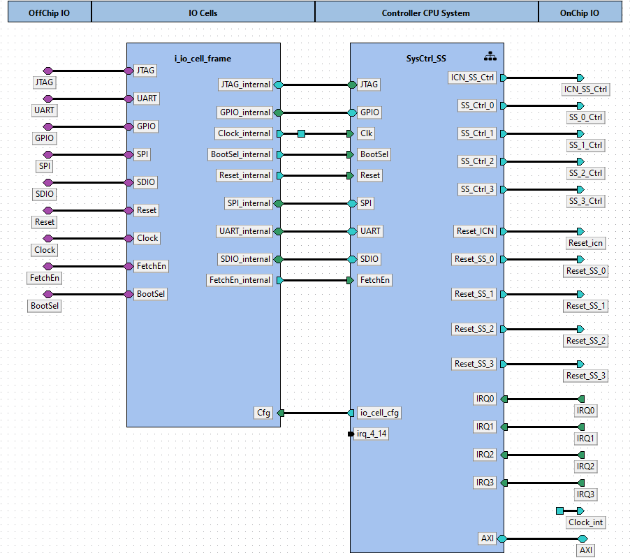  

Component instances within design tuni.fi:subsystem.wrapper:SysCtrl_SS_wrapper.design:1.0:  

|Instance name|Component type|Configurable values|Active view|Description|  
|:----|:----|:----|:----|:----|  
|i_io_cell_frame|[tuni.fi - subsystem.io - i_io_cell_frame - 1.0](#tuni.fi:subsystem.io:i_io_cell_frame:1.0)|||  
|SysCtrl_SS|[tuni.fi - subsystem - SysCtrl_SS - 1.0](#tuni.fi:subsystem:SysCtrl_SS:1.0)|||  
# 3. Component tuni.fi:subsystem.io:i_io_cell_frame:1.0<a id="tuni.fi:subsystem.io:i_io_cell_frame:1.0">  

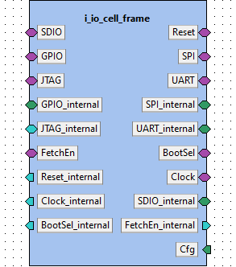

**IP-Xact file:** [i_io_cell_frame.1.0.xml](../ipxact/tuni.fi/subsystem.io/i_io_cell_frame/1.0/i_io_cell_frame.1.0.xml)  

## 3.1 Kactus2 attributes <a id="tuni.fi:subsystem.io:i_io_cell_frame:1.0.attributes">  

**Product hierarchy:** IP  
**Component implementation:** HW  
**Component firmness:** Mutable  

## 3.2 Ports <a id="tuni.fi:subsystem.io:i_io_cell_frame:1.0.ports">  

|Name|Direction|Left bound|Right bound|Port type|Type definition|Default value|Array left|Array right|Description|  
|:----|:----|:----|:----|:----|:----|:----|:----|:----|:----|  
|reset <a id="tuni.fi:subsystem.io:i_io_cell_frame:1.0.port.reset">|inout|0|0|||||||  
|sdio_clk <a id="tuni.fi:subsystem.io:i_io_cell_frame:1.0.port.sdio_clk">|inout|0|0|||||||  
|sdio_cmd <a id="tuni.fi:subsystem.io:i_io_cell_frame:1.0.port.sdio_cmd">|inout|0|0|||||||  
|sdio_data <a id="tuni.fi:subsystem.io:i_io_cell_frame:1.0.port.sdio_data">|inout|3|0|||||||  
|spi_csn <a id="tuni.fi:subsystem.io:i_io_cell_frame:1.0.port.spi_csn">|inout|1|0|||||||  
|spi_sck <a id="tuni.fi:subsystem.io:i_io_cell_frame:1.0.port.spi_sck">|inout|0|0|||||||  
|spi_data <a id="tuni.fi:subsystem.io:i_io_cell_frame:1.0.port.spi_data">|inout|3|0|||||||  
|gpio <a id="tuni.fi:subsystem.io:i_io_cell_frame:1.0.port.gpio">|inout|3|0|||||||  
|uart_rx <a id="tuni.fi:subsystem.io:i_io_cell_frame:1.0.port.uart_rx">|inout|0|0|||||||  
|uart_tx <a id="tuni.fi:subsystem.io:i_io_cell_frame:1.0.port.uart_tx">|inout|0|0|||||||  
|jtag_tck <a id="tuni.fi:subsystem.io:i_io_cell_frame:1.0.port.jtag_tck">|inout|0|0|||||||  
|jtag_tdi <a id="tuni.fi:subsystem.io:i_io_cell_frame:1.0.port.jtag_tdi">|inout|0|0||||||Data can be daisy chained or routed directly back|  
|jtag_tdo <a id="tuni.fi:subsystem.io:i_io_cell_frame:1.0.port.jtag_tdo">|inout|0|0||||||Data can be daisy chained or routed directly back|  
|jtag_tms <a id="tuni.fi:subsystem.io:i_io_cell_frame:1.0.port.jtag_tms">|inout|0|0|||||||  
|jtag_trst <a id="tuni.fi:subsystem.io:i_io_cell_frame:1.0.port.jtag_trst">|inout|0|0|||||||  
|boot_sel <a id="tuni.fi:subsystem.io:i_io_cell_frame:1.0.port.boot_sel">|inout|0|0|||||||  
|fetch_en <a id="tuni.fi:subsystem.io:i_io_cell_frame:1.0.port.fetch_en">|inout|0|0|||||||  
|clk_in <a id="tuni.fi:subsystem.io:i_io_cell_frame:1.0.port.clk_in">|inout|0|0|||||||  
|reset_internal <a id="tuni.fi:subsystem.io:i_io_cell_frame:1.0.port.reset_internal">|out|||||||||  
|clk_internal <a id="tuni.fi:subsystem.io:i_io_cell_frame:1.0.port.clk_internal">|out|||||||||  
|fetchEn_internal <a id="tuni.fi:subsystem.io:i_io_cell_frame:1.0.port.fetchEn_internal">|out|||||||||  
|BootSel_internal <a id="tuni.fi:subsystem.io:i_io_cell_frame:1.0.port.BootSel_internal">|out|||||||||  
|cell_cfg <a id="tuni.fi:subsystem.io:i_io_cell_frame:1.0.port.cell_cfg">|in|49|0|||||||  
|uart_rx_internal <a id="tuni.fi:subsystem.io:i_io_cell_frame:1.0.port.uart_rx_internal">|out|||||||||  
|uart_tx_internal <a id="tuni.fi:subsystem.io:i_io_cell_frame:1.0.port.uart_tx_internal">|in|||||||||  
|gpio_to_core <a id="tuni.fi:subsystem.io:i_io_cell_frame:1.0.port.gpio_to_core">|out|3|0|||||||  
|gpio_from_core <a id="tuni.fi:subsystem.io:i_io_cell_frame:1.0.port.gpio_from_core">|in|3|0|||||||  
|jtag_tck_internal <a id="tuni.fi:subsystem.io:i_io_cell_frame:1.0.port.jtag_tck_internal">|out|||||||||  
|jtag_tdi_internal <a id="tuni.fi:subsystem.io:i_io_cell_frame:1.0.port.jtag_tdi_internal">|out|||||||||  
|jtag_tdo_internal <a id="tuni.fi:subsystem.io:i_io_cell_frame:1.0.port.jtag_tdo_internal">|in|||||||||  
|jtag_tms_internal <a id="tuni.fi:subsystem.io:i_io_cell_frame:1.0.port.jtag_tms_internal">|out|||||||||  
|jtag_trst_internal <a id="tuni.fi:subsystem.io:i_io_cell_frame:1.0.port.jtag_trst_internal">|out|||||||||  
|spim_sck_internal <a id="tuni.fi:subsystem.io:i_io_cell_frame:1.0.port.spim_sck_internal">|in|||||||||  
|spim_csn_internal <a id="tuni.fi:subsystem.io:i_io_cell_frame:1.0.port.spim_csn_internal">|in|1|0|||||||  
|spim_mosi_internal <a id="tuni.fi:subsystem.io:i_io_cell_frame:1.0.port.spim_mosi_internal">|in|3|0|||||||  
|spim_miso_internal <a id="tuni.fi:subsystem.io:i_io_cell_frame:1.0.port.spim_miso_internal">|out|3|0|||||||  
|sdio_clk_internal <a id="tuni.fi:subsystem.io:i_io_cell_frame:1.0.port.sdio_clk_internal">|in|||||||||  
|sdio_cmd_internal <a id="tuni.fi:subsystem.io:i_io_cell_frame:1.0.port.sdio_cmd_internal">|in|||||||||  
|sdio_data_i_internal <a id="tuni.fi:subsystem.io:i_io_cell_frame:1.0.port.sdio_data_i_internal">|out|3|0|||||||  
|sdio_data_o_internal <a id="tuni.fi:subsystem.io:i_io_cell_frame:1.0.port.sdio_data_o_internal">|in|3|0|||||||  
## 3.3 Bus interfaces <a id="tuni.fi:subsystem.io:i_io_cell_frame:1.0.interfaces">  

### 3.3.1 Bus interface Reset  

**Description:**   
**Interface mode:** system  
**System group:** external_io  
**Bus definition:** tuni.fi:interface:reset:1.0  
**Abstraction definitions:** tuni.fi:interface:reset.absDef:1.0  
**Ports used in this interface:**   

|Name|Direction|Left bound|Right bound|Port type|Type definition|Default value|Array left|Array right|Description|  
|:----|:----|:----|:----|:----|:----|:----|:----|:----|:----|  
|reset <a id="tuni.fi:subsystem.io:i_io_cell_frame:1.0.port.reset">|inout|0|0|||||||  
### 3.3.2 Bus interface SDIO  

**Description:**   
**Interface mode:** system  
**System group:** external_io  
**Bus definition:** tuni.fi:interface:SDIO:1.0  
**Abstraction definitions:** tuni.fi:interface:SDIO.absDef:1.0  
**Ports used in this interface:**   

|Name|Direction|Left bound|Right bound|Port type|Type definition|Default value|Array left|Array right|Description|  
|:----|:----|:----|:----|:----|:----|:----|:----|:----|:----|  
|sdio_clk <a id="tuni.fi:subsystem.io:i_io_cell_frame:1.0.port.sdio_clk">|inout|0|0|||||||  
|sdio_cmd <a id="tuni.fi:subsystem.io:i_io_cell_frame:1.0.port.sdio_cmd">|inout|0|0|||||||  
|sdio_data <a id="tuni.fi:subsystem.io:i_io_cell_frame:1.0.port.sdio_data">|inout|3|0|||||||  
### 3.3.3 Bus interface SPI  

**Description:**   
**Interface mode:** system  
**System group:** external_io  
**Bus definition:** tuni.fi:interface:SPI:1.0  
**Abstraction definitions:** tuni.fi:interface:SPI.absDef:1.0  
**Ports used in this interface:**   

|Name|Direction|Left bound|Right bound|Port type|Type definition|Default value|Array left|Array right|Description|  
|:----|:----|:----|:----|:----|:----|:----|:----|:----|:----|  
|spi_csn <a id="tuni.fi:subsystem.io:i_io_cell_frame:1.0.port.spi_csn">|inout|1|0|||||||  
|spi_sck <a id="tuni.fi:subsystem.io:i_io_cell_frame:1.0.port.spi_sck">|inout|0|0|||||||  
|spi_data <a id="tuni.fi:subsystem.io:i_io_cell_frame:1.0.port.spi_data">|inout|3|0|||||||  
### 3.3.4 Bus interface GPIO  

**Description:**   
**Interface mode:** system  
**System group:** external_io  
**Bus definition:** tuni.fi:interface:GPIO:1.0  
**Abstraction definitions:** tuni.fi:interface:GPIO.absDef:1.0  
**Ports used in this interface:**   

|Name|Direction|Left bound|Right bound|Port type|Type definition|Default value|Array left|Array right|Description|  
|:----|:----|:----|:----|:----|:----|:----|:----|:----|:----|  
|gpio <a id="tuni.fi:subsystem.io:i_io_cell_frame:1.0.port.gpio">|inout|3|0|||||||  
### 3.3.5 Bus interface UART  

**Description:**   
**Interface mode:** system  
**System group:** external_io  
**Bus definition:** tuni.fi:interface:UART:1.0  
**Abstraction definitions:** tuni.fi:interface:UART.absDef:1.0  
**Ports used in this interface:**   

|Name|Direction|Left bound|Right bound|Port type|Type definition|Default value|Array left|Array right|Description|  
|:----|:----|:----|:----|:----|:----|:----|:----|:----|:----|  
|uart_rx <a id="tuni.fi:subsystem.io:i_io_cell_frame:1.0.port.uart_rx">|inout|0|0|||||||  
|uart_tx <a id="tuni.fi:subsystem.io:i_io_cell_frame:1.0.port.uart_tx">|inout|0|0|||||||  
### 3.3.6 Bus interface JTAG  

**Description:**   
**Interface mode:** system  
**System group:** external_io  
**Bus definition:** tuni.fi:interface:JTAG:1.0  
**Abstraction definitions:** tuni.fi:interface:JTAG.absDef:1.0  
**Ports used in this interface:**   

|Name|Direction|Left bound|Right bound|Port type|Type definition|Default value|Array left|Array right|Description|  
|:----|:----|:----|:----|:----|:----|:----|:----|:----|:----|  
|jtag_tck <a id="tuni.fi:subsystem.io:i_io_cell_frame:1.0.port.jtag_tck">|inout|0|0|||||||  
|jtag_tdi <a id="tuni.fi:subsystem.io:i_io_cell_frame:1.0.port.jtag_tdi">|inout|0|0||||||Data can be daisy chained or routed directly back|  
|jtag_tdo <a id="tuni.fi:subsystem.io:i_io_cell_frame:1.0.port.jtag_tdo">|inout|0|0||||||Data can be daisy chained or routed directly back|  
|jtag_tms <a id="tuni.fi:subsystem.io:i_io_cell_frame:1.0.port.jtag_tms">|inout|0|0|||||||  
|jtag_trst <a id="tuni.fi:subsystem.io:i_io_cell_frame:1.0.port.jtag_trst">|inout|0|0|||||||  
### 3.3.7 Bus interface SPI_internal  

**Description:**   
**Interface mode:** target  
**Bus definition:** tuni.fi:interface:SPI:1.0  
**Abstraction definitions:** tuni.fi:interface:SPI.absDef:1.0  
**Ports used in this interface:**   

|Name|Direction|Left bound|Right bound|Port type|Type definition|Default value|Array left|Array right|Description|  
|:----|:----|:----|:----|:----|:----|:----|:----|:----|:----|  
|spim_sck_internal <a id="tuni.fi:subsystem.io:i_io_cell_frame:1.0.port.spim_sck_internal">|in|||||||||  
|spim_csn_internal <a id="tuni.fi:subsystem.io:i_io_cell_frame:1.0.port.spim_csn_internal">|in|1|0|||||||  
|spim_mosi_internal <a id="tuni.fi:subsystem.io:i_io_cell_frame:1.0.port.spim_mosi_internal">|in|3|0|||||||  
|spim_miso_internal <a id="tuni.fi:subsystem.io:i_io_cell_frame:1.0.port.spim_miso_internal">|out|3|0|||||||  
### 3.3.8 Bus interface GPIO_internal  

**Description:**   
**Interface mode:** target  
**Bus definition:** tuni.fi:interface:GPIO:1.0  
**Abstraction definitions:** tuni.fi:interface:GPIO.absDef:1.0  
**Ports used in this interface:**   

|Name|Direction|Left bound|Right bound|Port type|Type definition|Default value|Array left|Array right|Description|  
|:----|:----|:----|:----|:----|:----|:----|:----|:----|:----|  
|gpio_to_core <a id="tuni.fi:subsystem.io:i_io_cell_frame:1.0.port.gpio_to_core">|out|3|0|||||||  
|gpio_from_core <a id="tuni.fi:subsystem.io:i_io_cell_frame:1.0.port.gpio_from_core">|in|3|0|||||||  
### 3.3.9 Bus interface UART_internal  

**Description:**   
**Interface mode:** target  
**Bus definition:** tuni.fi:interface:UART:1.0  
**Abstraction definitions:** tuni.fi:interface:UART.absDef:1.0  
**Ports used in this interface:**   

|Name|Direction|Left bound|Right bound|Port type|Type definition|Default value|Array left|Array right|Description|  
|:----|:----|:----|:----|:----|:----|:----|:----|:----|:----|  
|uart_rx_internal <a id="tuni.fi:subsystem.io:i_io_cell_frame:1.0.port.uart_rx_internal">|out|||||||||  
|uart_tx_internal <a id="tuni.fi:subsystem.io:i_io_cell_frame:1.0.port.uart_tx_internal">|in|||||||||  
### 3.3.10 Bus interface JTAG_internal  

**Description:**   
**Interface mode:** initiator  
**Bus definition:** tuni.fi:interface:JTAG:1.0  
**Abstraction definitions:** tuni.fi:interface:JTAG.absDef:1.0  
**Ports used in this interface:**   

|Name|Direction|Left bound|Right bound|Port type|Type definition|Default value|Array left|Array right|Description|  
|:----|:----|:----|:----|:----|:----|:----|:----|:----|:----|  
|jtag_tck_internal <a id="tuni.fi:subsystem.io:i_io_cell_frame:1.0.port.jtag_tck_internal">|out|||||||||  
|jtag_tdi_internal <a id="tuni.fi:subsystem.io:i_io_cell_frame:1.0.port.jtag_tdi_internal">|out|||||||||  
|jtag_tdo_internal <a id="tuni.fi:subsystem.io:i_io_cell_frame:1.0.port.jtag_tdo_internal">|in|||||||||  
|jtag_tms_internal <a id="tuni.fi:subsystem.io:i_io_cell_frame:1.0.port.jtag_tms_internal">|out|||||||||  
|jtag_trst_internal <a id="tuni.fi:subsystem.io:i_io_cell_frame:1.0.port.jtag_trst_internal">|out|||||||||  
### 3.3.11 Bus interface BootSel  

**Description:**   
**Interface mode:** system  
**System group:** external_io  
**Bus definition:** tuni.fi:interface:GPIO:1.0  
**Abstraction definitions:** tuni.fi:interface:GPIO.absDef:1.0  
**Ports used in this interface:**   

|Name|Direction|Left bound|Right bound|Port type|Type definition|Default value|Array left|Array right|Description|  
|:----|:----|:----|:----|:----|:----|:----|:----|:----|:----|  
|boot_sel <a id="tuni.fi:subsystem.io:i_io_cell_frame:1.0.port.boot_sel">|inout|0|0|||||||  
### 3.3.12 Bus interface FetchEn  

**Description:**   
**Interface mode:** system  
**System group:** external_io  
**Bus definition:** tuni.fi:interface:GPIO:1.0  
**Abstraction definitions:** tuni.fi:interface:GPIO.absDef:1.0  
**Ports used in this interface:**   

|Name|Direction|Left bound|Right bound|Port type|Type definition|Default value|Array left|Array right|Description|  
|:----|:----|:----|:----|:----|:----|:----|:----|:----|:----|  
|fetch_en <a id="tuni.fi:subsystem.io:i_io_cell_frame:1.0.port.fetch_en">|inout|0|0|||||||  
### 3.3.13 Bus interface Clock  

**Description:**   
**Interface mode:** system  
**System group:** external_io  
**Bus definition:** tuni.fi:interface:clock:1.0  
**Abstraction definitions:** tuni.fi:interface:clock.absDef:1.0  
**Ports used in this interface:**   

|Name|Direction|Left bound|Right bound|Port type|Type definition|Default value|Array left|Array right|Description|  
|:----|:----|:----|:----|:----|:----|:----|:----|:----|:----|  
|clk_in <a id="tuni.fi:subsystem.io:i_io_cell_frame:1.0.port.clk_in">|inout|0|0|||||||  
### 3.3.14 Bus interface Reset_internal  

**Description:**   
**Interface mode:** initiator  
**Bus definition:** tuni.fi:interface:reset:1.0  
**Abstraction definitions:** tuni.fi:interface:reset.absDef:1.0  
**Ports used in this interface:**   

|Name|Direction|Left bound|Right bound|Port type|Type definition|Default value|Array left|Array right|Description|  
|:----|:----|:----|:----|:----|:----|:----|:----|:----|:----|  
|reset_internal <a id="tuni.fi:subsystem.io:i_io_cell_frame:1.0.port.reset_internal">|out|||||||||  
### 3.3.15 Bus interface SDIO_internal  

**Description:**   
**Interface mode:** target  
**Bus definition:** tuni.fi:interface:SDIO:1.0  
**Abstraction definitions:** tuni.fi:interface:SDIO.absDef:1.0  
**Ports used in this interface:**   

|Name|Direction|Left bound|Right bound|Port type|Type definition|Default value|Array left|Array right|Description|  
|:----|:----|:----|:----|:----|:----|:----|:----|:----|:----|  
|sdio_clk_internal <a id="tuni.fi:subsystem.io:i_io_cell_frame:1.0.port.sdio_clk_internal">|in|||||||||  
|sdio_cmd_internal <a id="tuni.fi:subsystem.io:i_io_cell_frame:1.0.port.sdio_cmd_internal">|in|||||||||  
|sdio_data_i_internal <a id="tuni.fi:subsystem.io:i_io_cell_frame:1.0.port.sdio_data_i_internal">|out|3|0|||||||  
|sdio_data_o_internal <a id="tuni.fi:subsystem.io:i_io_cell_frame:1.0.port.sdio_data_o_internal">|in|3|0|||||||  
### 3.3.16 Bus interface Clock_internal  

**Description:**   
**Interface mode:** initiator  
**Bus definition:** tuni.fi:interface:clock:1.0  
**Abstraction definitions:** tuni.fi:interface:clock.absDef:1.0  
**Ports used in this interface:**   

|Name|Direction|Left bound|Right bound|Port type|Type definition|Default value|Array left|Array right|Description|  
|:----|:----|:----|:----|:----|:----|:----|:----|:----|:----|  
|clk_internal <a id="tuni.fi:subsystem.io:i_io_cell_frame:1.0.port.clk_internal">|out|||||||||  
### 3.3.17 Bus interface FetchEn_internal  

**Description:**   
**Interface mode:** initiator  
**Bus definition:** tuni.fi:interface:GPIO:1.0  
**Abstraction definitions:** tuni.fi:interface:GPIO.absDef:1.0  
**Ports used in this interface:**   

|Name|Direction|Left bound|Right bound|Port type|Type definition|Default value|Array left|Array right|Description|  
|:----|:----|:----|:----|:----|:----|:----|:----|:----|:----|  
|fetchEn_internal <a id="tuni.fi:subsystem.io:i_io_cell_frame:1.0.port.fetchEn_internal">|out|||||||||  
### 3.3.18 Bus interface BootSel_internal  

**Description:**   
**Interface mode:** initiator  
**Bus definition:** tuni.fi:interface:GPIO:1.0  
**Abstraction definitions:** tuni.fi:interface:GPIO.absDef:1.0  
**Ports used in this interface:**   

|Name|Direction|Left bound|Right bound|Port type|Type definition|Default value|Array left|Array right|Description|  
|:----|:----|:----|:----|:----|:----|:----|:----|:----|:----|  
|BootSel_internal <a id="tuni.fi:subsystem.io:i_io_cell_frame:1.0.port.BootSel_internal">|out|||||||||  
### 3.3.19 Bus interface Cfg  

**Description:**   
**Interface mode:** target  
**Bus definition:** tuni.fi:interface:io_cell_cfg:1.0  
**Abstraction definitions:** tuni.fi:interface:io_cell_cfg.absDef:1.0  
**Ports used in this interface:**   

|Name|Direction|Left bound|Right bound|Port type|Type definition|Default value|Array left|Array right|Description|  
|:----|:----|:----|:----|:----|:----|:----|:----|:----|:----|  
|cell_cfg <a id="tuni.fi:subsystem.io:i_io_cell_frame:1.0.port.cell_cfg">|in|49|0|||||||  
# 4. Component tuni.fi:subsystem:SysCtrl_SS:1.0<a id="tuni.fi:subsystem:SysCtrl_SS:1.0">  

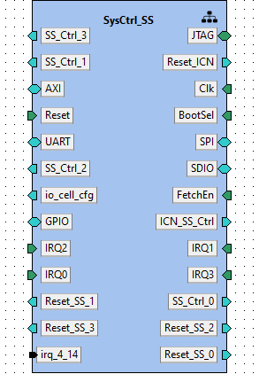

**IP-Xact file:** [SysCtrl_SS.1.0.xml](../ipxact/tuni.fi/subsystem/SysCtrl_SS/1.0/SysCtrl_SS.1.0.xml)  

## 4.1 Kactus2 attributes <a id="tuni.fi:subsystem:SysCtrl_SS:1.0.attributes">  

**Product hierarchy:** Flat  
**Component implementation:** HW  
**Component firmness:** Mutable  

## 4.2 Ports <a id="tuni.fi:subsystem:SysCtrl_SS:1.0.ports">  

|Name|Direction|Left bound|Right bound|Port type|Type definition|Default value|Array left|Array right|Description|  
|:----|:----|:----|:----|:----|:----|:----|:----|:----|:----|  
|jtag_tck_internal <a id="tuni.fi:subsystem:SysCtrl_SS:1.0.port.jtag_tck_internal">|in|||||||||  
|jtag_tdi_internal <a id="tuni.fi:subsystem:SysCtrl_SS:1.0.port.jtag_tdi_internal">|in|||||||||  
|jtag_tdo_internal <a id="tuni.fi:subsystem:SysCtrl_SS:1.0.port.jtag_tdo_internal">|out|||||||||  
|jtag_tms_internal <a id="tuni.fi:subsystem:SysCtrl_SS:1.0.port.jtag_tms_internal">|in|||||||||  
|jtag_trst_internal <a id="tuni.fi:subsystem:SysCtrl_SS:1.0.port.jtag_trst_internal">|in|||||||||  
|ss_ctrl_3 <a id="tuni.fi:subsystem:SysCtrl_SS:1.0.port.ss_ctrl_3">|out|7|0|||||||  
|irq_en_3 <a id="tuni.fi:subsystem:SysCtrl_SS:1.0.port.irq_en_3">|out|||||||||  
|reset_icn <a id="tuni.fi:subsystem:SysCtrl_SS:1.0.port.reset_icn">|out|||||||||  
|ss_ctrl_1 <a id="tuni.fi:subsystem:SysCtrl_SS:1.0.port.ss_ctrl_1">|out|7|0|||||||  
|irq_en_1 <a id="tuni.fi:subsystem:SysCtrl_SS:1.0.port.irq_en_1">|out|||||||||  
|clk_internal <a id="tuni.fi:subsystem:SysCtrl_SS:1.0.port.clk_internal">|in|||||||||  
|AR_ADDR <a id="tuni.fi:subsystem:SysCtrl_SS:1.0.port.AR_ADDR">|out|31|0|||||||  
|AR_BURST <a id="tuni.fi:subsystem:SysCtrl_SS:1.0.port.AR_BURST">|out|1|0|||||||  
|AR_CACHE <a id="tuni.fi:subsystem:SysCtrl_SS:1.0.port.AR_CACHE">|out|3|0|||||||  
|AR_SIZE <a id="tuni.fi:subsystem:SysCtrl_SS:1.0.port.AR_SIZE">|out|2|0|||||||  
|AR_USER <a id="tuni.fi:subsystem:SysCtrl_SS:1.0.port.AR_USER">|out|||||||||  
|AR_VALID <a id="tuni.fi:subsystem:SysCtrl_SS:1.0.port.AR_VALID">|out|||||||||  
|AW_ADDR <a id="tuni.fi:subsystem:SysCtrl_SS:1.0.port.AW_ADDR">|out|31|0|||||||  
|AW_ID <a id="tuni.fi:subsystem:SysCtrl_SS:1.0.port.AW_ID">|out|9|0|||||||  
|AW_LEN <a id="tuni.fi:subsystem:SysCtrl_SS:1.0.port.AW_LEN">|out|7|0|||||||  
|AW_LOCK <a id="tuni.fi:subsystem:SysCtrl_SS:1.0.port.AW_LOCK">|out|||||||||  
|AW_PROT <a id="tuni.fi:subsystem:SysCtrl_SS:1.0.port.AW_PROT">|out|2|0|||||||  
|AR_ID <a id="tuni.fi:subsystem:SysCtrl_SS:1.0.port.AR_ID">|out|9|0|||||||  
|AR_LEN <a id="tuni.fi:subsystem:SysCtrl_SS:1.0.port.AR_LEN">|out|7|0|||||||  
|AR_LOCK <a id="tuni.fi:subsystem:SysCtrl_SS:1.0.port.AR_LOCK">|out|||||||||  
|AR_PROT <a id="tuni.fi:subsystem:SysCtrl_SS:1.0.port.AR_PROT">|out|2|0|||||||  
|AR_QOS <a id="tuni.fi:subsystem:SysCtrl_SS:1.0.port.AR_QOS">|out|3|0|||||||  
|AR_READY <a id="tuni.fi:subsystem:SysCtrl_SS:1.0.port.AR_READY">|in|||||||||  
|AR_REGION <a id="tuni.fi:subsystem:SysCtrl_SS:1.0.port.AR_REGION">|out|2|0|||||||  
|AW_ATOP <a id="tuni.fi:subsystem:SysCtrl_SS:1.0.port.AW_ATOP">|out|5|0|||||||  
|AW_BURST <a id="tuni.fi:subsystem:SysCtrl_SS:1.0.port.AW_BURST">|out|1|0|||||||  
|AW_CACHE <a id="tuni.fi:subsystem:SysCtrl_SS:1.0.port.AW_CACHE">|out|3|0|||||||  
|AW_QOS <a id="tuni.fi:subsystem:SysCtrl_SS:1.0.port.AW_QOS">|out|3|0|||||||  
|AW_READY <a id="tuni.fi:subsystem:SysCtrl_SS:1.0.port.AW_READY">|in|||||||||  
|AW_REGION <a id="tuni.fi:subsystem:SysCtrl_SS:1.0.port.AW_REGION">|out|3|0|||||||  
|B_ID <a id="tuni.fi:subsystem:SysCtrl_SS:1.0.port.B_ID">|in|10|0|||||||  
|B_READY <a id="tuni.fi:subsystem:SysCtrl_SS:1.0.port.B_READY">|out|||||||||  
|B_RESP <a id="tuni.fi:subsystem:SysCtrl_SS:1.0.port.B_RESP">|in|1|0|||||||  
|B_USER <a id="tuni.fi:subsystem:SysCtrl_SS:1.0.port.B_USER">|in|||||||||  
|B_VALID <a id="tuni.fi:subsystem:SysCtrl_SS:1.0.port.B_VALID">|in|||||||||  
|R_DATA <a id="tuni.fi:subsystem:SysCtrl_SS:1.0.port.R_DATA">|in|31|0|||||||  
|R_ID <a id="tuni.fi:subsystem:SysCtrl_SS:1.0.port.R_ID">|in|10|0|||||||  
|R_LAST <a id="tuni.fi:subsystem:SysCtrl_SS:1.0.port.R_LAST">|in|||||||||  
|AW_SIZE <a id="tuni.fi:subsystem:SysCtrl_SS:1.0.port.AW_SIZE">|out|2|0|||||||  
|AW_USER <a id="tuni.fi:subsystem:SysCtrl_SS:1.0.port.AW_USER">|out|||||||||  
|AW_VALID <a id="tuni.fi:subsystem:SysCtrl_SS:1.0.port.AW_VALID">|out|||||||||  
|R_READY <a id="tuni.fi:subsystem:SysCtrl_SS:1.0.port.R_READY">|out|||||||||  
|R_RESP <a id="tuni.fi:subsystem:SysCtrl_SS:1.0.port.R_RESP">|in|1|0|||||||  
|R_USER <a id="tuni.fi:subsystem:SysCtrl_SS:1.0.port.R_USER">|in|||||||||  
|W_DATA <a id="tuni.fi:subsystem:SysCtrl_SS:1.0.port.W_DATA">|out|31|0|||||||  
|W_LAST <a id="tuni.fi:subsystem:SysCtrl_SS:1.0.port.W_LAST">|out|||||||||  
|W_READY <a id="tuni.fi:subsystem:SysCtrl_SS:1.0.port.W_READY">|in|||||||||  
|W_STROBE <a id="tuni.fi:subsystem:SysCtrl_SS:1.0.port.W_STROBE">|out|3|0|||||||  
|W_USER <a id="tuni.fi:subsystem:SysCtrl_SS:1.0.port.W_USER">|out|||||||||  
|W_VALID <a id="tuni.fi:subsystem:SysCtrl_SS:1.0.port.W_VALID">|out|||||||||  
|R_VALID <a id="tuni.fi:subsystem:SysCtrl_SS:1.0.port.R_VALID">|in|||||||||  
|BootSel_internal <a id="tuni.fi:subsystem:SysCtrl_SS:1.0.port.BootSel_internal">|in|||||||||  
|reset_internal <a id="tuni.fi:subsystem:SysCtrl_SS:1.0.port.reset_internal">|in|||||||||  
|spim_csn_internal <a id="tuni.fi:subsystem:SysCtrl_SS:1.0.port.spim_csn_internal">|out|1|0|||||||  
|spim_sck_internal <a id="tuni.fi:subsystem:SysCtrl_SS:1.0.port.spim_sck_internal">|out|||||||||  
|spim_miso_internal <a id="tuni.fi:subsystem:SysCtrl_SS:1.0.port.spim_miso_internal">|in|3|0|||||||  
|spim_mosi_internal <a id="tuni.fi:subsystem:SysCtrl_SS:1.0.port.spim_mosi_internal">|out|3|0|||||||  
|uart_rx_internal <a id="tuni.fi:subsystem:SysCtrl_SS:1.0.port.uart_rx_internal">|in|||||||||  
|uart_tx_internal <a id="tuni.fi:subsystem:SysCtrl_SS:1.0.port.uart_tx_internal">|out|||||||||  
|sdio_clk_internal <a id="tuni.fi:subsystem:SysCtrl_SS:1.0.port.sdio_clk_internal">|out|||||||||  
|sdio_cmd_internal <a id="tuni.fi:subsystem:SysCtrl_SS:1.0.port.sdio_cmd_internal">|out|||||||||  
|sdio_data_i_internal <a id="tuni.fi:subsystem:SysCtrl_SS:1.0.port.sdio_data_i_internal">|in|3|0|||||||  
|sdio_data_o_internal <a id="tuni.fi:subsystem:SysCtrl_SS:1.0.port.sdio_data_o_internal">|out|3|0|||||||  
|ss_ctrl_2 <a id="tuni.fi:subsystem:SysCtrl_SS:1.0.port.ss_ctrl_2">|out|7|0|||||||  
|irq_en_2 <a id="tuni.fi:subsystem:SysCtrl_SS:1.0.port.irq_en_2">|out|||||||||  
|fetchEn_internal <a id="tuni.fi:subsystem:SysCtrl_SS:1.0.port.fetchEn_internal">|in|||||||||  
|cell_cfg <a id="tuni.fi:subsystem:SysCtrl_SS:1.0.port.cell_cfg">|out|49|0|||||||  
|ss_ctrl_icn <a id="tuni.fi:subsystem:SysCtrl_SS:1.0.port.ss_ctrl_icn">|out|7|0|||||||  
|gpio_from_core <a id="tuni.fi:subsystem:SysCtrl_SS:1.0.port.gpio_from_core">|out|3|0|||||||  
|gpio_to_core <a id="tuni.fi:subsystem:SysCtrl_SS:1.0.port.gpio_to_core">|in|3|0|||||||  
|irq_1 <a id="tuni.fi:subsystem:SysCtrl_SS:1.0.port.irq_1">|in|||||||||  
|irq_2 <a id="tuni.fi:subsystem:SysCtrl_SS:1.0.port.irq_2">|in|||||||||  
|irq_3 <a id="tuni.fi:subsystem:SysCtrl_SS:1.0.port.irq_3">|in|||||||||  
|irq_0 <a id="tuni.fi:subsystem:SysCtrl_SS:1.0.port.irq_0">|in|||||||||  
|ss_ctrl_0 <a id="tuni.fi:subsystem:SysCtrl_SS:1.0.port.ss_ctrl_0">|out|7|0|||||||  
|irq_en_0 <a id="tuni.fi:subsystem:SysCtrl_SS:1.0.port.irq_en_0">|out|||||||||  
|reset_ss_0 <a id="tuni.fi:subsystem:SysCtrl_SS:1.0.port.reset_ss_0">|out|0|0|||||||  
|reset_ss_1 <a id="tuni.fi:subsystem:SysCtrl_SS:1.0.port.reset_ss_1">|out|||||||||  
|reset_ss_2 <a id="tuni.fi:subsystem:SysCtrl_SS:1.0.port.reset_ss_2">|out|||||||||  
|reset_ss_3 <a id="tuni.fi:subsystem:SysCtrl_SS:1.0.port.reset_ss_3">|out|||||||||  
|irq_4_14 <a id="tuni.fi:subsystem:SysCtrl_SS:1.0.port.irq_4_14">|in|9|0|||10'h0||||  
## 4.3 Bus interfaces <a id="tuni.fi:subsystem:SysCtrl_SS:1.0.interfaces">  

### 4.3.1 Bus interface JTAG  

**Description:**   
**Interface mode:** target  
**Bus definition:** tuni.fi:interface:JTAG:1.0  
**Abstraction definitions:** tuni.fi:interface:JTAG.absDef:1.0  
**Ports used in this interface:**   

|Name|Direction|Left bound|Right bound|Port type|Type definition|Default value|Array left|Array right|Description|  
|:----|:----|:----|:----|:----|:----|:----|:----|:----|:----|  
|jtag_tck_internal <a id="tuni.fi:subsystem:SysCtrl_SS:1.0.port.jtag_tck_internal">|in|||||||||  
|jtag_tdi_internal <a id="tuni.fi:subsystem:SysCtrl_SS:1.0.port.jtag_tdi_internal">|in|||||||||  
|jtag_tdo_internal <a id="tuni.fi:subsystem:SysCtrl_SS:1.0.port.jtag_tdo_internal">|out|||||||||  
|jtag_tms_internal <a id="tuni.fi:subsystem:SysCtrl_SS:1.0.port.jtag_tms_internal">|in|||||||||  
|jtag_trst_internal <a id="tuni.fi:subsystem:SysCtrl_SS:1.0.port.jtag_trst_internal">|in|||||||||  
### 4.3.2 Bus interface SS_Ctrl_3  

**Description:**   
**Interface mode:** initiator  
**Bus definition:** tuni.fi:interface:SS_Ctrl:1.0  
**Abstraction definitions:** tuni.fi:interface:SS_Ctrl.absDef:1.0  
**Ports used in this interface:**   

|Name|Direction|Left bound|Right bound|Port type|Type definition|Default value|Array left|Array right|Description|  
|:----|:----|:----|:----|:----|:----|:----|:----|:----|:----|  
|ss_ctrl_3 <a id="tuni.fi:subsystem:SysCtrl_SS:1.0.port.ss_ctrl_3">|out|7|0|||||||  
|irq_en_3 <a id="tuni.fi:subsystem:SysCtrl_SS:1.0.port.irq_en_3">|out|||||||||  
### 4.3.3 Bus interface Reset_ICN  

**Description:**   
**Interface mode:** initiator  
**Bus definition:** tuni.fi:interface:reset:1.0  
**Abstraction definitions:** tuni.fi:interface:reset.absDef:1.0  
**Ports used in this interface:**   

|Name|Direction|Left bound|Right bound|Port type|Type definition|Default value|Array left|Array right|Description|  
|:----|:----|:----|:----|:----|:----|:----|:----|:----|:----|  
|reset_icn <a id="tuni.fi:subsystem:SysCtrl_SS:1.0.port.reset_icn">|out|||||||||  
### 4.3.4 Bus interface SS_Ctrl_1  

**Description:**   
**Interface mode:** initiator  
**Bus definition:** tuni.fi:interface:SS_Ctrl:1.0  
**Abstraction definitions:** tuni.fi:interface:SS_Ctrl.absDef:1.0  
**Ports used in this interface:**   

|Name|Direction|Left bound|Right bound|Port type|Type definition|Default value|Array left|Array right|Description|  
|:----|:----|:----|:----|:----|:----|:----|:----|:----|:----|  
|ss_ctrl_1 <a id="tuni.fi:subsystem:SysCtrl_SS:1.0.port.ss_ctrl_1">|out|7|0|||||||  
|irq_en_1 <a id="tuni.fi:subsystem:SysCtrl_SS:1.0.port.irq_en_1">|out|||||||||  
### 4.3.5 Bus interface Clk  

**Description:**   
**Interface mode:** target  
**Bus definition:** tuni.fi:interface:clock:1.0  
**Abstraction definitions:** tuni.fi:interface:clock.absDef:1.0  
**Ports used in this interface:**   

|Name|Direction|Left bound|Right bound|Port type|Type definition|Default value|Array left|Array right|Description|  
|:----|:----|:----|:----|:----|:----|:----|:----|:----|:----|  
|clk_internal <a id="tuni.fi:subsystem:SysCtrl_SS:1.0.port.clk_internal">|in|||||||||  
### 4.3.6 Bus interface AXI  

**Description:**   
**Interface mode:** initiator  
**Bus definition:** tuni.fi:interface:AXI4:1.0  
**Abstraction definitions:** tuni.fi:interface:AXI4.absDef:1.0  
**Ports used in this interface:**   

|Name|Direction|Left bound|Right bound|Port type|Type definition|Default value|Array left|Array right|Description|  
|:----|:----|:----|:----|:----|:----|:----|:----|:----|:----|  
|AR_ADDR <a id="tuni.fi:subsystem:SysCtrl_SS:1.0.port.AR_ADDR">|out|31|0|||||||  
|AR_BURST <a id="tuni.fi:subsystem:SysCtrl_SS:1.0.port.AR_BURST">|out|1|0|||||||  
|AR_CACHE <a id="tuni.fi:subsystem:SysCtrl_SS:1.0.port.AR_CACHE">|out|3|0|||||||  
|AR_SIZE <a id="tuni.fi:subsystem:SysCtrl_SS:1.0.port.AR_SIZE">|out|2|0|||||||  
|AR_USER <a id="tuni.fi:subsystem:SysCtrl_SS:1.0.port.AR_USER">|out|||||||||  
|AR_VALID <a id="tuni.fi:subsystem:SysCtrl_SS:1.0.port.AR_VALID">|out|||||||||  
|AW_ADDR <a id="tuni.fi:subsystem:SysCtrl_SS:1.0.port.AW_ADDR">|out|31|0|||||||  
|AW_ID <a id="tuni.fi:subsystem:SysCtrl_SS:1.0.port.AW_ID">|out|9|0|||||||  
|AW_LEN <a id="tuni.fi:subsystem:SysCtrl_SS:1.0.port.AW_LEN">|out|7|0|||||||  
|AW_LOCK <a id="tuni.fi:subsystem:SysCtrl_SS:1.0.port.AW_LOCK">|out|||||||||  
|AW_PROT <a id="tuni.fi:subsystem:SysCtrl_SS:1.0.port.AW_PROT">|out|2|0|||||||  
|AR_ID <a id="tuni.fi:subsystem:SysCtrl_SS:1.0.port.AR_ID">|out|9|0|||||||  
|AR_LEN <a id="tuni.fi:subsystem:SysCtrl_SS:1.0.port.AR_LEN">|out|7|0|||||||  
|AR_LOCK <a id="tuni.fi:subsystem:SysCtrl_SS:1.0.port.AR_LOCK">|out|||||||||  
|AR_PROT <a id="tuni.fi:subsystem:SysCtrl_SS:1.0.port.AR_PROT">|out|2|0|||||||  
|AR_QOS <a id="tuni.fi:subsystem:SysCtrl_SS:1.0.port.AR_QOS">|out|3|0|||||||  
|AR_READY <a id="tuni.fi:subsystem:SysCtrl_SS:1.0.port.AR_READY">|in|||||||||  
|AR_REGION <a id="tuni.fi:subsystem:SysCtrl_SS:1.0.port.AR_REGION">|out|2|0|||||||  
|AW_ATOP <a id="tuni.fi:subsystem:SysCtrl_SS:1.0.port.AW_ATOP">|out|5|0|||||||  
|AW_BURST <a id="tuni.fi:subsystem:SysCtrl_SS:1.0.port.AW_BURST">|out|1|0|||||||  
|AW_CACHE <a id="tuni.fi:subsystem:SysCtrl_SS:1.0.port.AW_CACHE">|out|3|0|||||||  
|AW_QOS <a id="tuni.fi:subsystem:SysCtrl_SS:1.0.port.AW_QOS">|out|3|0|||||||  
|AW_READY <a id="tuni.fi:subsystem:SysCtrl_SS:1.0.port.AW_READY">|in|||||||||  
|AW_REGION <a id="tuni.fi:subsystem:SysCtrl_SS:1.0.port.AW_REGION">|out|3|0|||||||  
|B_ID <a id="tuni.fi:subsystem:SysCtrl_SS:1.0.port.B_ID">|in|10|0|||||||  
|B_READY <a id="tuni.fi:subsystem:SysCtrl_SS:1.0.port.B_READY">|out|||||||||  
|B_RESP <a id="tuni.fi:subsystem:SysCtrl_SS:1.0.port.B_RESP">|in|1|0|||||||  
|B_USER <a id="tuni.fi:subsystem:SysCtrl_SS:1.0.port.B_USER">|in|||||||||  
|B_VALID <a id="tuni.fi:subsystem:SysCtrl_SS:1.0.port.B_VALID">|in|||||||||  
|R_DATA <a id="tuni.fi:subsystem:SysCtrl_SS:1.0.port.R_DATA">|in|31|0|||||||  
|R_ID <a id="tuni.fi:subsystem:SysCtrl_SS:1.0.port.R_ID">|in|10|0|||||||  
|R_LAST <a id="tuni.fi:subsystem:SysCtrl_SS:1.0.port.R_LAST">|in|||||||||  
|AW_SIZE <a id="tuni.fi:subsystem:SysCtrl_SS:1.0.port.AW_SIZE">|out|2|0|||||||  
|AW_USER <a id="tuni.fi:subsystem:SysCtrl_SS:1.0.port.AW_USER">|out|||||||||  
|AW_VALID <a id="tuni.fi:subsystem:SysCtrl_SS:1.0.port.AW_VALID">|out|||||||||  
|R_READY <a id="tuni.fi:subsystem:SysCtrl_SS:1.0.port.R_READY">|out|||||||||  
|R_RESP <a id="tuni.fi:subsystem:SysCtrl_SS:1.0.port.R_RESP">|in|1|0|||||||  
|R_USER <a id="tuni.fi:subsystem:SysCtrl_SS:1.0.port.R_USER">|in|||||||||  
|W_DATA <a id="tuni.fi:subsystem:SysCtrl_SS:1.0.port.W_DATA">|out|31|0|||||||  
|W_LAST <a id="tuni.fi:subsystem:SysCtrl_SS:1.0.port.W_LAST">|out|||||||||  
|W_READY <a id="tuni.fi:subsystem:SysCtrl_SS:1.0.port.W_READY">|in|||||||||  
|W_STROBE <a id="tuni.fi:subsystem:SysCtrl_SS:1.0.port.W_STROBE">|out|3|0|||||||  
|W_USER <a id="tuni.fi:subsystem:SysCtrl_SS:1.0.port.W_USER">|out|||||||||  
|W_VALID <a id="tuni.fi:subsystem:SysCtrl_SS:1.0.port.W_VALID">|out|||||||||  
|R_VALID <a id="tuni.fi:subsystem:SysCtrl_SS:1.0.port.R_VALID">|in|||||||||  
### 4.3.7 Bus interface BootSel  

**Description:**   
**Interface mode:** target  
**Bus definition:** tuni.fi:interface:GPIO:1.0  
**Abstraction definitions:** tuni.fi:interface:GPIO.absDef:1.0  
**Ports used in this interface:**   

|Name|Direction|Left bound|Right bound|Port type|Type definition|Default value|Array left|Array right|Description|  
|:----|:----|:----|:----|:----|:----|:----|:----|:----|:----|  
|BootSel_internal <a id="tuni.fi:subsystem:SysCtrl_SS:1.0.port.BootSel_internal">|in|||||||||  
### 4.3.8 Bus interface Reset  

**Description:**   
**Interface mode:** target  
**Bus definition:** tuni.fi:interface:reset:1.0  
**Abstraction definitions:** tuni.fi:interface:reset.absDef:1.0  
**Ports used in this interface:**   

|Name|Direction|Left bound|Right bound|Port type|Type definition|Default value|Array left|Array right|Description|  
|:----|:----|:----|:----|:----|:----|:----|:----|:----|:----|  
|reset_internal <a id="tuni.fi:subsystem:SysCtrl_SS:1.0.port.reset_internal">|in|||||||||  
### 4.3.9 Bus interface SPI  

**Description:**   
**Interface mode:** initiator  
**Bus definition:** tuni.fi:interface:SPI:1.0  
**Abstraction definitions:** tuni.fi:interface:SPI.absDef:1.0  
**Ports used in this interface:**   

|Name|Direction|Left bound|Right bound|Port type|Type definition|Default value|Array left|Array right|Description|  
|:----|:----|:----|:----|:----|:----|:----|:----|:----|:----|  
|spim_csn_internal <a id="tuni.fi:subsystem:SysCtrl_SS:1.0.port.spim_csn_internal">|out|1|0|||||||  
|spim_sck_internal <a id="tuni.fi:subsystem:SysCtrl_SS:1.0.port.spim_sck_internal">|out|||||||||  
|spim_miso_internal <a id="tuni.fi:subsystem:SysCtrl_SS:1.0.port.spim_miso_internal">|in|3|0|||||||  
|spim_mosi_internal <a id="tuni.fi:subsystem:SysCtrl_SS:1.0.port.spim_mosi_internal">|out|3|0|||||||  
### 4.3.10 Bus interface UART  

**Description:**   
**Interface mode:** initiator  
**Bus definition:** tuni.fi:interface:UART:1.0  
**Abstraction definitions:** tuni.fi:interface:UART.absDef:1.0  
**Ports used in this interface:**   

|Name|Direction|Left bound|Right bound|Port type|Type definition|Default value|Array left|Array right|Description|  
|:----|:----|:----|:----|:----|:----|:----|:----|:----|:----|  
|uart_rx_internal <a id="tuni.fi:subsystem:SysCtrl_SS:1.0.port.uart_rx_internal">|in|||||||||  
|uart_tx_internal <a id="tuni.fi:subsystem:SysCtrl_SS:1.0.port.uart_tx_internal">|out|||||||||  
### 4.3.11 Bus interface SDIO  

**Description:**   
**Interface mode:** initiator  
**Bus definition:** tuni.fi:interface:SDIO:1.0  
**Abstraction definitions:** tuni.fi:interface:SDIO.absDef:1.0  
**Ports used in this interface:**   

|Name|Direction|Left bound|Right bound|Port type|Type definition|Default value|Array left|Array right|Description|  
|:----|:----|:----|:----|:----|:----|:----|:----|:----|:----|  
|sdio_clk_internal <a id="tuni.fi:subsystem:SysCtrl_SS:1.0.port.sdio_clk_internal">|out|||||||||  
|sdio_cmd_internal <a id="tuni.fi:subsystem:SysCtrl_SS:1.0.port.sdio_cmd_internal">|out|||||||||  
|sdio_data_i_internal <a id="tuni.fi:subsystem:SysCtrl_SS:1.0.port.sdio_data_i_internal">|in|3|0|||||||  
|sdio_data_o_internal <a id="tuni.fi:subsystem:SysCtrl_SS:1.0.port.sdio_data_o_internal">|out|3|0|||||||  
### 4.3.12 Bus interface SS_Ctrl_2  

**Description:**   
**Interface mode:** initiator  
**Bus definition:** tuni.fi:interface:SS_Ctrl:1.0  
**Abstraction definitions:** tuni.fi:interface:SS_Ctrl.absDef:1.0  
**Ports used in this interface:**   

|Name|Direction|Left bound|Right bound|Port type|Type definition|Default value|Array left|Array right|Description|  
|:----|:----|:----|:----|:----|:----|:----|:----|:----|:----|  
|ss_ctrl_2 <a id="tuni.fi:subsystem:SysCtrl_SS:1.0.port.ss_ctrl_2">|out|7|0|||||||  
|irq_en_2 <a id="tuni.fi:subsystem:SysCtrl_SS:1.0.port.irq_en_2">|out|||||||||  
### 4.3.13 Bus interface FetchEn  

**Description:**   
**Interface mode:** target  
**Bus definition:** tuni.fi:interface:GPIO:1.0  
**Abstraction definitions:** tuni.fi:interface:GPIO.absDef:1.0  
**Ports used in this interface:**   

|Name|Direction|Left bound|Right bound|Port type|Type definition|Default value|Array left|Array right|Description|  
|:----|:----|:----|:----|:----|:----|:----|:----|:----|:----|  
|fetchEn_internal <a id="tuni.fi:subsystem:SysCtrl_SS:1.0.port.fetchEn_internal">|in|||||||||  
### 4.3.14 Bus interface io_cell_cfg  

**Description:**   
**Interface mode:** initiator  
**Bus definition:** tuni.fi:interface:io_cell_cfg:1.0  
**Abstraction definitions:** tuni.fi:interface:io_cell_cfg.absDef:1.0  
**Ports used in this interface:**   

|Name|Direction|Left bound|Right bound|Port type|Type definition|Default value|Array left|Array right|Description|  
|:----|:----|:----|:----|:----|:----|:----|:----|:----|:----|  
|cell_cfg <a id="tuni.fi:subsystem:SysCtrl_SS:1.0.port.cell_cfg">|out|49|0|||||||  
### 4.3.15 Bus interface ICN_SS_Ctrl  

**Description:**   
**Interface mode:** initiator  
**Bus definition:** tuni.fi:interface:SS_Ctrl:1.0  
**Abstraction definitions:** tuni.fi:interface:SS_Ctrl.absDef:1.0  
**Ports used in this interface:**   

|Name|Direction|Left bound|Right bound|Port type|Type definition|Default value|Array left|Array right|Description|  
|:----|:----|:----|:----|:----|:----|:----|:----|:----|:----|  
|ss_ctrl_icn <a id="tuni.fi:subsystem:SysCtrl_SS:1.0.port.ss_ctrl_icn">|out|7|0|||||||  
### 4.3.16 Bus interface GPIO  

**Description:**   
**Interface mode:** initiator  
**Bus definition:** tuni.fi:interface:GPIO:1.0  
**Abstraction definitions:** tuni.fi:interface:GPIO.absDef:1.0  
**Ports used in this interface:**   

|Name|Direction|Left bound|Right bound|Port type|Type definition|Default value|Array left|Array right|Description|  
|:----|:----|:----|:----|:----|:----|:----|:----|:----|:----|  
|gpio_from_core <a id="tuni.fi:subsystem:SysCtrl_SS:1.0.port.gpio_from_core">|out|3|0|||||||  
|gpio_to_core <a id="tuni.fi:subsystem:SysCtrl_SS:1.0.port.gpio_to_core">|in|3|0|||||||  
### 4.3.17 Bus interface IRQ1  

**Description:**   
**Interface mode:** target  
**Bus definition:** tuni.fi:interface:IRQ:1.0  
**Abstraction definitions:** tuni.fi:interface:IRQ.absDef:1.0  
**Ports used in this interface:**   

|Name|Direction|Left bound|Right bound|Port type|Type definition|Default value|Array left|Array right|Description|  
|:----|:----|:----|:----|:----|:----|:----|:----|:----|:----|  
|irq_1 <a id="tuni.fi:subsystem:SysCtrl_SS:1.0.port.irq_1">|in|||||||||  
### 4.3.18 Bus interface IRQ2  

**Description:**   
**Interface mode:** target  
**Bus definition:** tuni.fi:interface:IRQ:1.0  
**Abstraction definitions:** tuni.fi:interface:IRQ.absDef:1.0  
**Ports used in this interface:**   

|Name|Direction|Left bound|Right bound|Port type|Type definition|Default value|Array left|Array right|Description|  
|:----|:----|:----|:----|:----|:----|:----|:----|:----|:----|  
|irq_2 <a id="tuni.fi:subsystem:SysCtrl_SS:1.0.port.irq_2">|in|||||||||  
### 4.3.19 Bus interface IRQ3  

**Description:**   
**Interface mode:** target  
**Bus definition:** tuni.fi:interface:IRQ:1.0  
**Abstraction definitions:** tuni.fi:interface:IRQ.absDef:1.0  
**Ports used in this interface:**   

|Name|Direction|Left bound|Right bound|Port type|Type definition|Default value|Array left|Array right|Description|  
|:----|:----|:----|:----|:----|:----|:----|:----|:----|:----|  
|irq_3 <a id="tuni.fi:subsystem:SysCtrl_SS:1.0.port.irq_3">|in|||||||||  
### 4.3.20 Bus interface IRQ0  

**Description:**   
**Interface mode:** target  
**Bus definition:** tuni.fi:interface:IRQ:1.0  
**Abstraction definitions:** tuni.fi:interface:IRQ.absDef:1.0  
**Ports used in this interface:**   

|Name|Direction|Left bound|Right bound|Port type|Type definition|Default value|Array left|Array right|Description|  
|:----|:----|:----|:----|:----|:----|:----|:----|:----|:----|  
|irq_0 <a id="tuni.fi:subsystem:SysCtrl_SS:1.0.port.irq_0">|in|||||||||  
### 4.3.21 Bus interface SS_Ctrl_0  

**Description:**   
**Interface mode:** initiator  
**Bus definition:** tuni.fi:interface:SS_Ctrl:1.0  
**Abstraction definitions:** tuni.fi:interface:SS_Ctrl.absDef:1.0  
**Ports used in this interface:**   

|Name|Direction|Left bound|Right bound|Port type|Type definition|Default value|Array left|Array right|Description|  
|:----|:----|:----|:----|:----|:----|:----|:----|:----|:----|  
|ss_ctrl_0 <a id="tuni.fi:subsystem:SysCtrl_SS:1.0.port.ss_ctrl_0">|out|7|0|||||||  
|irq_en_0 <a id="tuni.fi:subsystem:SysCtrl_SS:1.0.port.irq_en_0">|out|||||||||  
### 4.3.22 Bus interface Reset_SS_1  

**Description:**   
**Interface mode:** initiator  
**Bus definition:** tuni.fi:interface:reset:1.0  
**Abstraction definitions:** tuni.fi:interface:reset.absDef:1.0  
**Ports used in this interface:**   

|Name|Direction|Left bound|Right bound|Port type|Type definition|Default value|Array left|Array right|Description|  
|:----|:----|:----|:----|:----|:----|:----|:----|:----|:----|  
|reset_ss_1 <a id="tuni.fi:subsystem:SysCtrl_SS:1.0.port.reset_ss_1">|out|||||||||  
### 4.3.23 Bus interface Reset_SS_2  

**Description:**   
**Interface mode:** initiator  
**Bus definition:** tuni.fi:interface:reset:1.0  
**Abstraction definitions:** tuni.fi:interface:reset.absDef:1.0  
**Ports used in this interface:**   

|Name|Direction|Left bound|Right bound|Port type|Type definition|Default value|Array left|Array right|Description|  
|:----|:----|:----|:----|:----|:----|:----|:----|:----|:----|  
|reset_ss_2 <a id="tuni.fi:subsystem:SysCtrl_SS:1.0.port.reset_ss_2">|out|||||||||  
### 4.3.24 Bus interface Reset_SS_3  

**Description:**   
**Interface mode:** initiator  
**Bus definition:** tuni.fi:interface:reset:1.0  
**Abstraction definitions:** tuni.fi:interface:reset.absDef:1.0  
**Ports used in this interface:**   

|Name|Direction|Left bound|Right bound|Port type|Type definition|Default value|Array left|Array right|Description|  
|:----|:----|:----|:----|:----|:----|:----|:----|:----|:----|  
|reset_ss_3 <a id="tuni.fi:subsystem:SysCtrl_SS:1.0.port.reset_ss_3">|out|||||||||  
### 4.3.25 Bus interface Reset_SS_0  

**Description:**   
**Interface mode:** initiator  
**Bus definition:** tuni.fi:interface:reset:1.0  
**Abstraction definitions:** tuni.fi:interface:reset.absDef:1.0  
**Ports used in this interface:**   

|Name|Direction|Left bound|Right bound|Port type|Type definition|Default value|Array left|Array right|Description|  
|:----|:----|:----|:----|:----|:----|:----|:----|:----|:----|  
|reset_ss_0 <a id="tuni.fi:subsystem:SysCtrl_SS:1.0.port.reset_ss_0">|out|0|0|||||||  
## 4.4 Views <a id="tuni.fi:subsystem:SysCtrl_SS:1.0.views">  

### 4.4.1 View: hierarchical  

#### 4.4.1.1 Design configuration instantiation: _design_configuration  

**Design configuration:** tuni.fi:subsystem:SysCtrl_SS.designcfg:1.0  
**IP-Xact file:** [SysCtrl_SS.designcfg.1.0.xml](../ipxact/tuni.fi/subsystem/SysCtrl_SS/1.0/SysCtrl_SS.designcfg.1.0.xml)  
Diagram of design tuni.fi:subsystem:SysCtrl_SS.design:1.0:  
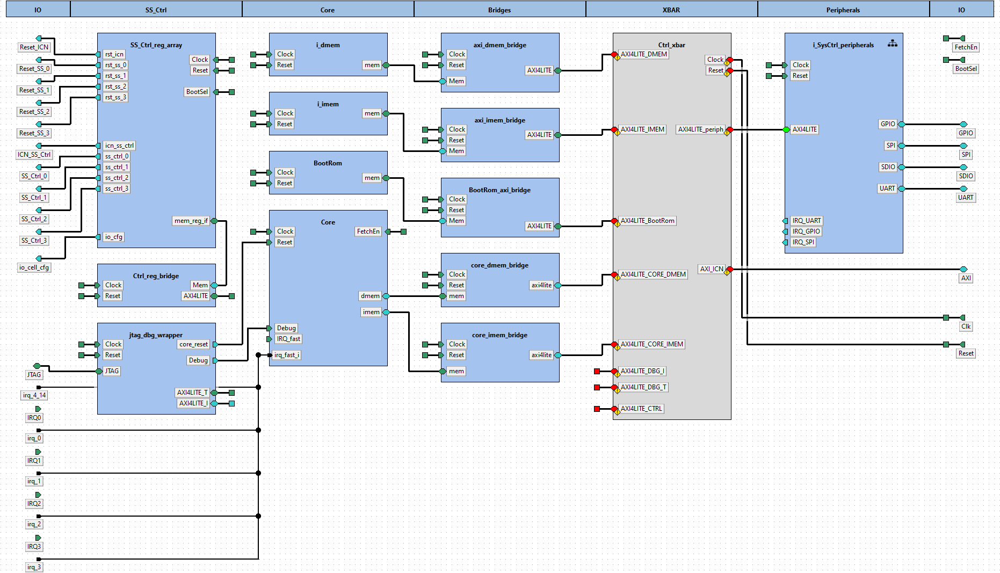  

Component instances within design tuni.fi:subsystem:SysCtrl_SS.design:1.0:  

|Instance name|Component type|Configurable values|Active view|Description|  
|:----|:----|:----|:----|:----|  
|i_dmem|[tuni.fi - memory.simulation - sp_sram - 1.0](#tuni.fi:memory.simulation:sp_sram:1.0)|||  
|core_imem_bridge|[tuni.fi - lowRISC - ibex_axi_bridge - 1.0](#tuni.fi:lowRISC:ibex_axi_bridge:1.0)|||  
|Ctrl_xbar|[ -  -  - ](#:::)|||  
|i_SysCtrl_peripherals|[tuni.fi - ip - SysCtrl_peripherals - 1.0](#tuni.fi:ip:SysCtrl_peripherals:1.0)|||  
|jtag_dbg_wrapper|[tuni.fi - ip - jtag_dbg_wrapper - 1.0](#tuni.fi:ip:jtag_dbg_wrapper:1.0)|||  
|axi_dmem_bridge|[tuni.fi - ip - mem_axi_bridge - 1.0](#tuni.fi:ip:mem_axi_bridge:1.0)|||  
|BootRom|[tuni.fi - ip - BootRom - 1.0](#tuni.fi:ip:BootRom:1.0)|||  
|SS_Ctrl_reg_array|[tuni.fi - ip - SS_Ctrl_reg_array - 1.0](#tuni.fi:ip:SS_Ctrl_reg_array:1.0)|||  
|Core|[tuni.fi - lowRISC - ibex - 1.0](#tuni.fi:lowRISC:ibex:1.0)|||  
|core_dmem_bridge|[tuni.fi - lowRISC - ibex_axi_bridge - 1.0](#tuni.fi:lowRISC:ibex_axi_bridge:1.0)|||  
|i_imem|[tuni.fi - memory.simulation - sp_sram - 1.0](#tuni.fi:memory.simulation:sp_sram:1.0)|||  
|axi_imem_bridge|[tuni.fi - ip - mem_axi_bridge - 1.0](#tuni.fi:ip:mem_axi_bridge:1.0)|||  
|BootRom_axi_bridge|[tuni.fi - ip - mem_axi_bridge - 1.0](#tuni.fi:ip:mem_axi_bridge:1.0)|||  
|Ctrl_reg_bridge|[tuni.fi - ip - mem_axi_bridge - 1.0](#tuni.fi:ip:mem_axi_bridge:1.0)|||  
# 5. Component tuni.fi:memory.simulation:sp_sram:1.0<a id="tuni.fi:memory.simulation:sp_sram:1.0">  

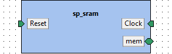

**IP-Xact file:** [sp_sram.1.0.xml](../ipxact/tuni.fi/memory.simulation/sp_sram/1.0/sp_sram.1.0.xml)  

## 5.1 Kactus2 attributes <a id="tuni.fi:memory.simulation:sp_sram:1.0.attributes">  

**Product hierarchy:** Flat  
**Component implementation:** HW  
**Component firmness:** Mutable  

## 5.2 General parameters <a id="tuni.fi:memory.simulation:sp_sram:1.0.parameters">  

|Name|Type|Value|Resolve|Bit vector left|Bit vector right|Array left|Array right|Description|  
|:----|:----|:----|:----|:----|:----|:----|:----|:----|  
|CONNECTED_AW||32|||||||  
|DATA_WIDTH||32|||||||  
|NUM_WORDS||1024|||||||  
## 5.3 Memory maps <a id="tuni.fi:memory.simulation:sp_sram:1.0.memoryMaps">  

### 5.3.1 Memory map sram  

**Address unit bits (AUB):** 8  

### 5.3.1.1 Address block ram  

**Description:**   
**Usage:** memory  
**Base address [AUB]:** 'h0  
**Range [AUB]:** NUM_WORDS*4  
**Width [AUB]:** DATA_WIDTH  
**Access:**   
**Volatile:**   

## 5.4 Ports <a id="tuni.fi:memory.simulation:sp_sram:1.0.ports">  

|Name|Direction|Left bound|Right bound|Port type|Type definition|Default value|Array left|Array right|Description|  
|:----|:----|:----|:----|:----|:----|:----|:----|:----|:----|  
|clk_i <a id="tuni.fi:memory.simulation:sp_sram:1.0.port.clk_i">|in|||logic||||||  
|rst_ni <a id="tuni.fi:memory.simulation:sp_sram:1.0.port.rst_ni">|in|||logic||||||  
|req_i <a id="tuni.fi:memory.simulation:sp_sram:1.0.port.req_i">|in|||logic||||||  
|we_i <a id="tuni.fi:memory.simulation:sp_sram:1.0.port.we_i">|in|||logic||||||  
|addr_i <a id="tuni.fi:memory.simulation:sp_sram:1.0.port.addr_i">|in|CONNECTED_AW-1|0|logic||||||  
|be_i <a id="tuni.fi:memory.simulation:sp_sram:1.0.port.be_i">|in|(DATA_WIDTH+7)/8-1|0|logic||||||  
|rdata_o <a id="tuni.fi:memory.simulation:sp_sram:1.0.port.rdata_o">|out|DATA_WIDTH-1|0|logic||||||  
## 5.5 Bus interfaces <a id="tuni.fi:memory.simulation:sp_sram:1.0.interfaces">  

### 5.5.1 Bus interface Clock  

**Description:**   
**Interface mode:** target  
**Bus definition:** tuni.fi:interface:clock:1.0  
**Abstraction definitions:** tuni.fi:interface:clock.absDef:1.0  
**Ports used in this interface:**   

|Name|Direction|Left bound|Right bound|Port type|Type definition|Default value|Array left|Array right|Description|  
|:----|:----|:----|:----|:----|:----|:----|:----|:----|:----|  
|clk_i <a id="tuni.fi:memory.simulation:sp_sram:1.0.port.clk_i">|in|||logic||||||  
### 5.5.2 Bus interface Reset  

**Description:**   
**Interface mode:** target  
**Bus definition:** tuni.fi:interface:reset:1.0  
**Abstraction definitions:** tuni.fi:interface:reset.absDef:1.0  
**Ports used in this interface:**   

|Name|Direction|Left bound|Right bound|Port type|Type definition|Default value|Array left|Array right|Description|  
|:----|:----|:----|:----|:----|:----|:----|:----|:----|:----|  
|rst_ni <a id="tuni.fi:memory.simulation:sp_sram:1.0.port.rst_ni">|in|||logic||||||  
### 5.5.3 Bus interface mem  

**Description:**   
**Interface mode:** target  
**Bus definition:** tuni.fi:interface:generic.memory:1.0  
**Abstraction definitions:** tuni.fi:interface:generic.memory.absDef:1.0  
**Ports used in this interface:**   

|Name|Direction|Left bound|Right bound|Port type|Type definition|Default value|Array left|Array right|Description|  
|:----|:----|:----|:----|:----|:----|:----|:----|:----|:----|  
|req_i <a id="tuni.fi:memory.simulation:sp_sram:1.0.port.req_i">|in|||logic||||||  
|we_i <a id="tuni.fi:memory.simulation:sp_sram:1.0.port.we_i">|in|||logic||||||  
|addr_i <a id="tuni.fi:memory.simulation:sp_sram:1.0.port.addr_i">|in|CONNECTED_AW-1|0|logic||||||  
|be_i <a id="tuni.fi:memory.simulation:sp_sram:1.0.port.be_i">|in|(DATA_WIDTH+7)/8-1|0|logic||||||  
|rdata_o <a id="tuni.fi:memory.simulation:sp_sram:1.0.port.rdata_o">|out|DATA_WIDTH-1|0|logic||||||  
# 6. Component tuni.fi:lowRISC:ibex_axi_bridge:1.0<a id="tuni.fi:lowRISC:ibex_axi_bridge:1.0">  

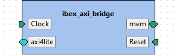

**IP-Xact file:** [ibex_axi_bridge.1.0.xml](../ipxact/tuni.fi/lowRISC/ibex_axi_bridge/1.0/ibex_axi_bridge.1.0.xml)  

## 6.1 Kactus2 attributes <a id="tuni.fi:lowRISC:ibex_axi_bridge:1.0.attributes">  

**Product hierarchy:** Flat  
**Component implementation:** HW  
**Component firmness:** Mutable  

## 6.2 General parameters <a id="tuni.fi:lowRISC:ibex_axi_bridge:1.0.parameters">  

|Name|Type|Value|Resolve|Bit vector left|Bit vector right|Array left|Array right|Description|  
|:----|:----|:----|:----|:----|:----|:----|:----|:----|  
|AXI_DW||32|||||||  
|AXI_AW||32|||||||  
|IBEX_AW||32|||||||  
|IBEX_DW||32|||||||  
## 6.3 Ports <a id="tuni.fi:lowRISC:ibex_axi_bridge:1.0.ports">  

|Name|Direction|Left bound|Right bound|Port type|Type definition|Default value|Array left|Array right|Description|  
|:----|:----|:----|:----|:----|:----|:----|:----|:----|:----|  
|addr_i <a id="tuni.fi:lowRISC:ibex_axi_bridge:1.0.port.addr_i">|in|IBEX_AW-1|0|logic||||||  
|be_i <a id="tuni.fi:lowRISC:ibex_axi_bridge:1.0.port.be_i">|in|3|0|logic||||||  
|err_o <a id="tuni.fi:lowRISC:ibex_axi_bridge:1.0.port.err_o">|out|||logic||||||  
|gnt_o <a id="tuni.fi:lowRISC:ibex_axi_bridge:1.0.port.gnt_o">|out|||logic||||||  
|rdata_o <a id="tuni.fi:lowRISC:ibex_axi_bridge:1.0.port.rdata_o">|out|IBEX_DW-1|0|logic||||||  
|req_i <a id="tuni.fi:lowRISC:ibex_axi_bridge:1.0.port.req_i">|in|||logic||||||  
|rvalid_o <a id="tuni.fi:lowRISC:ibex_axi_bridge:1.0.port.rvalid_o">|out|||logic||||||  
|wdata_i <a id="tuni.fi:lowRISC:ibex_axi_bridge:1.0.port.wdata_i">|in|IBEX_DW-1|0|logic||||||  
|we_i <a id="tuni.fi:lowRISC:ibex_axi_bridge:1.0.port.we_i">|in|||logic||||||  
|clk_i <a id="tuni.fi:lowRISC:ibex_axi_bridge:1.0.port.clk_i">|in|||logic||||||  
|rst_ni <a id="tuni.fi:lowRISC:ibex_axi_bridge:1.0.port.rst_ni">|in|||logic||||||  
|aw_addr_i <a id="tuni.fi:lowRISC:ibex_axi_bridge:1.0.port.aw_addr_i">|out|AXI_AW-1|0|logic||||||  
|aw_valid_i <a id="tuni.fi:lowRISC:ibex_axi_bridge:1.0.port.aw_valid_i">|out|||logic||||||  
|aw_ready_o <a id="tuni.fi:lowRISC:ibex_axi_bridge:1.0.port.aw_ready_o">|in|||logic||||||  
|w_data_i <a id="tuni.fi:lowRISC:ibex_axi_bridge:1.0.port.w_data_i">|out|AXI_DW-1|0|logic||||||  
|w_strb_i <a id="tuni.fi:lowRISC:ibex_axi_bridge:1.0.port.w_strb_i">|out|(AXI_DW/8)-1|0|logic||||||  
|w_valid_i <a id="tuni.fi:lowRISC:ibex_axi_bridge:1.0.port.w_valid_i">|out|||logic||||||  
|w_ready_o <a id="tuni.fi:lowRISC:ibex_axi_bridge:1.0.port.w_ready_o">|in|||logic||||||  
|b_resp_o <a id="tuni.fi:lowRISC:ibex_axi_bridge:1.0.port.b_resp_o">|in|1|0|logic||||||  
|b_valid_o <a id="tuni.fi:lowRISC:ibex_axi_bridge:1.0.port.b_valid_o">|in|||logic||||||  
|b_ready_i <a id="tuni.fi:lowRISC:ibex_axi_bridge:1.0.port.b_ready_i">|out|||logic||||||  
|ar_addr_i <a id="tuni.fi:lowRISC:ibex_axi_bridge:1.0.port.ar_addr_i">|out|AXI_AW-1|0|logic||||||  
|ar_valid_i <a id="tuni.fi:lowRISC:ibex_axi_bridge:1.0.port.ar_valid_i">|out|||logic||||||  
|ar_ready_o <a id="tuni.fi:lowRISC:ibex_axi_bridge:1.0.port.ar_ready_o">|in|||logic||||||  
|r_data_o <a id="tuni.fi:lowRISC:ibex_axi_bridge:1.0.port.r_data_o">|in|AXI_DW-1|0|logic||||||  
|r_resp_o <a id="tuni.fi:lowRISC:ibex_axi_bridge:1.0.port.r_resp_o">|in|1|0|logic||||||  
|r_valid_o <a id="tuni.fi:lowRISC:ibex_axi_bridge:1.0.port.r_valid_o">|in|||logic||||||  
|r_ready_i <a id="tuni.fi:lowRISC:ibex_axi_bridge:1.0.port.r_ready_i">|out|||logic||||||  
## 6.4 Bus interfaces <a id="tuni.fi:lowRISC:ibex_axi_bridge:1.0.interfaces">  

### 6.4.1 Bus interface mem  

**Description:**   
**Interface mode:** target  
**Bus definition:** tuni.fi:interface:ibex.memory:1.0  
**Abstraction definitions:** tuni.fi:interface:ibex.memory.absDef:1.0  
**Ports used in this interface:**   

|Name|Direction|Left bound|Right bound|Port type|Type definition|Default value|Array left|Array right|Description|  
|:----|:----|:----|:----|:----|:----|:----|:----|:----|:----|  
|addr_i <a id="tuni.fi:lowRISC:ibex_axi_bridge:1.0.port.addr_i">|in|IBEX_AW-1|0|logic||||||  
|be_i <a id="tuni.fi:lowRISC:ibex_axi_bridge:1.0.port.be_i">|in|3|0|logic||||||  
|err_o <a id="tuni.fi:lowRISC:ibex_axi_bridge:1.0.port.err_o">|out|||logic||||||  
|gnt_o <a id="tuni.fi:lowRISC:ibex_axi_bridge:1.0.port.gnt_o">|out|||logic||||||  
|rdata_o <a id="tuni.fi:lowRISC:ibex_axi_bridge:1.0.port.rdata_o">|out|IBEX_DW-1|0|logic||||||  
|req_i <a id="tuni.fi:lowRISC:ibex_axi_bridge:1.0.port.req_i">|in|||logic||||||  
|rvalid_o <a id="tuni.fi:lowRISC:ibex_axi_bridge:1.0.port.rvalid_o">|out|||logic||||||  
|wdata_i <a id="tuni.fi:lowRISC:ibex_axi_bridge:1.0.port.wdata_i">|in|IBEX_DW-1|0|logic||||||  
|we_i <a id="tuni.fi:lowRISC:ibex_axi_bridge:1.0.port.we_i">|in|||logic||||||  
### 6.4.2 Bus interface Clock  

**Description:**   
**Interface mode:** target  
**Bus definition:** tuni.fi:interface:clock:1.0  
**Abstraction definitions:** tuni.fi:interface:clock.absDef:1.0  
**Ports used in this interface:**   

|Name|Direction|Left bound|Right bound|Port type|Type definition|Default value|Array left|Array right|Description|  
|:----|:----|:----|:----|:----|:----|:----|:----|:----|:----|  
|clk_i <a id="tuni.fi:lowRISC:ibex_axi_bridge:1.0.port.clk_i">|in|||logic||||||  
### 6.4.3 Bus interface Reset  

**Description:**   
**Interface mode:** target  
**Bus definition:** tuni.fi:interface:reset:1.0  
**Abstraction definitions:** tuni.fi:interface:reset.absDef:1.0  
**Ports used in this interface:**   

|Name|Direction|Left bound|Right bound|Port type|Type definition|Default value|Array left|Array right|Description|  
|:----|:----|:----|:----|:----|:----|:----|:----|:----|:----|  
|rst_ni <a id="tuni.fi:lowRISC:ibex_axi_bridge:1.0.port.rst_ni">|in|||logic||||||  
### 6.4.4 Bus interface axi4lite  

**Description:**   
**Interface mode:** initiator  
**Bus definition:** tuni.fi:interface:AXI4LITE:1.0  
**Abstraction definitions:** tuni.fi:interface:AXI4LITE.absDef:1.0  
**Ports used in this interface:**   

|Name|Direction|Left bound|Right bound|Port type|Type definition|Default value|Array left|Array right|Description|  
|:----|:----|:----|:----|:----|:----|:----|:----|:----|:----|  
|aw_addr_i <a id="tuni.fi:lowRISC:ibex_axi_bridge:1.0.port.aw_addr_i">|out|AXI_AW-1|0|logic||||||  
|aw_valid_i <a id="tuni.fi:lowRISC:ibex_axi_bridge:1.0.port.aw_valid_i">|out|||logic||||||  
|aw_ready_o <a id="tuni.fi:lowRISC:ibex_axi_bridge:1.0.port.aw_ready_o">|in|||logic||||||  
|w_data_i <a id="tuni.fi:lowRISC:ibex_axi_bridge:1.0.port.w_data_i">|out|AXI_DW-1|0|logic||||||  
|w_strb_i <a id="tuni.fi:lowRISC:ibex_axi_bridge:1.0.port.w_strb_i">|out|(AXI_DW/8)-1|0|logic||||||  
|w_valid_i <a id="tuni.fi:lowRISC:ibex_axi_bridge:1.0.port.w_valid_i">|out|||logic||||||  
|w_ready_o <a id="tuni.fi:lowRISC:ibex_axi_bridge:1.0.port.w_ready_o">|in|||logic||||||  
|b_resp_o <a id="tuni.fi:lowRISC:ibex_axi_bridge:1.0.port.b_resp_o">|in|1|0|logic||||||  
|b_valid_o <a id="tuni.fi:lowRISC:ibex_axi_bridge:1.0.port.b_valid_o">|in|||logic||||||  
|b_ready_i <a id="tuni.fi:lowRISC:ibex_axi_bridge:1.0.port.b_ready_i">|out|||logic||||||  
|ar_addr_i <a id="tuni.fi:lowRISC:ibex_axi_bridge:1.0.port.ar_addr_i">|out|AXI_AW-1|0|logic||||||  
|ar_valid_i <a id="tuni.fi:lowRISC:ibex_axi_bridge:1.0.port.ar_valid_i">|out|||logic||||||  
|ar_ready_o <a id="tuni.fi:lowRISC:ibex_axi_bridge:1.0.port.ar_ready_o">|in|||logic||||||  
|r_data_o <a id="tuni.fi:lowRISC:ibex_axi_bridge:1.0.port.r_data_o">|in|AXI_DW-1|0|logic||||||  
|r_resp_o <a id="tuni.fi:lowRISC:ibex_axi_bridge:1.0.port.r_resp_o">|in|1|0|logic||||||  
|r_valid_o <a id="tuni.fi:lowRISC:ibex_axi_bridge:1.0.port.r_valid_o">|in|||logic||||||  
|r_ready_i <a id="tuni.fi:lowRISC:ibex_axi_bridge:1.0.port.r_ready_i">|out|||logic||||||  
# 7. Component tuni.fi:ip:SysCtrl_peripherals:1.0<a id="tuni.fi:ip:SysCtrl_peripherals:1.0">  

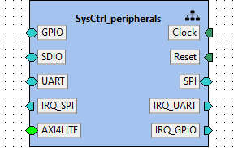

**IP-Xact file:** [SysCtrl_peripherals.1.0.xml](../ipxact/tuni.fi/ip/SysCtrl_peripherals/1.0/SysCtrl_peripherals.1.0.xml)  

## 7.1 Kactus2 attributes <a id="tuni.fi:ip:SysCtrl_peripherals:1.0.attributes">  

**Product hierarchy:** Flat  
**Component implementation:** HW  
**Component firmness:** Mutable  

## 7.2 Ports <a id="tuni.fi:ip:SysCtrl_peripherals:1.0.ports">  

|Name|Direction|Left bound|Right bound|Port type|Type definition|Default value|Array left|Array right|Description|  
|:----|:----|:----|:----|:----|:----|:----|:----|:----|:----|  
|gpio_from_core <a id="tuni.fi:ip:SysCtrl_peripherals:1.0.port.gpio_from_core">|out|3|0|||||||  
|gpio_to_core <a id="tuni.fi:ip:SysCtrl_peripherals:1.0.port.gpio_to_core">|in|3|0|||||||  
|sdio_clk_internal <a id="tuni.fi:ip:SysCtrl_peripherals:1.0.port.sdio_clk_internal">|out|||||||||  
|sdio_cmd_internal <a id="tuni.fi:ip:SysCtrl_peripherals:1.0.port.sdio_cmd_internal">|out|||||||||  
|sdio_data_i_internal <a id="tuni.fi:ip:SysCtrl_peripherals:1.0.port.sdio_data_i_internal">|in|3|0|||||||  
|sdio_data_o_internal <a id="tuni.fi:ip:SysCtrl_peripherals:1.0.port.sdio_data_o_internal">|out|3|0|||||||  
|spim_csn_internal <a id="tuni.fi:ip:SysCtrl_peripherals:1.0.port.spim_csn_internal">|out|1|0|||||||  
|spim_sck_internal <a id="tuni.fi:ip:SysCtrl_peripherals:1.0.port.spim_sck_internal">|out|||||||||  
|spim_miso_internal <a id="tuni.fi:ip:SysCtrl_peripherals:1.0.port.spim_miso_internal">|in|3|0|||||||  
|spim_mosi_internal <a id="tuni.fi:ip:SysCtrl_peripherals:1.0.port.spim_mosi_internal">|out|3|0|||||||  
|uart_rx_internal <a id="tuni.fi:ip:SysCtrl_peripherals:1.0.port.uart_rx_internal">|in|||||||||  
|uart_tx_internal <a id="tuni.fi:ip:SysCtrl_peripherals:1.0.port.uart_tx_internal">|out|||||||||  
|rst_n <a id="tuni.fi:ip:SysCtrl_peripherals:1.0.port.rst_n">|in|||||||||  
|clk <a id="tuni.fi:ip:SysCtrl_peripherals:1.0.port.clk">|in|||||||||  
|irq_uart <a id="tuni.fi:ip:SysCtrl_peripherals:1.0.port.irq_uart">|out|||||||||  
|irq_spi <a id="tuni.fi:ip:SysCtrl_peripherals:1.0.port.irq_spi">|out|1|0|||||||  
|irq_gpio <a id="tuni.fi:ip:SysCtrl_peripherals:1.0.port.irq_gpio">|out|||||||||  
|aw_addr <a id="tuni.fi:ip:SysCtrl_peripherals:1.0.port.aw_addr">|in|31|0|||||||  
|aw_valid <a id="tuni.fi:ip:SysCtrl_peripherals:1.0.port.aw_valid">|in|||||||||  
|aw_ready <a id="tuni.fi:ip:SysCtrl_peripherals:1.0.port.aw_ready">|out|||||||||  
|ar_addr <a id="tuni.fi:ip:SysCtrl_peripherals:1.0.port.ar_addr">|in|31|0|||||||  
|ar_valid <a id="tuni.fi:ip:SysCtrl_peripherals:1.0.port.ar_valid">|in|||||||||  
|ar_ready <a id="tuni.fi:ip:SysCtrl_peripherals:1.0.port.ar_ready">|out|||||||||  
|b_resp <a id="tuni.fi:ip:SysCtrl_peripherals:1.0.port.b_resp">|out|1|0|||||||  
|b_valid <a id="tuni.fi:ip:SysCtrl_peripherals:1.0.port.b_valid">|out|||||||||  
|b_ready <a id="tuni.fi:ip:SysCtrl_peripherals:1.0.port.b_ready">|in|||||||||  
|r_data <a id="tuni.fi:ip:SysCtrl_peripherals:1.0.port.r_data">|out|31|0|||||||  
|r_resp <a id="tuni.fi:ip:SysCtrl_peripherals:1.0.port.r_resp">|out|1|0|||||||  
|r_valid <a id="tuni.fi:ip:SysCtrl_peripherals:1.0.port.r_valid">|out|||||||||  
|r_ready <a id="tuni.fi:ip:SysCtrl_peripherals:1.0.port.r_ready">|in|||||||||  
|w_data <a id="tuni.fi:ip:SysCtrl_peripherals:1.0.port.w_data">|in|31|0|||||||  
|w_strb <a id="tuni.fi:ip:SysCtrl_peripherals:1.0.port.w_strb">|in|3|0|||||||  
|w_valid <a id="tuni.fi:ip:SysCtrl_peripherals:1.0.port.w_valid">|in|||||||||  
|w_ready <a id="tuni.fi:ip:SysCtrl_peripherals:1.0.port.w_ready">|out|||||||||  
|ar_prot <a id="tuni.fi:ip:SysCtrl_peripherals:1.0.port.ar_prot">|in|2|0|||||||  
|aw_prot <a id="tuni.fi:ip:SysCtrl_peripherals:1.0.port.aw_prot">|in|2|0|||||||  
## 7.3 Bus interfaces <a id="tuni.fi:ip:SysCtrl_peripherals:1.0.interfaces">  

### 7.3.1 Bus interface Clock  

**Description:**   
**Interface mode:** target  
**Bus definition:** tuni.fi:interface:clock:1.0  
**Abstraction definitions:** tuni.fi:interface:clock.absDef:1.0  
**Ports used in this interface:**   

|Name|Direction|Left bound|Right bound|Port type|Type definition|Default value|Array left|Array right|Description|  
|:----|:----|:----|:----|:----|:----|:----|:----|:----|:----|  
|clk <a id="tuni.fi:ip:SysCtrl_peripherals:1.0.port.clk">|in|||||||||  
### 7.3.2 Bus interface GPIO  

**Description:**   
**Interface mode:** initiator  
**Bus definition:** tuni.fi:interface:GPIO:1.0  
**Abstraction definitions:** tuni.fi:interface:GPIO.absDef:1.0  
**Ports used in this interface:**   

|Name|Direction|Left bound|Right bound|Port type|Type definition|Default value|Array left|Array right|Description|  
|:----|:----|:----|:----|:----|:----|:----|:----|:----|:----|  
|gpio_from_core <a id="tuni.fi:ip:SysCtrl_peripherals:1.0.port.gpio_from_core">|out|3|0|||||||  
|gpio_to_core <a id="tuni.fi:ip:SysCtrl_peripherals:1.0.port.gpio_to_core">|in|3|0|||||||  
### 7.3.3 Bus interface Reset  

**Description:**   
**Interface mode:** target  
**Bus definition:** tuni.fi:interface:reset:1.0  
**Abstraction definitions:** tuni.fi:interface:reset.absDef:1.0  
**Ports used in this interface:**   

|Name|Direction|Left bound|Right bound|Port type|Type definition|Default value|Array left|Array right|Description|  
|:----|:----|:----|:----|:----|:----|:----|:----|:----|:----|  
|rst_n <a id="tuni.fi:ip:SysCtrl_peripherals:1.0.port.rst_n">|in|||||||||  
### 7.3.4 Bus interface SDIO  

**Description:**   
**Interface mode:** initiator  
**Bus definition:** tuni.fi:interface:SDIO:1.0  
**Abstraction definitions:** tuni.fi:interface:SDIO.absDef:1.0  
**Ports used in this interface:**   

|Name|Direction|Left bound|Right bound|Port type|Type definition|Default value|Array left|Array right|Description|  
|:----|:----|:----|:----|:----|:----|:----|:----|:----|:----|  
|sdio_clk_internal <a id="tuni.fi:ip:SysCtrl_peripherals:1.0.port.sdio_clk_internal">|out|||||||||  
|sdio_cmd_internal <a id="tuni.fi:ip:SysCtrl_peripherals:1.0.port.sdio_cmd_internal">|out|||||||||  
|sdio_data_i_internal <a id="tuni.fi:ip:SysCtrl_peripherals:1.0.port.sdio_data_i_internal">|in|3|0|||||||  
|sdio_data_o_internal <a id="tuni.fi:ip:SysCtrl_peripherals:1.0.port.sdio_data_o_internal">|out|3|0|||||||  
### 7.3.5 Bus interface SPI  

**Description:**   
**Interface mode:** initiator  
**Bus definition:** tuni.fi:interface:SPI:1.0  
**Abstraction definitions:** tuni.fi:interface:SPI.absDef:1.0  
**Ports used in this interface:**   

|Name|Direction|Left bound|Right bound|Port type|Type definition|Default value|Array left|Array right|Description|  
|:----|:----|:----|:----|:----|:----|:----|:----|:----|:----|  
|spim_csn_internal <a id="tuni.fi:ip:SysCtrl_peripherals:1.0.port.spim_csn_internal">|out|1|0|||||||  
|spim_sck_internal <a id="tuni.fi:ip:SysCtrl_peripherals:1.0.port.spim_sck_internal">|out|||||||||  
|spim_miso_internal <a id="tuni.fi:ip:SysCtrl_peripherals:1.0.port.spim_miso_internal">|in|3|0|||||||  
|spim_mosi_internal <a id="tuni.fi:ip:SysCtrl_peripherals:1.0.port.spim_mosi_internal">|out|3|0|||||||  
### 7.3.6 Bus interface UART  

**Description:**   
**Interface mode:** initiator  
**Bus definition:** tuni.fi:interface:UART:1.0  
**Abstraction definitions:** tuni.fi:interface:UART.absDef:1.0  
**Ports used in this interface:**   

|Name|Direction|Left bound|Right bound|Port type|Type definition|Default value|Array left|Array right|Description|  
|:----|:----|:----|:----|:----|:----|:----|:----|:----|:----|  
|uart_rx_internal <a id="tuni.fi:ip:SysCtrl_peripherals:1.0.port.uart_rx_internal">|in|||||||||  
|uart_tx_internal <a id="tuni.fi:ip:SysCtrl_peripherals:1.0.port.uart_tx_internal">|out|||||||||  
### 7.3.7 Bus interface IRQ_UART  

**Description:**   
**Interface mode:** initiator  
**Bus definition:** tuni.fi:interface:IRQ:1.0  
**Abstraction definitions:** tuni.fi:interface:IRQ.absDef:1.0  
**Ports used in this interface:**   

|Name|Direction|Left bound|Right bound|Port type|Type definition|Default value|Array left|Array right|Description|  
|:----|:----|:----|:----|:----|:----|:----|:----|:----|:----|  
|irq_uart <a id="tuni.fi:ip:SysCtrl_peripherals:1.0.port.irq_uart">|out|||||||||  
### 7.3.8 Bus interface IRQ_SPI  

**Description:**   
**Interface mode:** initiator  
**Bus definition:** tuni.fi:interface:IRQ:1.0  
**Abstraction definitions:** tuni.fi:interface:IRQ.absDef:1.0  
**Ports used in this interface:**   

|Name|Direction|Left bound|Right bound|Port type|Type definition|Default value|Array left|Array right|Description|  
|:----|:----|:----|:----|:----|:----|:----|:----|:----|:----|  
|irq_spi <a id="tuni.fi:ip:SysCtrl_peripherals:1.0.port.irq_spi">|out|1|0|||||||  
### 7.3.9 Bus interface IRQ_GPIO  

**Description:**   
**Interface mode:** initiator  
**Bus definition:** tuni.fi:interface:IRQ:1.0  
**Abstraction definitions:** tuni.fi:interface:IRQ.absDef:1.0  
**Ports used in this interface:**   

|Name|Direction|Left bound|Right bound|Port type|Type definition|Default value|Array left|Array right|Description|  
|:----|:----|:----|:----|:----|:----|:----|:----|:----|:----|  
|irq_gpio <a id="tuni.fi:ip:SysCtrl_peripherals:1.0.port.irq_gpio">|out|||||||||  
### 7.3.10 Bus interface AXI4LITE  

**Description:**   
**Interface mode:** mirroredInitiator  
**Bus definition:** tuni.fi:interface:AXI4LITE:1.0  
**Abstraction definitions:** tuni.fi:interface:AXI4LITE.absDef:1.0  
**Ports used in this interface:**   

|Name|Direction|Left bound|Right bound|Port type|Type definition|Default value|Array left|Array right|Description|  
|:----|:----|:----|:----|:----|:----|:----|:----|:----|:----|  
|aw_addr <a id="tuni.fi:ip:SysCtrl_peripherals:1.0.port.aw_addr">|in|31|0|||||||  
|aw_valid <a id="tuni.fi:ip:SysCtrl_peripherals:1.0.port.aw_valid">|in|||||||||  
|aw_ready <a id="tuni.fi:ip:SysCtrl_peripherals:1.0.port.aw_ready">|out|||||||||  
|ar_addr <a id="tuni.fi:ip:SysCtrl_peripherals:1.0.port.ar_addr">|in|31|0|||||||  
|ar_valid <a id="tuni.fi:ip:SysCtrl_peripherals:1.0.port.ar_valid">|in|||||||||  
|ar_ready <a id="tuni.fi:ip:SysCtrl_peripherals:1.0.port.ar_ready">|out|||||||||  
|b_resp <a id="tuni.fi:ip:SysCtrl_peripherals:1.0.port.b_resp">|out|1|0|||||||  
|b_valid <a id="tuni.fi:ip:SysCtrl_peripherals:1.0.port.b_valid">|out|||||||||  
|b_ready <a id="tuni.fi:ip:SysCtrl_peripherals:1.0.port.b_ready">|in|||||||||  
|r_data <a id="tuni.fi:ip:SysCtrl_peripherals:1.0.port.r_data">|out|31|0|||||||  
|r_resp <a id="tuni.fi:ip:SysCtrl_peripherals:1.0.port.r_resp">|out|1|0|||||||  
|r_valid <a id="tuni.fi:ip:SysCtrl_peripherals:1.0.port.r_valid">|out|||||||||  
|r_ready <a id="tuni.fi:ip:SysCtrl_peripherals:1.0.port.r_ready">|in|||||||||  
|w_data <a id="tuni.fi:ip:SysCtrl_peripherals:1.0.port.w_data">|in|31|0|||||||  
|w_strb <a id="tuni.fi:ip:SysCtrl_peripherals:1.0.port.w_strb">|in|3|0|||||||  
|w_valid <a id="tuni.fi:ip:SysCtrl_peripherals:1.0.port.w_valid">|in|||||||||  
|w_ready <a id="tuni.fi:ip:SysCtrl_peripherals:1.0.port.w_ready">|out|||||||||  
|ar_prot <a id="tuni.fi:ip:SysCtrl_peripherals:1.0.port.ar_prot">|in|2|0|||||||  
|aw_prot <a id="tuni.fi:ip:SysCtrl_peripherals:1.0.port.aw_prot">|in|2|0|||||||  
## 7.4 Views <a id="tuni.fi:ip:SysCtrl_peripherals:1.0.views">  

### 7.4.1 View: hierarchical  

#### 7.4.1.1 Design configuration instantiation: _design_configuration  

**Design configuration:** tuni.fi:ip:SysCtrl_peripherals.designcfg:1.0  
**IP-Xact file:** [SysCtrl_peripherals.designcfg.1.0.xml](../ipxact/tuni.fi/ip/SysCtrl_peripherals/1.0/SysCtrl_peripherals.designcfg.1.0.xml)  
Diagram of design tuni.fi:ip:SysCtrl_peripherals.design:1.0:  
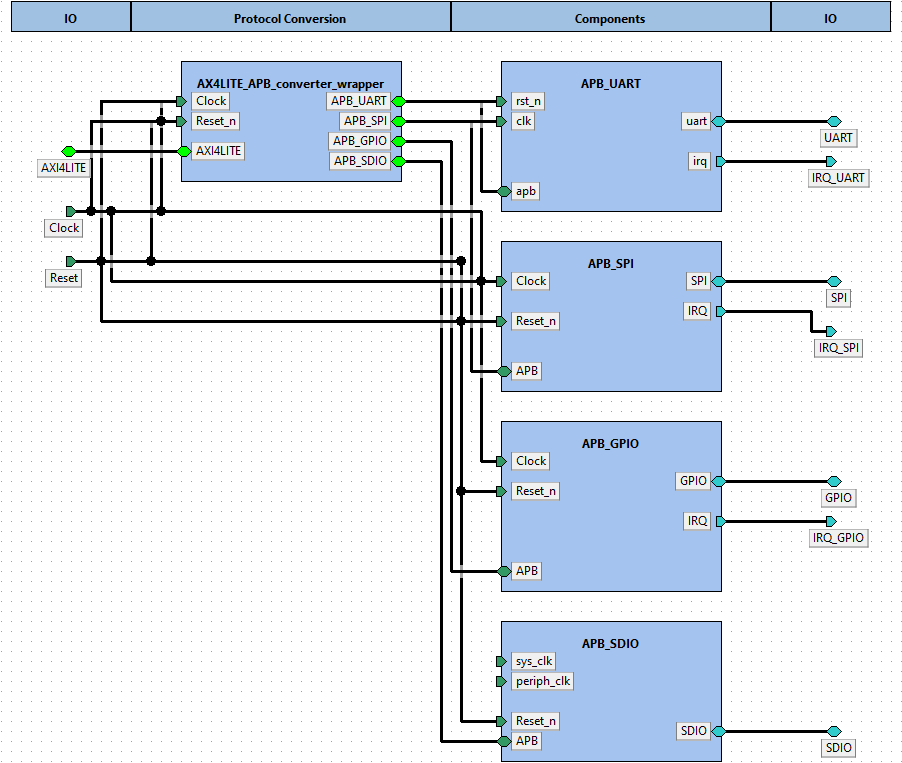  

Component instances within design tuni.fi:ip:SysCtrl_peripherals.design:1.0:  

|Instance name|Component type|Configurable values|Active view|Description|  
|:----|:----|:----|:----|:----|  
|APB_UART|[tuni.fi - pulp.peripheral - apb_uart - 1.0](#tuni.fi:pulp.peripheral:apb_uart:1.0)|||  
|APB_SPI|[tuni.fi - pulp.peripheral - APB_SPI_master - 1.0](#tuni.fi:pulp.peripheral:APB_SPI_master:1.0)|||  
|APB_GPIO|[tuni.fi - pulp.peripheral - APB_GPIO - 1.0](#tuni.fi:pulp.peripheral:APB_GPIO:1.0)|||  
|APB_SDIO|[tuni.fi - pulp.peripheral - APB_SDIO - 1.0](#tuni.fi:pulp.peripheral:APB_SDIO:1.0)|||  
|AX4LITE_APB_converter_wrapper|[tuni.fi - communication - AX4LITE_APB_converter_wrapper - 1.0](#tuni.fi:communication:AX4LITE_APB_converter_wrapper:1.0)|||  
# 8. Component tuni.fi:pulp.peripheral:apb_uart:1.0<a id="tuni.fi:pulp.peripheral:apb_uart:1.0">  

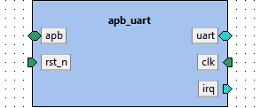

**IP-Xact file:** [apb_uart.1.0.xml](../ipxact/tuni.fi/pulp.peripheral/apb_uart/1.0/apb_uart.1.0.xml)  

## 8.1 Kactus2 attributes <a id="tuni.fi:pulp.peripheral:apb_uart:1.0.attributes">  

**Product hierarchy:** Flat  
**Component implementation:** HW  
**Component firmness:** Mutable  

## 8.2 Ports <a id="tuni.fi:pulp.peripheral:apb_uart:1.0.ports">  

|Name|Direction|Left bound|Right bound|Port type|Type definition|Default value|Array left|Array right|Description|  
|:----|:----|:----|:----|:----|:----|:----|:----|:----|:----|  
|rx_i <a id="tuni.fi:pulp.peripheral:apb_uart:1.0.port.rx_i">|in||||||||receiver input|  
|tx_o <a id="tuni.fi:pulp.peripheral:apb_uart:1.0.port.tx_o">|out||||||||transmitter output|  
|PADDR <a id="tuni.fi:pulp.peripheral:apb_uart:1.0.port.PADDR">|in|31|0|||||||  
|PENABLE <a id="tuni.fi:pulp.peripheral:apb_uart:1.0.port.PENABLE">|in|||||||||  
|PRDATA <a id="tuni.fi:pulp.peripheral:apb_uart:1.0.port.PRDATA">|out|31|0|||||||  
|PREADY <a id="tuni.fi:pulp.peripheral:apb_uart:1.0.port.PREADY">|out|||||||||  
|PSEL <a id="tuni.fi:pulp.peripheral:apb_uart:1.0.port.PSEL">|in|||||||||  
|PSLVERR <a id="tuni.fi:pulp.peripheral:apb_uart:1.0.port.PSLVERR">|out|||||||||  
|PWDATA <a id="tuni.fi:pulp.peripheral:apb_uart:1.0.port.PWDATA">|in|31|0|||||||  
|PWRITE <a id="tuni.fi:pulp.peripheral:apb_uart:1.0.port.PWRITE">|in|||||||||  
|CLK <a id="tuni.fi:pulp.peripheral:apb_uart:1.0.port.CLK">|in|||||||||  
|RSTN <a id="tuni.fi:pulp.peripheral:apb_uart:1.0.port.RSTN">|in|||||||||  
|event_o <a id="tuni.fi:pulp.peripheral:apb_uart:1.0.port.event_o">|out||||||||irq/event output|  
## 8.3 Bus interfaces <a id="tuni.fi:pulp.peripheral:apb_uart:1.0.interfaces">  

### 8.3.1 Bus interface uart  

**Description:**   
**Interface mode:** initiator  
**Bus definition:** tuni.fi:interface:UART:1.0  
**Abstraction definitions:** tuni.fi:interface:UART.absDef:1.0  
**Ports used in this interface:**   

|Name|Direction|Left bound|Right bound|Port type|Type definition|Default value|Array left|Array right|Description|  
|:----|:----|:----|:----|:----|:----|:----|:----|:----|:----|  
|rx_i <a id="tuni.fi:pulp.peripheral:apb_uart:1.0.port.rx_i">|in||||||||receiver input|  
|tx_o <a id="tuni.fi:pulp.peripheral:apb_uart:1.0.port.tx_o">|out||||||||transmitter output|  
### 8.3.2 Bus interface apb  

**Description:**   
**Interface mode:** target  
**Bus definition:** tuni.fi:interface:APB:1.0  
**Abstraction definitions:** tuni.fi:interface:APB.absDef:1.0  
**Ports used in this interface:**   

|Name|Direction|Left bound|Right bound|Port type|Type definition|Default value|Array left|Array right|Description|  
|:----|:----|:----|:----|:----|:----|:----|:----|:----|:----|  
|PADDR <a id="tuni.fi:pulp.peripheral:apb_uart:1.0.port.PADDR">|in|31|0|||||||  
|PENABLE <a id="tuni.fi:pulp.peripheral:apb_uart:1.0.port.PENABLE">|in|||||||||  
|PRDATA <a id="tuni.fi:pulp.peripheral:apb_uart:1.0.port.PRDATA">|out|31|0|||||||  
|PREADY <a id="tuni.fi:pulp.peripheral:apb_uart:1.0.port.PREADY">|out|||||||||  
|PSEL <a id="tuni.fi:pulp.peripheral:apb_uart:1.0.port.PSEL">|in|||||||||  
|PSLVERR <a id="tuni.fi:pulp.peripheral:apb_uart:1.0.port.PSLVERR">|out|||||||||  
|PWDATA <a id="tuni.fi:pulp.peripheral:apb_uart:1.0.port.PWDATA">|in|31|0|||||||  
|PWRITE <a id="tuni.fi:pulp.peripheral:apb_uart:1.0.port.PWRITE">|in|||||||||  
### 8.3.3 Bus interface clk  

**Description:**   
**Interface mode:** target  
**Bus definition:** tuni.fi:interface:clock:1.0  
**Abstraction definitions:** tuni.fi:interface:clock.absDef:1.0  
**Ports used in this interface:**   

|Name|Direction|Left bound|Right bound|Port type|Type definition|Default value|Array left|Array right|Description|  
|:----|:----|:----|:----|:----|:----|:----|:----|:----|:----|  
|CLK <a id="tuni.fi:pulp.peripheral:apb_uart:1.0.port.CLK">|in|||||||||  
### 8.3.4 Bus interface rst_n  

**Description:**   
**Interface mode:** target  
**Bus definition:** tuni.fi:interface:reset:1.0  
**Abstraction definitions:** tuni.fi:interface:reset.absDef:1.0  
**Ports used in this interface:**   

|Name|Direction|Left bound|Right bound|Port type|Type definition|Default value|Array left|Array right|Description|  
|:----|:----|:----|:----|:----|:----|:----|:----|:----|:----|  
|RSTN <a id="tuni.fi:pulp.peripheral:apb_uart:1.0.port.RSTN">|in|||||||||  
### 8.3.5 Bus interface irq  

**Description:**   
**Interface mode:** initiator  
**Bus definition:** tuni.fi:interface:IRQ:1.0  
**Abstraction definitions:** tuni.fi:interface:IRQ.absDef:1.0  
**Ports used in this interface:**   

|Name|Direction|Left bound|Right bound|Port type|Type definition|Default value|Array left|Array right|Description|  
|:----|:----|:----|:----|:----|:----|:----|:----|:----|:----|  
|event_o <a id="tuni.fi:pulp.peripheral:apb_uart:1.0.port.event_o">|out||||||||irq/event output|  
# 9. Component tuni.fi:pulp.peripheral:APB_SPI_master:1.0<a id="tuni.fi:pulp.peripheral:APB_SPI_master:1.0">  

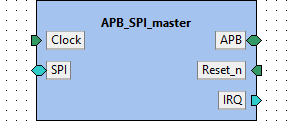

**IP-Xact file:** [APB_SPI_master.1.0.xml](../ipxact/tuni.fi/pulp.peripheral/APB_SPI_master/1.0/APB_SPI_master.1.0.xml)  

## 9.1 Kactus2 attributes <a id="tuni.fi:pulp.peripheral:APB_SPI_master:1.0.attributes">  

**Product hierarchy:** Flat  
**Component implementation:** HW  
**Component firmness:** Mutable  

## 9.2 Ports <a id="tuni.fi:pulp.peripheral:APB_SPI_master:1.0.ports">  

|Name|Direction|Left bound|Right bound|Port type|Type definition|Default value|Array left|Array right|Description|  
|:----|:----|:----|:----|:----|:----|:----|:----|:----|:----|  
|PADDR <a id="tuni.fi:pulp.peripheral:APB_SPI_master:1.0.port.PADDR">|in|31|0|logic||||||  
|PENABLE <a id="tuni.fi:pulp.peripheral:APB_SPI_master:1.0.port.PENABLE">|in|||logic||||||  
|PRDATA <a id="tuni.fi:pulp.peripheral:APB_SPI_master:1.0.port.PRDATA">|out|31|0|logic||||||  
|PREADY <a id="tuni.fi:pulp.peripheral:APB_SPI_master:1.0.port.PREADY">|out|0|0|logic||||||  
|PSEL <a id="tuni.fi:pulp.peripheral:APB_SPI_master:1.0.port.PSEL">|in|0|0|logic||||||  
|PSLVERR <a id="tuni.fi:pulp.peripheral:APB_SPI_master:1.0.port.PSLVERR">|out|0|0|logic||||||  
|PWDATA <a id="tuni.fi:pulp.peripheral:APB_SPI_master:1.0.port.PWDATA">|in|31|0|logic||||||  
|PWRITE <a id="tuni.fi:pulp.peripheral:APB_SPI_master:1.0.port.PWRITE">|in|||logic||||||  
|HCLK <a id="tuni.fi:pulp.peripheral:APB_SPI_master:1.0.port.HCLK">|in|||logic||||||  
|HRSETn <a id="tuni.fi:pulp.peripheral:APB_SPI_master:1.0.port.HRSETn">|in|||logic||||||  
|events_o <a id="tuni.fi:pulp.peripheral:APB_SPI_master:1.0.port.events_o">|out|1|0|logic||||||  
|spi_clk <a id="tuni.fi:pulp.peripheral:APB_SPI_master:1.0.port.spi_clk">|out|||logic||||||  
|spi_csn0 <a id="tuni.fi:pulp.peripheral:APB_SPI_master:1.0.port.spi_csn0">|out|||logic||||||  
|spi_csn1 <a id="tuni.fi:pulp.peripheral:APB_SPI_master:1.0.port.spi_csn1">|out|||logic||||||  
|spi_csn2 <a id="tuni.fi:pulp.peripheral:APB_SPI_master:1.0.port.spi_csn2">|out|||logic||||||  
|spi_csn3 <a id="tuni.fi:pulp.peripheral:APB_SPI_master:1.0.port.spi_csn3">|out|||logic||||||  
|spi_mode <a id="tuni.fi:pulp.peripheral:APB_SPI_master:1.0.port.spi_mode">|out|1|0|logic||||||  
|spi_sdo0 <a id="tuni.fi:pulp.peripheral:APB_SPI_master:1.0.port.spi_sdo0">|out|||logic||||||  
|spi_sdo1 <a id="tuni.fi:pulp.peripheral:APB_SPI_master:1.0.port.spi_sdo1">|out|||logic||||||  
|spi_sdo2 <a id="tuni.fi:pulp.peripheral:APB_SPI_master:1.0.port.spi_sdo2">|out|||logic||||||  
|spi_sdo3 <a id="tuni.fi:pulp.peripheral:APB_SPI_master:1.0.port.spi_sdo3">|out|||logic||||||  
|spi_sdi0 <a id="tuni.fi:pulp.peripheral:APB_SPI_master:1.0.port.spi_sdi0">|in|||logic||||||  
|spi_sdi1 <a id="tuni.fi:pulp.peripheral:APB_SPI_master:1.0.port.spi_sdi1">|in|||logic||||||  
|spi_sdi2 <a id="tuni.fi:pulp.peripheral:APB_SPI_master:1.0.port.spi_sdi2">|in|||logic||||||  
|spi_sdi3 <a id="tuni.fi:pulp.peripheral:APB_SPI_master:1.0.port.spi_sdi3">|in|||logic||||||  
## 9.3 Bus interfaces <a id="tuni.fi:pulp.peripheral:APB_SPI_master:1.0.interfaces">  

### 9.3.1 Bus interface APB  

**Description:**   
**Interface mode:** target  
**Bus definition:** tuni.fi:interface:APB:1.0  
**Abstraction definitions:** tuni.fi:interface:APB.absDef:1.0  
**Ports used in this interface:**   

|Name|Direction|Left bound|Right bound|Port type|Type definition|Default value|Array left|Array right|Description|  
|:----|:----|:----|:----|:----|:----|:----|:----|:----|:----|  
|PADDR <a id="tuni.fi:pulp.peripheral:APB_SPI_master:1.0.port.PADDR">|in|31|0|logic||||||  
|PENABLE <a id="tuni.fi:pulp.peripheral:APB_SPI_master:1.0.port.PENABLE">|in|||logic||||||  
|PRDATA <a id="tuni.fi:pulp.peripheral:APB_SPI_master:1.0.port.PRDATA">|out|31|0|logic||||||  
|PREADY <a id="tuni.fi:pulp.peripheral:APB_SPI_master:1.0.port.PREADY">|out|0|0|logic||||||  
|PSEL <a id="tuni.fi:pulp.peripheral:APB_SPI_master:1.0.port.PSEL">|in|0|0|logic||||||  
|PSLVERR <a id="tuni.fi:pulp.peripheral:APB_SPI_master:1.0.port.PSLVERR">|out|0|0|logic||||||  
|PWDATA <a id="tuni.fi:pulp.peripheral:APB_SPI_master:1.0.port.PWDATA">|in|31|0|logic||||||  
|PWRITE <a id="tuni.fi:pulp.peripheral:APB_SPI_master:1.0.port.PWRITE">|in|||logic||||||  
### 9.3.2 Bus interface Clock  

**Description:**   
**Interface mode:** target  
**Bus definition:** tuni.fi:interface:clock:1.0  
**Abstraction definitions:** tuni.fi:interface:clock.absDef:1.0  
**Ports used in this interface:**   

|Name|Direction|Left bound|Right bound|Port type|Type definition|Default value|Array left|Array right|Description|  
|:----|:----|:----|:----|:----|:----|:----|:----|:----|:----|  
|HCLK <a id="tuni.fi:pulp.peripheral:APB_SPI_master:1.0.port.HCLK">|in|||logic||||||  
### 9.3.3 Bus interface Reset_n  

**Description:**   
**Interface mode:** target  
**Bus definition:** tuni.fi:interface:reset:1.0  
**Abstraction definitions:** tuni.fi:interface:reset.absDef:1.0  
**Ports used in this interface:**   

|Name|Direction|Left bound|Right bound|Port type|Type definition|Default value|Array left|Array right|Description|  
|:----|:----|:----|:----|:----|:----|:----|:----|:----|:----|  
|HRSETn <a id="tuni.fi:pulp.peripheral:APB_SPI_master:1.0.port.HRSETn">|in|||logic||||||  
### 9.3.4 Bus interface SPI  

**Description:**   
**Interface mode:** initiator  
**Bus definition:** tuni.fi:interface:SPI:1.0  
**Abstraction definitions:** tuni.fi:interface:SPI.absDef:1.0  
**Ports used in this interface:**   

|Name|Direction|Left bound|Right bound|Port type|Type definition|Default value|Array left|Array right|Description|  
|:----|:----|:----|:----|:----|:----|:----|:----|:----|:----|  
|spi_clk <a id="tuni.fi:pulp.peripheral:APB_SPI_master:1.0.port.spi_clk">|out|||logic||||||  
|spi_csn0 <a id="tuni.fi:pulp.peripheral:APB_SPI_master:1.0.port.spi_csn0">|out|||logic||||||  
|spi_csn1 <a id="tuni.fi:pulp.peripheral:APB_SPI_master:1.0.port.spi_csn1">|out|||logic||||||  
|spi_csn2 <a id="tuni.fi:pulp.peripheral:APB_SPI_master:1.0.port.spi_csn2">|out|||logic||||||  
|spi_csn3 <a id="tuni.fi:pulp.peripheral:APB_SPI_master:1.0.port.spi_csn3">|out|||logic||||||  
|spi_mode <a id="tuni.fi:pulp.peripheral:APB_SPI_master:1.0.port.spi_mode">|out|1|0|logic||||||  
|spi_sdo0 <a id="tuni.fi:pulp.peripheral:APB_SPI_master:1.0.port.spi_sdo0">|out|||logic||||||  
|spi_sdo1 <a id="tuni.fi:pulp.peripheral:APB_SPI_master:1.0.port.spi_sdo1">|out|||logic||||||  
|spi_sdo2 <a id="tuni.fi:pulp.peripheral:APB_SPI_master:1.0.port.spi_sdo2">|out|||logic||||||  
|spi_sdo3 <a id="tuni.fi:pulp.peripheral:APB_SPI_master:1.0.port.spi_sdo3">|out|||logic||||||  
|spi_sdi0 <a id="tuni.fi:pulp.peripheral:APB_SPI_master:1.0.port.spi_sdi0">|in|||logic||||||  
|spi_sdi1 <a id="tuni.fi:pulp.peripheral:APB_SPI_master:1.0.port.spi_sdi1">|in|||logic||||||  
|spi_sdi2 <a id="tuni.fi:pulp.peripheral:APB_SPI_master:1.0.port.spi_sdi2">|in|||logic||||||  
|spi_sdi3 <a id="tuni.fi:pulp.peripheral:APB_SPI_master:1.0.port.spi_sdi3">|in|||logic||||||  
### 9.3.5 Bus interface IRQ  

**Description:**   
**Interface mode:** initiator  
**Bus definition:** tuni.fi:interface:IRQ:1.0  
**Abstraction definitions:** tuni.fi:interface:IRQ.absDef:1.0  
**Ports used in this interface:**   

|Name|Direction|Left bound|Right bound|Port type|Type definition|Default value|Array left|Array right|Description|  
|:----|:----|:----|:----|:----|:----|:----|:----|:----|:----|  
|events_o <a id="tuni.fi:pulp.peripheral:APB_SPI_master:1.0.port.events_o">|out|1|0|logic||||||  
# 10. Component tuni.fi:pulp.peripheral:APB_GPIO:1.0<a id="tuni.fi:pulp.peripheral:APB_GPIO:1.0">  

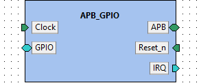

**IP-Xact file:** [APB_GPIO.1.0.xml](../ipxact/tuni.fi/pulp.peripheral/APB_GPIO/1.0/APB_GPIO.1.0.xml)  

## 10.1 Kactus2 attributes <a id="tuni.fi:pulp.peripheral:APB_GPIO:1.0.attributes">  

**Product hierarchy:** Flat  
**Component implementation:** HW  
**Component firmness:** Mutable  

## 10.2 Memory maps <a id="tuni.fi:pulp.peripheral:APB_GPIO:1.0.memoryMaps">  

### 10.2.1 Memory map apb_gpio  

**Address unit bits (AUB):** 8  

### 10.2.1.1 Address block addressBlock  

**Description:**   
**Usage:**   
**Base address [AUB]:** 'h0  
**Range [AUB]:** 112  
**Width [AUB]:** 32  
**Access:**   
**Volatile:**   

#### Address block 'addressBlock' contains the following registers:  

|Register name|Offset [AUB]|Size [bits]|Dimension|Volatile|Access|  
|:----|:----|:----|:----|:----|:----|  
|REG_PADDIR_00_31|'h0|32||||  
|REG_GPIOEN_00_31|'h4|32||||  
|REG_PADIN_00_31|'h8|32||||  
|REG_PADOUT_00_31|'hC|32||||  
|REG_PADOUTSET_00_31|'h10|32||||  
|REG_PADOUTCLR_00_31|'h14|32||||  
|REG_INTEN_00_31|'h18|32||||  
|REG_INTTYPE_00_15|'h1C|32||||  
|REG_INTTYPE_16_31|'h20|32||||  
|REG_INTSTATUS_00_31|'h24|32||||  
|REG_PADCFG_00_07|'h28|32||||  
|REG_PADCFG_08_15|'h2C|32||||  
|REG_PADCFG_16_23|'h30|32||||  
|REG_PADCFG_24_31|'h34|32||||  
|REG_PADDIR_32_63|'h38|32||||  
|REG_PADCFG_56_63|'h6c|32||||  
|REG_PADCFG_48_55|'h68|32||||  
|REG_PADCFG_40_47|'h64|32||||  
|REG_PADCFG_32_39|'h60|32||||  
|REG_INTSTATUS_32_63|'h5c|32||||  
|REG_INTTYPE_48_63|'h58|32||||  
|REG_INTTYPE_32_47|'h54|32||||  
|REG_INTEN_32_63|'h50|32||||  
|REG_PADOUTCLR_32_63|'h4c|32||||  
|REG_PADOUTSET_32_63|'h48|32||||  
|REG_PADOUT_32_63|'h44|32||||  
|REG_PADIN_32_63|'h40|32||||  
|REG_GPIOEN_32_63|'h3C|32||||  
### 10.2.1.1.1 Register REG_PADDIR_00_31  

**Description:** Pad Direction.
Control the direction of each of the GPIO pads. A value of 1 means it is configured as
an output, while 0 configures it as an input.  
**Offset [AUB]:** 'h0  
**Size [bits]:** 32  
**Dimension:**   
**Volatile:**   
**Access:**   

#### Register 'REG_PADDIR_00_31' contains the following fields:  

|Field name|Offset [bits]|Width [bits]|Volatile|Access|Resets|Description|  
|:----|:----|:----|:----|:----|:----|:----|  
|REG_PADDIR_00_31 <a id="tuni.fi:pulp.peripheral:APB_GPIO:1.0.field.REG_PADDIR_00_31">|0|32|||||  
### 10.2.1.1.1.1 Field REG_PADDIR_00_31  

**Offset [bits]:** 0  
**Width [bits]:** 32  
**Volatile:**   
**Access:**   
**Resets:**   
**Description:**   

### 10.2.1.1.2 Register REG_GPIOEN_00_31  

**Description:** Input Values.
  
**Offset [AUB]:** 'h4  
**Size [bits]:** 32  
**Dimension:**   
**Volatile:**   
**Access:**   

#### Register 'REG_GPIOEN_00_31' contains the following fields:  

|Field name|Offset [bits]|Width [bits]|Volatile|Access|Resets|Description|  
|:----|:----|:----|:----|:----|:----|:----|  
|REG_GPIOEN_00_31 <a id="tuni.fi:pulp.peripheral:APB_GPIO:1.0.field.REG_GPIOEN_00_31">|0|32|||||  
### 10.2.1.1.2.1 Field REG_GPIOEN_00_31  

**Offset [bits]:** 0  
**Width [bits]:** 32  
**Volatile:**   
**Access:**   
**Resets:**   
**Description:**   

### 10.2.1.1.3 Register REG_PADIN_00_31  

**Description:** Output Values.
  
**Offset [AUB]:** 'h8  
**Size [bits]:** 32  
**Dimension:**   
**Volatile:**   
**Access:**   

#### Register 'REG_PADIN_00_31' contains the following fields:  

|Field name|Offset [bits]|Width [bits]|Volatile|Access|Resets|Description|  
|:----|:----|:----|:----|:----|:----|:----|  
|REG_PADIN_00_31 <a id="tuni.fi:pulp.peripheral:APB_GPIO:1.0.field.REG_PADIN_00_31">|0|32|||||  
### 10.2.1.1.3.1 Field REG_PADIN_00_31  

**Offset [bits]:** 0  
**Width [bits]:** 32  
**Volatile:**   
**Access:**   
**Resets:**   
**Description:**   

### 10.2.1.1.4 Register REG_PADOUT_00_31  

**Description:** Interrupt Enable.
Interrupt enable per input bit. INTTYPE0 and INTTYPE1 control the interrupt
triggering behavior.  
**Offset [AUB]:** 'hC  
**Size [bits]:** 32  
**Dimension:**   
**Volatile:**   
**Access:**   

#### Register 'REG_PADOUT_00_31' contains the following fields:  

|Field name|Offset [bits]|Width [bits]|Volatile|Access|Resets|Description|  
|:----|:----|:----|:----|:----|:----|:----|  
|REG_PADOUT_00_31 <a id="tuni.fi:pulp.peripheral:APB_GPIO:1.0.field.REG_PADOUT_00_31">|0|32|||||  
### 10.2.1.1.4.1 Field REG_PADOUT_00_31  

**Offset [bits]:** 0  
**Width [bits]:** 32  
**Volatile:**   
**Access:**   
**Resets:**   
**Description:**   

### 10.2.1.1.5 Register REG_PADOUTSET_00_31  

**Description:** Interrupt Type 0.
Controls the interrupt trigger behavior together with INTTYPE1. Use INTEN to
enable interrupts first.  
**Offset [AUB]:** 'h10  
**Size [bits]:** 32  
**Dimension:**   
**Volatile:**   
**Access:**   

#### Register 'REG_PADOUTSET_00_31' contains the following fields:  

|Field name|Offset [bits]|Width [bits]|Volatile|Access|Resets|Description|  
|:----|:----|:----|:----|:----|:----|:----|  
|REG_PADOUTSET_00_31 <a id="tuni.fi:pulp.peripheral:APB_GPIO:1.0.field.REG_PADOUTSET_00_31">|0|32|||||  
### 10.2.1.1.5.1 Field REG_PADOUTSET_00_31  

**Offset [bits]:** 0  
**Width [bits]:** 32  
**Volatile:**   
**Access:**   
**Resets:**   
**Description:**   

### 10.2.1.1.6 Register REG_PADOUTCLR_00_31  

**Description:** Interrupt Type 1.
Controls the interrupt trigger behavior together with INTTYPE0. Use INTEN to
enable interrupts first.
  
**Offset [AUB]:** 'h14  
**Size [bits]:** 32  
**Dimension:**   
**Volatile:**   
**Access:**   

#### Register 'REG_PADOUTCLR_00_31' contains the following fields:  

|Field name|Offset [bits]|Width [bits]|Volatile|Access|Resets|Description|  
|:----|:----|:----|:----|:----|:----|:----|  
|REG_PADOUTCLR_00_31 <a id="tuni.fi:pulp.peripheral:APB_GPIO:1.0.field.REG_PADOUTCLR_00_31">|0|32|||||  
### 10.2.1.1.6.1 Field REG_PADOUTCLR_00_31  

**Offset [bits]:** 0  
**Width [bits]:** 32  
**Volatile:**   
**Access:**   
**Resets:**   
**Description:**   

### 10.2.1.1.7 Register REG_INTEN_00_31  

**Description:** Interrupt Status.
Contains interrupt status per GPIO line. The status register is cleared when read.
Similarly the interrupt line is high while a bit is set in interrupt status and will be
deasserted when the status register is read.
  
**Offset [AUB]:** 'h18  
**Size [bits]:** 32  
**Dimension:**   
**Volatile:**   
**Access:**   

#### Register 'REG_INTEN_00_31' contains the following fields:  

|Field name|Offset [bits]|Width [bits]|Volatile|Access|Resets|Description|  
|:----|:----|:----|:----|:----|:----|:----|  
|REG_INTEN_00_31 <a id="tuni.fi:pulp.peripheral:APB_GPIO:1.0.field.REG_INTEN_00_31">|0|32|||||  
### 10.2.1.1.7.1 Field REG_INTEN_00_31  

**Offset [bits]:** 0  
**Width [bits]:** 32  
**Volatile:**   
**Access:**   
**Resets:**   
**Description:**   

### 10.2.1.1.8 Register REG_INTTYPE_00_15  

**Description:**   
**Offset [AUB]:** 'h1C  
**Size [bits]:** 32  
**Dimension:**   
**Volatile:**   
**Access:**   

#### Register 'REG_INTTYPE_00_15' contains the following fields:  

|Field name|Offset [bits]|Width [bits]|Volatile|Access|Resets|Description|  
|:----|:----|:----|:----|:----|:----|:----|  
|REG_INTTYPE_00_15 <a id="tuni.fi:pulp.peripheral:APB_GPIO:1.0.field.REG_INTTYPE_00_15">|0|32|||||  
### 10.2.1.1.8.1 Field REG_INTTYPE_00_15  

**Offset [bits]:** 0  
**Width [bits]:** 32  
**Volatile:**   
**Access:**   
**Resets:**   
**Description:**   

### 10.2.1.1.9 Register REG_INTTYPE_16_31  

**Description:** Pad Configuration Registers.
The pad configuration registers control various aspects of the pads that are typically
used in ASICs, e.g. drive strength, Schmitt-Triggers, Slew Rate, etc. Since those
configuration parameters depend on the exact pads used, each implementation is free
to use the PADCFG0-7 registers in every way it wants and also leave them unconnected,
if unneeded.  
**Offset [AUB]:** 'h20  
**Size [bits]:** 32  
**Dimension:**   
**Volatile:**   
**Access:**   

#### Register 'REG_INTTYPE_16_31' contains the following fields:  

|Field name|Offset [bits]|Width [bits]|Volatile|Access|Resets|Description|  
|:----|:----|:----|:----|:----|:----|:----|  
|REG_INTTYPE_16_31_0 <a id="tuni.fi:pulp.peripheral:APB_GPIO:1.0.field.REG_INTTYPE_16_31_0">|0|32|||||  
### 10.2.1.1.9.1 Field REG_INTTYPE_16_31_0  

**Offset [bits]:** 0  
**Width [bits]:** 32  
**Volatile:**   
**Access:**   
**Resets:**   
**Description:**   

### 10.2.1.1.10 Register REG_INTSTATUS_00_31  

**Description:** Pad Configuration Registers.
The pad configuration registers control various aspects of the pads that are typically
used in ASICs, e.g. drive strength, Schmitt-Triggers, Slew Rate, etc. Since those
configuration parameters depend on the exact pads used, each implementation is free
to use the PADCFG0-7 registers in every way it wants and also leave them unconnected,
if unneeded.  
**Offset [AUB]:** 'h24  
**Size [bits]:** 32  
**Dimension:**   
**Volatile:**   
**Access:**   

#### Register 'REG_INTSTATUS_00_31' contains the following fields:  

|Field name|Offset [bits]|Width [bits]|Volatile|Access|Resets|Description|  
|:----|:----|:----|:----|:----|:----|:----|  
|REG_INTSTATUS_00_31 <a id="tuni.fi:pulp.peripheral:APB_GPIO:1.0.field.REG_INTSTATUS_00_31">|0|32|||||  
### 10.2.1.1.10.1 Field REG_INTSTATUS_00_31  

**Offset [bits]:** 0  
**Width [bits]:** 32  
**Volatile:**   
**Access:**   
**Resets:**   
**Description:**   

### 10.2.1.1.11 Register REG_PADCFG_00_07  

**Description:** Pad Configuration Registers.
The pad configuration registers control various aspects of the pads that are typically
used in ASICs, e.g. drive strength, Schmitt-Triggers, Slew Rate, etc. Since those
configuration parameters depend on the exact pads used, each implementation is free
to use the PADCFG0-7 registers in every way it wants and also leave them unconnected,
if unneeded.  
**Offset [AUB]:** 'h28  
**Size [bits]:** 32  
**Dimension:**   
**Volatile:**   
**Access:**   

#### Register 'REG_PADCFG_00_07' contains the following fields:  

|Field name|Offset [bits]|Width [bits]|Volatile|Access|Resets|Description|  
|:----|:----|:----|:----|:----|:----|:----|  
|REG_PADCFG_00_07 <a id="tuni.fi:pulp.peripheral:APB_GPIO:1.0.field.REG_PADCFG_00_07">|0|32|||||  
### 10.2.1.1.11.1 Field REG_PADCFG_00_07  

**Offset [bits]:** 0  
**Width [bits]:** 32  
**Volatile:**   
**Access:**   
**Resets:**   
**Description:**   

### 10.2.1.1.12 Register REG_PADCFG_08_15  

**Description:** Pad Configuration Registers.
The pad configuration registers control various aspects of the pads that are typically
used in ASICs, e.g. drive strength, Schmitt-Triggers, Slew Rate, etc. Since those
configuration parameters depend on the exact pads used, each implementation is free
to use the PADCFG0-7 registers in every way it wants and also leave them unconnected,
if unneeded.  
**Offset [AUB]:** 'h2C  
**Size [bits]:** 32  
**Dimension:**   
**Volatile:**   
**Access:**   

#### Register 'REG_PADCFG_08_15' contains the following fields:  

|Field name|Offset [bits]|Width [bits]|Volatile|Access|Resets|Description|  
|:----|:----|:----|:----|:----|:----|:----|  
|REG_PADCFG_08_15 <a id="tuni.fi:pulp.peripheral:APB_GPIO:1.0.field.REG_PADCFG_08_15">|0|32|||||  
### 10.2.1.1.12.1 Field REG_PADCFG_08_15  

**Offset [bits]:** 0  
**Width [bits]:** 32  
**Volatile:**   
**Access:**   
**Resets:**   
**Description:**   

### 10.2.1.1.13 Register REG_PADCFG_16_23  

**Description:** Pad Configuration Registers.
The pad configuration registers control various aspects of the pads that are typically
used in ASICs, e.g. drive strength, Schmitt-Triggers, Slew Rate, etc. Since those
configuration parameters depend on the exact pads used, each implementation is free
to use the PADCFG0-7 registers in every way it wants and also leave them unconnected,
if unneeded.  
**Offset [AUB]:** 'h30  
**Size [bits]:** 32  
**Dimension:**   
**Volatile:**   
**Access:**   

#### Register 'REG_PADCFG_16_23' contains the following fields:  

|Field name|Offset [bits]|Width [bits]|Volatile|Access|Resets|Description|  
|:----|:----|:----|:----|:----|:----|:----|  
|REG_PADCFG_16_23 <a id="tuni.fi:pulp.peripheral:APB_GPIO:1.0.field.REG_PADCFG_16_23">|0|32|||||  
### 10.2.1.1.13.1 Field REG_PADCFG_16_23  

**Offset [bits]:** 0  
**Width [bits]:** 32  
**Volatile:**   
**Access:**   
**Resets:**   
**Description:**   

### 10.2.1.1.14 Register REG_PADCFG_24_31  

**Description:** Pad Configuration Registers.
The pad configuration registers control various aspects of the pads that are typically
used in ASICs, e.g. drive strength, Schmitt-Triggers, Slew Rate, etc. Since those
configuration parameters depend on the exact pads used, each implementation is free
to use the PADCFG0-7 registers in every way it wants and also leave them unconnected,
if unneeded.  
**Offset [AUB]:** 'h34  
**Size [bits]:** 32  
**Dimension:**   
**Volatile:**   
**Access:**   

#### Register 'REG_PADCFG_24_31' contains the following fields:  

|Field name|Offset [bits]|Width [bits]|Volatile|Access|Resets|Description|  
|:----|:----|:----|:----|:----|:----|:----|  
|REG_PADCFG_24_31 <a id="tuni.fi:pulp.peripheral:APB_GPIO:1.0.field.REG_PADCFG_24_31">|0|32|||||  
### 10.2.1.1.14.1 Field REG_PADCFG_24_31  

**Offset [bits]:** 0  
**Width [bits]:** 32  
**Volatile:**   
**Access:**   
**Resets:**   
**Description:**   

### 10.2.1.1.15 Register REG_PADDIR_32_63  

**Description:** Pad Configuration Registers.
The pad configuration registers control various aspects of the pads that are typically
used in ASICs, e.g. drive strength, Schmitt-Triggers, Slew Rate, etc. Since those
configuration parameters depend on the exact pads used, each implementation is free
to use the PADCFG0-7 registers in every way it wants and also leave them unconnected,
if unneeded.  
**Offset [AUB]:** 'h38  
**Size [bits]:** 32  
**Dimension:**   
**Volatile:**   
**Access:**   

#### Register 'REG_PADDIR_32_63' contains the following fields:  

|Field name|Offset [bits]|Width [bits]|Volatile|Access|Resets|Description|  
|:----|:----|:----|:----|:----|:----|:----|  
|REG_PADDIR_32_63 <a id="tuni.fi:pulp.peripheral:APB_GPIO:1.0.field.REG_PADDIR_32_63">|0|32|||||  
### 10.2.1.1.15.1 Field REG_PADDIR_32_63  

**Offset [bits]:** 0  
**Width [bits]:** 32  
**Volatile:**   
**Access:**   
**Resets:**   
**Description:**   

### 10.2.1.1.16 Register REG_PADCFG_56_63  

**Description:**   
**Offset [AUB]:** 'h6c  
**Size [bits]:** 32  
**Dimension:**   
**Volatile:**   
**Access:**   

#### Register 'REG_PADCFG_56_63' contains the following fields:  

|Field name|Offset [bits]|Width [bits]|Volatile|Access|Resets|Description|  
|:----|:----|:----|:----|:----|:----|:----|  
|REG_PADCFG_56_63 <a id="tuni.fi:pulp.peripheral:APB_GPIO:1.0.field.REG_PADCFG_56_63">|0|32|||||  
### 10.2.1.1.16.1 Field REG_PADCFG_56_63  

**Offset [bits]:** 0  
**Width [bits]:** 32  
**Volatile:**   
**Access:**   
**Resets:**   
**Description:**   

### 10.2.1.1.17 Register REG_PADCFG_48_55  

**Description:**   
**Offset [AUB]:** 'h68  
**Size [bits]:** 32  
**Dimension:**   
**Volatile:**   
**Access:**   

#### Register 'REG_PADCFG_48_55' contains the following fields:  

|Field name|Offset [bits]|Width [bits]|Volatile|Access|Resets|Description|  
|:----|:----|:----|:----|:----|:----|:----|  
|REG_PADCFG_48_55 <a id="tuni.fi:pulp.peripheral:APB_GPIO:1.0.field.REG_PADCFG_48_55">|0|32|||||  
### 10.2.1.1.17.1 Field REG_PADCFG_48_55  

**Offset [bits]:** 0  
**Width [bits]:** 32  
**Volatile:**   
**Access:**   
**Resets:**   
**Description:**   

### 10.2.1.1.18 Register REG_PADCFG_40_47  

**Description:**   
**Offset [AUB]:** 'h64  
**Size [bits]:** 32  
**Dimension:**   
**Volatile:**   
**Access:**   

#### Register 'REG_PADCFG_40_47' contains the following fields:  

|Field name|Offset [bits]|Width [bits]|Volatile|Access|Resets|Description|  
|:----|:----|:----|:----|:----|:----|:----|  
|REG_PADCFG_40_47 <a id="tuni.fi:pulp.peripheral:APB_GPIO:1.0.field.REG_PADCFG_40_47">|0|32|||||  
### 10.2.1.1.18.1 Field REG_PADCFG_40_47  

**Offset [bits]:** 0  
**Width [bits]:** 32  
**Volatile:**   
**Access:**   
**Resets:**   
**Description:**   

### 10.2.1.1.19 Register REG_PADCFG_32_39  

**Description:**   
**Offset [AUB]:** 'h60  
**Size [bits]:** 32  
**Dimension:**   
**Volatile:**   
**Access:**   

#### Register 'REG_PADCFG_32_39' contains the following fields:  

|Field name|Offset [bits]|Width [bits]|Volatile|Access|Resets|Description|  
|:----|:----|:----|:----|:----|:----|:----|  
|REG_PADCFG_32_39 <a id="tuni.fi:pulp.peripheral:APB_GPIO:1.0.field.REG_PADCFG_32_39">|0|32|||||  
### 10.2.1.1.19.1 Field REG_PADCFG_32_39  

**Offset [bits]:** 0  
**Width [bits]:** 32  
**Volatile:**   
**Access:**   
**Resets:**   
**Description:**   

### 10.2.1.1.20 Register REG_INTSTATUS_32_63  

**Description:**   
**Offset [AUB]:** 'h5c  
**Size [bits]:** 32  
**Dimension:**   
**Volatile:**   
**Access:**   

#### Register 'REG_INTSTATUS_32_63' contains the following fields:  

|Field name|Offset [bits]|Width [bits]|Volatile|Access|Resets|Description|  
|:----|:----|:----|:----|:----|:----|:----|  
|REG_INTSTATUS_32_63 <a id="tuni.fi:pulp.peripheral:APB_GPIO:1.0.field.REG_INTSTATUS_32_63">|0|32|||||  
### 10.2.1.1.20.1 Field REG_INTSTATUS_32_63  

**Offset [bits]:** 0  
**Width [bits]:** 32  
**Volatile:**   
**Access:**   
**Resets:**   
**Description:**   

### 10.2.1.1.21 Register REG_INTTYPE_48_63  

**Description:**   
**Offset [AUB]:** 'h58  
**Size [bits]:** 32  
**Dimension:**   
**Volatile:**   
**Access:**   

#### Register 'REG_INTTYPE_48_63' contains the following fields:  

|Field name|Offset [bits]|Width [bits]|Volatile|Access|Resets|Description|  
|:----|:----|:----|:----|:----|:----|:----|  
|REG_INTTYPE_48_63 <a id="tuni.fi:pulp.peripheral:APB_GPIO:1.0.field.REG_INTTYPE_48_63">|0|32|||||  
### 10.2.1.1.21.1 Field REG_INTTYPE_48_63  

**Offset [bits]:** 0  
**Width [bits]:** 32  
**Volatile:**   
**Access:**   
**Resets:**   
**Description:**   

### 10.2.1.1.22 Register REG_INTTYPE_32_47  

**Description:**   
**Offset [AUB]:** 'h54  
**Size [bits]:** 32  
**Dimension:**   
**Volatile:**   
**Access:**   

#### Register 'REG_INTTYPE_32_47' contains the following fields:  

|Field name|Offset [bits]|Width [bits]|Volatile|Access|Resets|Description|  
|:----|:----|:----|:----|:----|:----|:----|  
|REG_INTTYPE_32_47 <a id="tuni.fi:pulp.peripheral:APB_GPIO:1.0.field.REG_INTTYPE_32_47">|0|32|||||  
### 10.2.1.1.22.1 Field REG_INTTYPE_32_47  

**Offset [bits]:** 0  
**Width [bits]:** 32  
**Volatile:**   
**Access:**   
**Resets:**   
**Description:**   

### 10.2.1.1.23 Register REG_INTEN_32_63  

**Description:**   
**Offset [AUB]:** 'h50  
**Size [bits]:** 32  
**Dimension:**   
**Volatile:**   
**Access:**   

#### Register 'REG_INTEN_32_63' contains the following fields:  

|Field name|Offset [bits]|Width [bits]|Volatile|Access|Resets|Description|  
|:----|:----|:----|:----|:----|:----|:----|  
|REG_INTEN_32_63 <a id="tuni.fi:pulp.peripheral:APB_GPIO:1.0.field.REG_INTEN_32_63">|0|32|||||  
### 10.2.1.1.23.1 Field REG_INTEN_32_63  

**Offset [bits]:** 0  
**Width [bits]:** 32  
**Volatile:**   
**Access:**   
**Resets:**   
**Description:**   

### 10.2.1.1.24 Register REG_PADOUTCLR_32_63  

**Description:**   
**Offset [AUB]:** 'h4c  
**Size [bits]:** 32  
**Dimension:**   
**Volatile:**   
**Access:**   

#### Register 'REG_PADOUTCLR_32_63' contains the following fields:  

|Field name|Offset [bits]|Width [bits]|Volatile|Access|Resets|Description|  
|:----|:----|:----|:----|:----|:----|:----|  
|REG_PADOUTCLR_32_63 <a id="tuni.fi:pulp.peripheral:APB_GPIO:1.0.field.REG_PADOUTCLR_32_63">|0|32|||||  
### 10.2.1.1.24.1 Field REG_PADOUTCLR_32_63  

**Offset [bits]:** 0  
**Width [bits]:** 32  
**Volatile:**   
**Access:**   
**Resets:**   
**Description:**   

### 10.2.1.1.25 Register REG_PADOUTSET_32_63  

**Description:**   
**Offset [AUB]:** 'h48  
**Size [bits]:** 32  
**Dimension:**   
**Volatile:**   
**Access:**   

#### Register 'REG_PADOUTSET_32_63' contains the following fields:  

|Field name|Offset [bits]|Width [bits]|Volatile|Access|Resets|Description|  
|:----|:----|:----|:----|:----|:----|:----|  
|REG_PADOUTSET_32_63 <a id="tuni.fi:pulp.peripheral:APB_GPIO:1.0.field.REG_PADOUTSET_32_63">|0|32|||||  
### 10.2.1.1.25.1 Field REG_PADOUTSET_32_63  

**Offset [bits]:** 0  
**Width [bits]:** 32  
**Volatile:**   
**Access:**   
**Resets:**   
**Description:**   

### 10.2.1.1.26 Register REG_PADOUT_32_63  

**Description:**   
**Offset [AUB]:** 'h44  
**Size [bits]:** 32  
**Dimension:**   
**Volatile:**   
**Access:**   

#### Register 'REG_PADOUT_32_63' contains the following fields:  

|Field name|Offset [bits]|Width [bits]|Volatile|Access|Resets|Description|  
|:----|:----|:----|:----|:----|:----|:----|  
|REG_PADOUT_32_63 <a id="tuni.fi:pulp.peripheral:APB_GPIO:1.0.field.REG_PADOUT_32_63">|0|32|||||  
### 10.2.1.1.26.1 Field REG_PADOUT_32_63  

**Offset [bits]:** 0  
**Width [bits]:** 32  
**Volatile:**   
**Access:**   
**Resets:**   
**Description:**   

### 10.2.1.1.27 Register REG_PADIN_32_63  

**Description:**   
**Offset [AUB]:** 'h40  
**Size [bits]:** 32  
**Dimension:**   
**Volatile:**   
**Access:**   

#### Register 'REG_PADIN_32_63' contains the following fields:  

|Field name|Offset [bits]|Width [bits]|Volatile|Access|Resets|Description|  
|:----|:----|:----|:----|:----|:----|:----|  
|REG_PADIN_32_63 <a id="tuni.fi:pulp.peripheral:APB_GPIO:1.0.field.REG_PADIN_32_63">|0|32|||||  
### 10.2.1.1.27.1 Field REG_PADIN_32_63  

**Offset [bits]:** 0  
**Width [bits]:** 32  
**Volatile:**   
**Access:**   
**Resets:**   
**Description:**   

### 10.2.1.1.28 Register REG_GPIOEN_32_63  

**Description:** Pad Configuration Registers.
The pad configuration registers control various aspects of the pads that are typically
used in ASICs, e.g. drive strength, Schmitt-Triggers, Slew Rate, etc. Since those
configuration parameters depend on the exact pads used, each implementation is free
to use the PADCFG0-7 registers in every way it wants and also leave them unconnected,
if unneeded.  
**Offset [AUB]:** 'h3C  
**Size [bits]:** 32  
**Dimension:**   
**Volatile:**   
**Access:**   

#### Register 'REG_GPIOEN_32_63' contains the following fields:  

|Field name|Offset [bits]|Width [bits]|Volatile|Access|Resets|Description|  
|:----|:----|:----|:----|:----|:----|:----|  
|REG_GPIOEN_32_63 <a id="tuni.fi:pulp.peripheral:APB_GPIO:1.0.field.REG_GPIOEN_32_63">|0|32|||||  
### 10.2.1.1.28.1 Field REG_GPIOEN_32_63  

**Offset [bits]:** 0  
**Width [bits]:** 32  
**Volatile:**   
**Access:**   
**Resets:**   
**Description:**   

## 10.3 Ports <a id="tuni.fi:pulp.peripheral:APB_GPIO:1.0.ports">  

|Name|Direction|Left bound|Right bound|Port type|Type definition|Default value|Array left|Array right|Description|  
|:----|:----|:----|:----|:----|:----|:----|:----|:----|:----|  
|PADDR <a id="tuni.fi:pulp.peripheral:APB_GPIO:1.0.port.PADDR">|in|31|0|||||||  
|PENABLE <a id="tuni.fi:pulp.peripheral:APB_GPIO:1.0.port.PENABLE">|in|||||||||  
|PRDATA <a id="tuni.fi:pulp.peripheral:APB_GPIO:1.0.port.PRDATA">|out|31|0|||||||  
|PREADY <a id="tuni.fi:pulp.peripheral:APB_GPIO:1.0.port.PREADY">|out|||||||||  
|PSEL <a id="tuni.fi:pulp.peripheral:APB_GPIO:1.0.port.PSEL">|in|||||||||  
|PSLVERR <a id="tuni.fi:pulp.peripheral:APB_GPIO:1.0.port.PSLVERR">|out|||||||||  
|PWDATA <a id="tuni.fi:pulp.peripheral:APB_GPIO:1.0.port.PWDATA">|in|31|0|||||||  
|PWRITE <a id="tuni.fi:pulp.peripheral:APB_GPIO:1.0.port.PWRITE">|in|||||||||  
|HCLK <a id="tuni.fi:pulp.peripheral:APB_GPIO:1.0.port.HCLK">|in|||||||||  
|HRESETn <a id="tuni.fi:pulp.peripheral:APB_GPIO:1.0.port.HRESETn">|in|||||||||  
|gpio_out <a id="tuni.fi:pulp.peripheral:APB_GPIO:1.0.port.gpio_out">|out|3|0|||||||  
|gpio_in <a id="tuni.fi:pulp.peripheral:APB_GPIO:1.0.port.gpio_in">|in|3|0|||||||  
|interrupt <a id="tuni.fi:pulp.peripheral:APB_GPIO:1.0.port.interrupt">|out|||||||||  
|gpio_dir <a id="tuni.fi:pulp.peripheral:APB_GPIO:1.0.port.gpio_dir">|out|3|0|||||||  
|gpio_padcfg <a id="tuni.fi:pulp.peripheral:APB_GPIO:1.0.port.gpio_padcfg">|out|31|0|||||||  
|dft_cg_enable_i <a id="tuni.fi:pulp.peripheral:APB_GPIO:1.0.port.dft_cg_enable_i">|in|||||1'b0||||  
## 10.4 Bus interfaces <a id="tuni.fi:pulp.peripheral:APB_GPIO:1.0.interfaces">  

### 10.4.1 Bus interface APB  

**Description:**   
**Interface mode:** target  
**Bus definition:** tuni.fi:interface:APB:1.0  
**Abstraction definitions:** tuni.fi:interface:APB.absDef:1.0  
**Ports used in this interface:**   

|Name|Direction|Left bound|Right bound|Port type|Type definition|Default value|Array left|Array right|Description|  
|:----|:----|:----|:----|:----|:----|:----|:----|:----|:----|  
|PADDR <a id="tuni.fi:pulp.peripheral:APB_GPIO:1.0.port.PADDR">|in|31|0|||||||  
|PENABLE <a id="tuni.fi:pulp.peripheral:APB_GPIO:1.0.port.PENABLE">|in|||||||||  
|PRDATA <a id="tuni.fi:pulp.peripheral:APB_GPIO:1.0.port.PRDATA">|out|31|0|||||||  
|PREADY <a id="tuni.fi:pulp.peripheral:APB_GPIO:1.0.port.PREADY">|out|||||||||  
|PSEL <a id="tuni.fi:pulp.peripheral:APB_GPIO:1.0.port.PSEL">|in|||||||||  
|PSLVERR <a id="tuni.fi:pulp.peripheral:APB_GPIO:1.0.port.PSLVERR">|out|||||||||  
|PWDATA <a id="tuni.fi:pulp.peripheral:APB_GPIO:1.0.port.PWDATA">|in|31|0|||||||  
|PWRITE <a id="tuni.fi:pulp.peripheral:APB_GPIO:1.0.port.PWRITE">|in|||||||||  
### 10.4.2 Bus interface Clock  

**Description:**   
**Interface mode:** target  
**Bus definition:** tuni.fi:interface:clock:1.0  
**Abstraction definitions:** tuni.fi:interface:clock.absDef:1.0  
**Ports used in this interface:**   

|Name|Direction|Left bound|Right bound|Port type|Type definition|Default value|Array left|Array right|Description|  
|:----|:----|:----|:----|:----|:----|:----|:----|:----|:----|  
|HCLK <a id="tuni.fi:pulp.peripheral:APB_GPIO:1.0.port.HCLK">|in|||||||||  
### 10.4.3 Bus interface Reset_n  

**Description:**   
**Interface mode:** target  
**Bus definition:** tuni.fi:interface:reset:1.0  
**Abstraction definitions:** tuni.fi:interface:reset.absDef:1.0  
**Ports used in this interface:**   

|Name|Direction|Left bound|Right bound|Port type|Type definition|Default value|Array left|Array right|Description|  
|:----|:----|:----|:----|:----|:----|:----|:----|:----|:----|  
|HRESETn <a id="tuni.fi:pulp.peripheral:APB_GPIO:1.0.port.HRESETn">|in|||||||||  
### 10.4.4 Bus interface GPIO  

**Description:**   
**Interface mode:** initiator  
**Bus definition:** tuni.fi:interface:GPIO:1.0  
**Abstraction definitions:** tuni.fi:interface:GPIO.absDef:1.0  
**Ports used in this interface:**   

|Name|Direction|Left bound|Right bound|Port type|Type definition|Default value|Array left|Array right|Description|  
|:----|:----|:----|:----|:----|:----|:----|:----|:----|:----|  
|gpio_out <a id="tuni.fi:pulp.peripheral:APB_GPIO:1.0.port.gpio_out">|out|3|0|||||||  
|gpio_in <a id="tuni.fi:pulp.peripheral:APB_GPIO:1.0.port.gpio_in">|in|3|0|||||||  
|gpio_dir <a id="tuni.fi:pulp.peripheral:APB_GPIO:1.0.port.gpio_dir">|out|3|0|||||||  
### 10.4.5 Bus interface IRQ  

**Description:**   
**Interface mode:** initiator  
**Bus definition:** tuni.fi:interface:IRQ:1.0  
**Abstraction definitions:** tuni.fi:interface:IRQ.absDef:1.0  
**Ports used in this interface:**   

|Name|Direction|Left bound|Right bound|Port type|Type definition|Default value|Array left|Array right|Description|  
|:----|:----|:----|:----|:----|:----|:----|:----|:----|:----|  
|interrupt <a id="tuni.fi:pulp.peripheral:APB_GPIO:1.0.port.interrupt">|out|||||||||  
# 11. Component tuni.fi:pulp.peripheral:APB_SDIO:1.0<a id="tuni.fi:pulp.peripheral:APB_SDIO:1.0">  

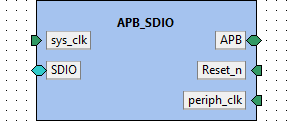

**IP-Xact file:** [APB_SDIO.1.0.xml](../ipxact/tuni.fi/pulp.peripheral/APB_SDIO/1.0/APB_SDIO.1.0.xml)  

## 11.1 Kactus2 attributes <a id="tuni.fi:pulp.peripheral:APB_SDIO:1.0.attributes">  

**Product hierarchy:** Flat  
**Component implementation:** HW  
**Component firmness:** Mutable  

## 11.2 Ports <a id="tuni.fi:pulp.peripheral:APB_SDIO:1.0.ports">  

|Name|Direction|Left bound|Right bound|Port type|Type definition|Default value|Array left|Array right|Description|  
|:----|:----|:----|:----|:----|:----|:----|:----|:----|:----|  
|PADDR <a id="tuni.fi:pulp.peripheral:APB_SDIO:1.0.port.PADDR">|in|31|0|||||||  
|PENABLE <a id="tuni.fi:pulp.peripheral:APB_SDIO:1.0.port.PENABLE">|in|||||||||  
|PRDATA <a id="tuni.fi:pulp.peripheral:APB_SDIO:1.0.port.PRDATA">|out|31|0|||||||  
|PREADY <a id="tuni.fi:pulp.peripheral:APB_SDIO:1.0.port.PREADY">|out|||||||||  
|PSEL <a id="tuni.fi:pulp.peripheral:APB_SDIO:1.0.port.PSEL">|in|||||||||  
|PSLVERR <a id="tuni.fi:pulp.peripheral:APB_SDIO:1.0.port.PSLVERR">|out|||||||||  
|PWDATA <a id="tuni.fi:pulp.peripheral:APB_SDIO:1.0.port.PWDATA">|in|31|0|||||||  
|PWRITE <a id="tuni.fi:pulp.peripheral:APB_SDIO:1.0.port.PWRITE">|in|||||||||  
|sys_clk_i <a id="tuni.fi:pulp.peripheral:APB_SDIO:1.0.port.sys_clk_i">|in|||||||||  
|rst_n_i <a id="tuni.fi:pulp.peripheral:APB_SDIO:1.0.port.rst_n_i">|in|||||||||  
|sdio_clk_internal <a id="tuni.fi:pulp.peripheral:APB_SDIO:1.0.port.sdio_clk_internal">|out|||||||||  
|sdio_cmd_internal <a id="tuni.fi:pulp.peripheral:APB_SDIO:1.0.port.sdio_cmd_internal">|out|||||||||  
|sdio_data_i_internal <a id="tuni.fi:pulp.peripheral:APB_SDIO:1.0.port.sdio_data_i_internal">|in|3|0|||||||  
|sdio_data_o_internal <a id="tuni.fi:pulp.peripheral:APB_SDIO:1.0.port.sdio_data_o_internal">|out|3|0|||||||  
|periph_clk_i <a id="tuni.fi:pulp.peripheral:APB_SDIO:1.0.port.periph_clk_i">|in|||||||||  
|err_o <a id="tuni.fi:pulp.peripheral:APB_SDIO:1.0.port.err_o">|out|||||||||  
|eot_o <a id="tuni.fi:pulp.peripheral:APB_SDIO:1.0.port.eot_o">|out|||||||||  
|sdio_init_disable_i <a id="tuni.fi:pulp.peripheral:APB_SDIO:1.0.port.sdio_init_disable_i">|in|||||||||  
|sdclk_o <a id="tuni.fi:pulp.peripheral:APB_SDIO:1.0.port.sdclk_o">|out|||||||||  
|sdcmd_i <a id="tuni.fi:pulp.peripheral:APB_SDIO:1.0.port.sdcmd_i">|in|||||||||  
|sdcmd_o <a id="tuni.fi:pulp.peripheral:APB_SDIO:1.0.port.sdcmd_o">|out|||||||||  
|sdcmd_oen_o <a id="tuni.fi:pulp.peripheral:APB_SDIO:1.0.port.sdcmd_oen_o">|out|||||||||  
|sddata_o <a id="tuni.fi:pulp.peripheral:APB_SDIO:1.0.port.sddata_o">|out|3|0|||||||  
|sddata_i <a id="tuni.fi:pulp.peripheral:APB_SDIO:1.0.port.sddata_i">|in|3|0|||||||  
|sddata_oen_o <a id="tuni.fi:pulp.peripheral:APB_SDIO:1.0.port.sddata_oen_o">|out|3|0|||||||  
## 11.3 Bus interfaces <a id="tuni.fi:pulp.peripheral:APB_SDIO:1.0.interfaces">  

### 11.3.1 Bus interface APB  

**Description:**   
**Interface mode:** target  
**Bus definition:** tuni.fi:interface:APB:1.0  
**Abstraction definitions:** tuni.fi:interface:APB.absDef:1.0  
**Ports used in this interface:**   

|Name|Direction|Left bound|Right bound|Port type|Type definition|Default value|Array left|Array right|Description|  
|:----|:----|:----|:----|:----|:----|:----|:----|:----|:----|  
|PADDR <a id="tuni.fi:pulp.peripheral:APB_SDIO:1.0.port.PADDR">|in|31|0|||||||  
|PENABLE <a id="tuni.fi:pulp.peripheral:APB_SDIO:1.0.port.PENABLE">|in|||||||||  
|PRDATA <a id="tuni.fi:pulp.peripheral:APB_SDIO:1.0.port.PRDATA">|out|31|0|||||||  
|PREADY <a id="tuni.fi:pulp.peripheral:APB_SDIO:1.0.port.PREADY">|out|||||||||  
|PSEL <a id="tuni.fi:pulp.peripheral:APB_SDIO:1.0.port.PSEL">|in|||||||||  
|PSLVERR <a id="tuni.fi:pulp.peripheral:APB_SDIO:1.0.port.PSLVERR">|out|||||||||  
|PWDATA <a id="tuni.fi:pulp.peripheral:APB_SDIO:1.0.port.PWDATA">|in|31|0|||||||  
|PWRITE <a id="tuni.fi:pulp.peripheral:APB_SDIO:1.0.port.PWRITE">|in|||||||||  
### 11.3.2 Bus interface sys_clk  

**Description:**   
**Interface mode:** target  
**Bus definition:** tuni.fi:interface:clock:1.0  
**Abstraction definitions:** tuni.fi:interface:clock.absDef:1.0  
**Ports used in this interface:**   

|Name|Direction|Left bound|Right bound|Port type|Type definition|Default value|Array left|Array right|Description|  
|:----|:----|:----|:----|:----|:----|:----|:----|:----|:----|  
|periph_clk_i <a id="tuni.fi:pulp.peripheral:APB_SDIO:1.0.port.periph_clk_i">|in|||||||||  
### 11.3.3 Bus interface Reset_n  

**Description:**   
**Interface mode:** target  
**Bus definition:** tuni.fi:interface:reset:1.0  
**Abstraction definitions:** tuni.fi:interface:reset.absDef:1.0  
**Ports used in this interface:**   

|Name|Direction|Left bound|Right bound|Port type|Type definition|Default value|Array left|Array right|Description|  
|:----|:----|:----|:----|:----|:----|:----|:----|:----|:----|  
|sys_clk_i <a id="tuni.fi:pulp.peripheral:APB_SDIO:1.0.port.sys_clk_i">|in|||||||||  
### 11.3.4 Bus interface SDIO  

**Description:**   
**Interface mode:** initiator  
**Bus definition:** tuni.fi:interface:SDIO:1.0  
**Abstraction definitions:** tuni.fi:interface:SDIO.absDef:1.0  
**Ports used in this interface:**   

|Name|Direction|Left bound|Right bound|Port type|Type definition|Default value|Array left|Array right|Description|  
|:----|:----|:----|:----|:----|:----|:----|:----|:----|:----|  
|sdio_clk_internal <a id="tuni.fi:pulp.peripheral:APB_SDIO:1.0.port.sdio_clk_internal">|out|||||||||  
|sdio_cmd_internal <a id="tuni.fi:pulp.peripheral:APB_SDIO:1.0.port.sdio_cmd_internal">|out|||||||||  
|sdio_data_i_internal <a id="tuni.fi:pulp.peripheral:APB_SDIO:1.0.port.sdio_data_i_internal">|in|3|0|||||||  
|sdio_data_o_internal <a id="tuni.fi:pulp.peripheral:APB_SDIO:1.0.port.sdio_data_o_internal">|out|3|0|||||||  
### 11.3.5 Bus interface periph_clk  

**Description:**   
**Interface mode:** target  
**Bus definition:** tuni.fi:interface:clock:1.0  
**Abstraction definitions:** tuni.fi:interface:clock.absDef:1.0  
**Ports used in this interface:**   

|Name|Direction|Left bound|Right bound|Port type|Type definition|Default value|Array left|Array right|Description|  
|:----|:----|:----|:----|:----|:----|:----|:----|:----|:----|  
|periph_clk_i <a id="tuni.fi:pulp.peripheral:APB_SDIO:1.0.port.periph_clk_i">|in|||||||||  
# 12. Component tuni.fi:communication:AX4LITE_APB_converter_wrapper:1.0<a id="tuni.fi:communication:AX4LITE_APB_converter_wrapper:1.0">  

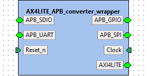

**IP-Xact file:** [AX4LITE_APB_converter_wrapper.1.0.xml](../ipxact/tuni.fi/communication/AX4LITE_APB_converter_wrapper/1.0/AX4LITE_APB_converter_wrapper.1.0.xml)  

## 12.1 Kactus2 attributes <a id="tuni.fi:communication:AX4LITE_APB_converter_wrapper:1.0.attributes">  

**Product hierarchy:** Flat  
**Component implementation:** HW  
**Component firmness:** Mutable  

## 12.2 Ports <a id="tuni.fi:communication:AX4LITE_APB_converter_wrapper:1.0.ports">  

|Name|Direction|Left bound|Right bound|Port type|Type definition|Default value|Array left|Array right|Description|  
|:----|:----|:----|:----|:----|:----|:----|:----|:----|:----|  
|PADDR <a id="tuni.fi:communication:AX4LITE_APB_converter_wrapper:1.0.port.PADDR">|out|31|0|||||||  
|PENABLE <a id="tuni.fi:communication:AX4LITE_APB_converter_wrapper:1.0.port.PENABLE">|out|||||||||  
|PRDATA <a id="tuni.fi:communication:AX4LITE_APB_converter_wrapper:1.0.port.PRDATA">|in|31|0|||||||  
|PREADY <a id="tuni.fi:communication:AX4LITE_APB_converter_wrapper:1.0.port.PREADY">|in|||||||||  
|PSEL <a id="tuni.fi:communication:AX4LITE_APB_converter_wrapper:1.0.port.PSEL">|out|||||||||  
|PSLVERR <a id="tuni.fi:communication:AX4LITE_APB_converter_wrapper:1.0.port.PSLVERR">|in|||||||||  
|PWDATA <a id="tuni.fi:communication:AX4LITE_APB_converter_wrapper:1.0.port.PWDATA">|out|31|0|||||||  
|PWRITE <a id="tuni.fi:communication:AX4LITE_APB_converter_wrapper:1.0.port.PWRITE">|out|||||||||  
|PADDR_1 <a id="tuni.fi:communication:AX4LITE_APB_converter_wrapper:1.0.port.PADDR_1">|out|31|0|||||||  
|PENABLE_1 <a id="tuni.fi:communication:AX4LITE_APB_converter_wrapper:1.0.port.PENABLE_1">|out|||||||||  
|PRDATA_1 <a id="tuni.fi:communication:AX4LITE_APB_converter_wrapper:1.0.port.PRDATA_1">|in|31|0|||||||  
|PREADY_1 <a id="tuni.fi:communication:AX4LITE_APB_converter_wrapper:1.0.port.PREADY_1">|in|||||||||  
|PSEL_1 <a id="tuni.fi:communication:AX4LITE_APB_converter_wrapper:1.0.port.PSEL_1">|out|||||||||  
|PSLVERR_1 <a id="tuni.fi:communication:AX4LITE_APB_converter_wrapper:1.0.port.PSLVERR_1">|in|||||||||  
|PWDATA_1 <a id="tuni.fi:communication:AX4LITE_APB_converter_wrapper:1.0.port.PWDATA_1">|out|31|0|||||||  
|PWRITE_1 <a id="tuni.fi:communication:AX4LITE_APB_converter_wrapper:1.0.port.PWRITE_1">|out|||||||||  
|PADDR_2 <a id="tuni.fi:communication:AX4LITE_APB_converter_wrapper:1.0.port.PADDR_2">|out|31|0|logic||||||  
|PENABLE_2 <a id="tuni.fi:communication:AX4LITE_APB_converter_wrapper:1.0.port.PENABLE_2">|out|||logic||||||  
|PRDATA_2 <a id="tuni.fi:communication:AX4LITE_APB_converter_wrapper:1.0.port.PRDATA_2">|in|31|0|logic||||||  
|PREADY_2 <a id="tuni.fi:communication:AX4LITE_APB_converter_wrapper:1.0.port.PREADY_2">|in|0|0|logic||||||  
|PSEL_2 <a id="tuni.fi:communication:AX4LITE_APB_converter_wrapper:1.0.port.PSEL_2">|out|0|0|logic||||||  
|PSLVERR_2 <a id="tuni.fi:communication:AX4LITE_APB_converter_wrapper:1.0.port.PSLVERR_2">|in|0|0|logic||||||  
|PWDATA_2 <a id="tuni.fi:communication:AX4LITE_APB_converter_wrapper:1.0.port.PWDATA_2">|out|31|0|logic||||||  
|PWRITE_2 <a id="tuni.fi:communication:AX4LITE_APB_converter_wrapper:1.0.port.PWRITE_2">|out|||logic||||||  
|PADDR_3 <a id="tuni.fi:communication:AX4LITE_APB_converter_wrapper:1.0.port.PADDR_3">|out|31|0|||||||  
|PENABLE_3 <a id="tuni.fi:communication:AX4LITE_APB_converter_wrapper:1.0.port.PENABLE_3">|out|||||||||  
|PRDATA_3 <a id="tuni.fi:communication:AX4LITE_APB_converter_wrapper:1.0.port.PRDATA_3">|in|31|0|||||||  
|PREADY_3 <a id="tuni.fi:communication:AX4LITE_APB_converter_wrapper:1.0.port.PREADY_3">|in|||||||||  
|PSEL_3 <a id="tuni.fi:communication:AX4LITE_APB_converter_wrapper:1.0.port.PSEL_3">|out|||||||||  
|PSLVERR_3 <a id="tuni.fi:communication:AX4LITE_APB_converter_wrapper:1.0.port.PSLVERR_3">|in|||||||||  
|PWDATA_3 <a id="tuni.fi:communication:AX4LITE_APB_converter_wrapper:1.0.port.PWDATA_3">|out|31|0|||||||  
|PWRITE_3 <a id="tuni.fi:communication:AX4LITE_APB_converter_wrapper:1.0.port.PWRITE_3">|out|||||||||  
|clk <a id="tuni.fi:communication:AX4LITE_APB_converter_wrapper:1.0.port.clk">|in|||||||||  
|rst_n <a id="tuni.fi:communication:AX4LITE_APB_converter_wrapper:1.0.port.rst_n">|in|||||||||  
|ar_addr <a id="tuni.fi:communication:AX4LITE_APB_converter_wrapper:1.0.port.ar_addr">|in|31|0|||||||  
|ar_ready <a id="tuni.fi:communication:AX4LITE_APB_converter_wrapper:1.0.port.ar_ready">|out|||||||||  
|ar_valid <a id="tuni.fi:communication:AX4LITE_APB_converter_wrapper:1.0.port.ar_valid">|in|||||||||  
|aw_addr <a id="tuni.fi:communication:AX4LITE_APB_converter_wrapper:1.0.port.aw_addr">|in|31|0|||||||  
|aw_valid <a id="tuni.fi:communication:AX4LITE_APB_converter_wrapper:1.0.port.aw_valid">|in|||||||||  
|b_ready <a id="tuni.fi:communication:AX4LITE_APB_converter_wrapper:1.0.port.b_ready">|in|||||||||  
|b_resp <a id="tuni.fi:communication:AX4LITE_APB_converter_wrapper:1.0.port.b_resp">|out|1|0|||||||  
|b_valid <a id="tuni.fi:communication:AX4LITE_APB_converter_wrapper:1.0.port.b_valid">|out|||||||||  
|r_data <a id="tuni.fi:communication:AX4LITE_APB_converter_wrapper:1.0.port.r_data">|out|31|0|||||||  
|r_ready <a id="tuni.fi:communication:AX4LITE_APB_converter_wrapper:1.0.port.r_ready">|in|||||||||  
|r_resp <a id="tuni.fi:communication:AX4LITE_APB_converter_wrapper:1.0.port.r_resp">|out|1|0|||||||  
|r_valid <a id="tuni.fi:communication:AX4LITE_APB_converter_wrapper:1.0.port.r_valid">|out|||||||||  
|aw_ready <a id="tuni.fi:communication:AX4LITE_APB_converter_wrapper:1.0.port.aw_ready">|out|||||||||  
|w_data <a id="tuni.fi:communication:AX4LITE_APB_converter_wrapper:1.0.port.w_data">|in|31|0|||||||  
|w_ready <a id="tuni.fi:communication:AX4LITE_APB_converter_wrapper:1.0.port.w_ready">|out|||||||||  
|w_strb <a id="tuni.fi:communication:AX4LITE_APB_converter_wrapper:1.0.port.w_strb">|in|3|0|||||||  
|w_valid <a id="tuni.fi:communication:AX4LITE_APB_converter_wrapper:1.0.port.w_valid">|in|||||||||  
|ar_prot <a id="tuni.fi:communication:AX4LITE_APB_converter_wrapper:1.0.port.ar_prot">|in|2|0|||||||  
|aw_prot <a id="tuni.fi:communication:AX4LITE_APB_converter_wrapper:1.0.port.aw_prot">|in|2|0|||||||  
## 12.3 Bus interfaces <a id="tuni.fi:communication:AX4LITE_APB_converter_wrapper:1.0.interfaces">  

### 12.3.1 Bus interface APB_GPIO  

**Description:**   
**Interface mode:** mirroredTarget  
**Bus definition:** tuni.fi:interface:APB:1.0  
**Abstraction definitions:** tuni.fi:interface:APB.absDef:1.0  
**Ports used in this interface:**   

|Name|Direction|Left bound|Right bound|Port type|Type definition|Default value|Array left|Array right|Description|  
|:----|:----|:----|:----|:----|:----|:----|:----|:----|:----|  
|PADDR <a id="tuni.fi:communication:AX4LITE_APB_converter_wrapper:1.0.port.PADDR">|out|31|0|||||||  
|PENABLE <a id="tuni.fi:communication:AX4LITE_APB_converter_wrapper:1.0.port.PENABLE">|out|||||||||  
|PRDATA <a id="tuni.fi:communication:AX4LITE_APB_converter_wrapper:1.0.port.PRDATA">|in|31|0|||||||  
|PREADY <a id="tuni.fi:communication:AX4LITE_APB_converter_wrapper:1.0.port.PREADY">|in|||||||||  
|PSEL <a id="tuni.fi:communication:AX4LITE_APB_converter_wrapper:1.0.port.PSEL">|out|||||||||  
|PSLVERR <a id="tuni.fi:communication:AX4LITE_APB_converter_wrapper:1.0.port.PSLVERR">|in|||||||||  
|PWDATA <a id="tuni.fi:communication:AX4LITE_APB_converter_wrapper:1.0.port.PWDATA">|out|31|0|||||||  
|PWRITE <a id="tuni.fi:communication:AX4LITE_APB_converter_wrapper:1.0.port.PWRITE">|out|||||||||  
### 12.3.2 Bus interface APB_SDIO  

**Description:**   
**Interface mode:** mirroredTarget  
**Bus definition:** tuni.fi:interface:APB:1.0  
**Abstraction definitions:** tuni.fi:interface:APB.absDef:1.0  
**Ports used in this interface:**   

|Name|Direction|Left bound|Right bound|Port type|Type definition|Default value|Array left|Array right|Description|  
|:----|:----|:----|:----|:----|:----|:----|:----|:----|:----|  
|PADDR_1 <a id="tuni.fi:communication:AX4LITE_APB_converter_wrapper:1.0.port.PADDR_1">|out|31|0|||||||  
|PENABLE_1 <a id="tuni.fi:communication:AX4LITE_APB_converter_wrapper:1.0.port.PENABLE_1">|out|||||||||  
|PRDATA_1 <a id="tuni.fi:communication:AX4LITE_APB_converter_wrapper:1.0.port.PRDATA_1">|in|31|0|||||||  
|PREADY_1 <a id="tuni.fi:communication:AX4LITE_APB_converter_wrapper:1.0.port.PREADY_1">|in|||||||||  
|PSEL_1 <a id="tuni.fi:communication:AX4LITE_APB_converter_wrapper:1.0.port.PSEL_1">|out|||||||||  
|PSLVERR_1 <a id="tuni.fi:communication:AX4LITE_APB_converter_wrapper:1.0.port.PSLVERR_1">|in|||||||||  
|PWDATA_1 <a id="tuni.fi:communication:AX4LITE_APB_converter_wrapper:1.0.port.PWDATA_1">|out|31|0|||||||  
|PWRITE_1 <a id="tuni.fi:communication:AX4LITE_APB_converter_wrapper:1.0.port.PWRITE_1">|out|||||||||  
### 12.3.3 Bus interface APB_SPI  

**Description:**   
**Interface mode:** mirroredTarget  
**Bus definition:** tuni.fi:interface:APB:1.0  
**Abstraction definitions:** tuni.fi:interface:APB.absDef:1.0  
**Ports used in this interface:**   

|Name|Direction|Left bound|Right bound|Port type|Type definition|Default value|Array left|Array right|Description|  
|:----|:----|:----|:----|:----|:----|:----|:----|:----|:----|  
|PADDR_2 <a id="tuni.fi:communication:AX4LITE_APB_converter_wrapper:1.0.port.PADDR_2">|out|31|0|logic||||||  
|PENABLE_2 <a id="tuni.fi:communication:AX4LITE_APB_converter_wrapper:1.0.port.PENABLE_2">|out|||logic||||||  
|PRDATA_2 <a id="tuni.fi:communication:AX4LITE_APB_converter_wrapper:1.0.port.PRDATA_2">|in|31|0|logic||||||  
|PREADY_2 <a id="tuni.fi:communication:AX4LITE_APB_converter_wrapper:1.0.port.PREADY_2">|in|0|0|logic||||||  
|PSEL_2 <a id="tuni.fi:communication:AX4LITE_APB_converter_wrapper:1.0.port.PSEL_2">|out|0|0|logic||||||  
|PSLVERR_2 <a id="tuni.fi:communication:AX4LITE_APB_converter_wrapper:1.0.port.PSLVERR_2">|in|0|0|logic||||||  
|PWDATA_2 <a id="tuni.fi:communication:AX4LITE_APB_converter_wrapper:1.0.port.PWDATA_2">|out|31|0|logic||||||  
|PWRITE_2 <a id="tuni.fi:communication:AX4LITE_APB_converter_wrapper:1.0.port.PWRITE_2">|out|||logic||||||  
### 12.3.4 Bus interface APB_UART  

**Description:**   
**Interface mode:** mirroredTarget  
**Bus definition:** tuni.fi:interface:APB:1.0  
**Abstraction definitions:** tuni.fi:interface:APB.absDef:1.0  
**Ports used in this interface:**   

|Name|Direction|Left bound|Right bound|Port type|Type definition|Default value|Array left|Array right|Description|  
|:----|:----|:----|:----|:----|:----|:----|:----|:----|:----|  
|PADDR_3 <a id="tuni.fi:communication:AX4LITE_APB_converter_wrapper:1.0.port.PADDR_3">|out|31|0|||||||  
|PENABLE_3 <a id="tuni.fi:communication:AX4LITE_APB_converter_wrapper:1.0.port.PENABLE_3">|out|||||||||  
|PRDATA_3 <a id="tuni.fi:communication:AX4LITE_APB_converter_wrapper:1.0.port.PRDATA_3">|in|31|0|||||||  
|PREADY_3 <a id="tuni.fi:communication:AX4LITE_APB_converter_wrapper:1.0.port.PREADY_3">|in|||||||||  
|PSEL_3 <a id="tuni.fi:communication:AX4LITE_APB_converter_wrapper:1.0.port.PSEL_3">|out|||||||||  
|PSLVERR_3 <a id="tuni.fi:communication:AX4LITE_APB_converter_wrapper:1.0.port.PSLVERR_3">|in|||||||||  
|PWDATA_3 <a id="tuni.fi:communication:AX4LITE_APB_converter_wrapper:1.0.port.PWDATA_3">|out|31|0|||||||  
|PWRITE_3 <a id="tuni.fi:communication:AX4LITE_APB_converter_wrapper:1.0.port.PWRITE_3">|out|||||||||  
### 12.3.5 Bus interface Clock  

**Description:**   
**Interface mode:** target  
**Bus definition:** tuni.fi:interface:clock:1.0  
**Abstraction definitions:** tuni.fi:interface:clock.absDef:1.0  
**Ports used in this interface:**   

|Name|Direction|Left bound|Right bound|Port type|Type definition|Default value|Array left|Array right|Description|  
|:----|:----|:----|:----|:----|:----|:----|:----|:----|:----|  
|clk <a id="tuni.fi:communication:AX4LITE_APB_converter_wrapper:1.0.port.clk">|in|||||||||  
### 12.3.6 Bus interface Reset_n  

**Description:**   
**Interface mode:** target  
**Bus definition:** tuni.fi:interface:reset:1.0  
**Abstraction definitions:** tuni.fi:interface:reset.absDef:1.0  
**Ports used in this interface:**   

|Name|Direction|Left bound|Right bound|Port type|Type definition|Default value|Array left|Array right|Description|  
|:----|:----|:----|:----|:----|:----|:----|:----|:----|:----|  
|rst_n <a id="tuni.fi:communication:AX4LITE_APB_converter_wrapper:1.0.port.rst_n">|in|||||||||  
### 12.3.7 Bus interface AXI4LITE  

**Description:**   
**Interface mode:** mirroredInitiator  
**Bus definition:** tuni.fi:interface:AXI4LITE:1.0  
**Abstraction definitions:** tuni.fi:interface:AXI4LITE.absDef:1.0  
**Ports used in this interface:**   

|Name|Direction|Left bound|Right bound|Port type|Type definition|Default value|Array left|Array right|Description|  
|:----|:----|:----|:----|:----|:----|:----|:----|:----|:----|  
|ar_addr <a id="tuni.fi:communication:AX4LITE_APB_converter_wrapper:1.0.port.ar_addr">|in|31|0|||||||  
|ar_ready <a id="tuni.fi:communication:AX4LITE_APB_converter_wrapper:1.0.port.ar_ready">|out|||||||||  
|ar_valid <a id="tuni.fi:communication:AX4LITE_APB_converter_wrapper:1.0.port.ar_valid">|in|||||||||  
|aw_addr <a id="tuni.fi:communication:AX4LITE_APB_converter_wrapper:1.0.port.aw_addr">|in|31|0|||||||  
|aw_valid <a id="tuni.fi:communication:AX4LITE_APB_converter_wrapper:1.0.port.aw_valid">|in|||||||||  
|b_ready <a id="tuni.fi:communication:AX4LITE_APB_converter_wrapper:1.0.port.b_ready">|in|||||||||  
|b_resp <a id="tuni.fi:communication:AX4LITE_APB_converter_wrapper:1.0.port.b_resp">|out|1|0|||||||  
|b_valid <a id="tuni.fi:communication:AX4LITE_APB_converter_wrapper:1.0.port.b_valid">|out|||||||||  
|r_data <a id="tuni.fi:communication:AX4LITE_APB_converter_wrapper:1.0.port.r_data">|out|31|0|||||||  
|r_ready <a id="tuni.fi:communication:AX4LITE_APB_converter_wrapper:1.0.port.r_ready">|in|||||||||  
|r_resp <a id="tuni.fi:communication:AX4LITE_APB_converter_wrapper:1.0.port.r_resp">|out|1|0|||||||  
|r_valid <a id="tuni.fi:communication:AX4LITE_APB_converter_wrapper:1.0.port.r_valid">|out|||||||||  
|aw_ready <a id="tuni.fi:communication:AX4LITE_APB_converter_wrapper:1.0.port.aw_ready">|out|||||||||  
|w_data <a id="tuni.fi:communication:AX4LITE_APB_converter_wrapper:1.0.port.w_data">|in|31|0|||||||  
|w_ready <a id="tuni.fi:communication:AX4LITE_APB_converter_wrapper:1.0.port.w_ready">|out|||||||||  
|w_strb <a id="tuni.fi:communication:AX4LITE_APB_converter_wrapper:1.0.port.w_strb">|in|3|0|||||||  
|w_valid <a id="tuni.fi:communication:AX4LITE_APB_converter_wrapper:1.0.port.w_valid">|in|||||||||  
|ar_prot <a id="tuni.fi:communication:AX4LITE_APB_converter_wrapper:1.0.port.ar_prot">|in|2|0|||||||  
|aw_prot <a id="tuni.fi:communication:AX4LITE_APB_converter_wrapper:1.0.port.aw_prot">|in|2|0|||||||  
## 12.4 File sets <a id="tuni.fi:communication:AX4LITE_APB_converter_wrapper:1.0.fileSets">  

### 12.4.1 File set fileSet  

**Identifiers:**   

#### 12.4.1.1 Files  

|File name|Logical name|Build command|Build flags|Specified file types|Description|  
|:----|:----|:----|:----|:----|:----|  
|[AX4LITE_APB_converter_wrapper.v](../src/rtl/AX4LITE_APB_converter_wrapper.v)||||verilogSource||  
# 13. Component tuni.fi:ip:jtag_dbg_wrapper:1.0<a id="tuni.fi:ip:jtag_dbg_wrapper:1.0">  

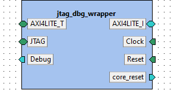

**IP-Xact file:** [jtag_dbg_wrapper.1.0.xml](../ipxact/tuni.fi/ip/jtag_dbg_wrapper/1.0/jtag_dbg_wrapper.1.0.xml)  

## 13.1 Kactus2 attributes <a id="tuni.fi:ip:jtag_dbg_wrapper:1.0.attributes">  

**Product hierarchy:** Flat  
**Component implementation:** HW  
**Component firmness:** Mutable  

## 13.2 General parameters <a id="tuni.fi:ip:jtag_dbg_wrapper:1.0.parameters">  

|Name|Type|Value|Resolve|Bit vector left|Bit vector right|Array left|Array right|Description|  
|:----|:----|:----|:----|:----|:----|:----|:----|:----|  
|AXI_AW||32|||||||  
|DM_BASE_ADDRESS||'h1000|||||||  
|AXI_DW||32|||||||  
## 13.3 Ports <a id="tuni.fi:ip:jtag_dbg_wrapper:1.0.ports">  

|Name|Direction|Left bound|Right bound|Port type|Type definition|Default value|Array left|Array right|Description|  
|:----|:----|:----|:----|:----|:----|:----|:----|:----|:----|  
|init_ar_addr_out <a id="tuni.fi:ip:jtag_dbg_wrapper:1.0.port.init_ar_addr_out">|out|31|0|logic||||||  
|init_ar_ready_in <a id="tuni.fi:ip:jtag_dbg_wrapper:1.0.port.init_ar_ready_in">|in|||logic||||||  
|init_ar_valid_out <a id="tuni.fi:ip:jtag_dbg_wrapper:1.0.port.init_ar_valid_out">|out|||logic||||||  
|init_aw_addr_out <a id="tuni.fi:ip:jtag_dbg_wrapper:1.0.port.init_aw_addr_out">|out|31|0|logic||||||  
|init_aw_valid_out <a id="tuni.fi:ip:jtag_dbg_wrapper:1.0.port.init_aw_valid_out">|out|||logic||||||  
|init_b_ready_out <a id="tuni.fi:ip:jtag_dbg_wrapper:1.0.port.init_b_ready_out">|out|||logic||||||  
|init_b_resp_in <a id="tuni.fi:ip:jtag_dbg_wrapper:1.0.port.init_b_resp_in">|in|1|0|logic||||||  
|init_b_valid_in <a id="tuni.fi:ip:jtag_dbg_wrapper:1.0.port.init_b_valid_in">|in|||logic||||||  
|init_r_data_in <a id="tuni.fi:ip:jtag_dbg_wrapper:1.0.port.init_r_data_in">|in|31|0|logic||||||  
|init_r_ready_out <a id="tuni.fi:ip:jtag_dbg_wrapper:1.0.port.init_r_ready_out">|out|||logic||||||  
|init_r_resp_in <a id="tuni.fi:ip:jtag_dbg_wrapper:1.0.port.init_r_resp_in">|in|1|0|logic||||||  
|init_r_valid_in <a id="tuni.fi:ip:jtag_dbg_wrapper:1.0.port.init_r_valid_in">|in|||logic||||||  
|init_aw_ready_in <a id="tuni.fi:ip:jtag_dbg_wrapper:1.0.port.init_aw_ready_in">|in|||logic||||||  
|init_w_data_out <a id="tuni.fi:ip:jtag_dbg_wrapper:1.0.port.init_w_data_out">|out|31|0|logic||||||  
|init_w_ready_in <a id="tuni.fi:ip:jtag_dbg_wrapper:1.0.port.init_w_ready_in">|in|||logic||||||  
|init_w_strb_out <a id="tuni.fi:ip:jtag_dbg_wrapper:1.0.port.init_w_strb_out">|out|||logic||||||  
|init_w_valid_out <a id="tuni.fi:ip:jtag_dbg_wrapper:1.0.port.init_w_valid_out">|out|||logic||||||  
|target_ar_addr_in <a id="tuni.fi:ip:jtag_dbg_wrapper:1.0.port.target_ar_addr_in">|in|31|0|logic||||||  
|target_ar_ready_out <a id="tuni.fi:ip:jtag_dbg_wrapper:1.0.port.target_ar_ready_out">|out|||logic||||||  
|target_valid_in <a id="tuni.fi:ip:jtag_dbg_wrapper:1.0.port.target_valid_in">|in|||logic||||||  
|target_aw_addr_in <a id="tuni.fi:ip:jtag_dbg_wrapper:1.0.port.target_aw_addr_in">|in|31|0|logic||||||  
|target_aw_valid_in <a id="tuni.fi:ip:jtag_dbg_wrapper:1.0.port.target_aw_valid_in">|in|||logic||||||  
|target_b_ready_in <a id="tuni.fi:ip:jtag_dbg_wrapper:1.0.port.target_b_ready_in">|in|||logic||||||  
|target_b_resp_out <a id="tuni.fi:ip:jtag_dbg_wrapper:1.0.port.target_b_resp_out">|out|1|0|logic||||||  
|target_b_valid_out <a id="tuni.fi:ip:jtag_dbg_wrapper:1.0.port.target_b_valid_out">|out|||logic||||||  
|target_r_data_out <a id="tuni.fi:ip:jtag_dbg_wrapper:1.0.port.target_r_data_out">|out|31|0|logic||||||  
|target_r_ready_in <a id="tuni.fi:ip:jtag_dbg_wrapper:1.0.port.target_r_ready_in">|in|||logic||||||  
|target_r_resp_out <a id="tuni.fi:ip:jtag_dbg_wrapper:1.0.port.target_r_resp_out">|out|1|0|logic||||||  
|target_r_valid_out <a id="tuni.fi:ip:jtag_dbg_wrapper:1.0.port.target_r_valid_out">|out|||logic||||||  
|target_aw_ready_out <a id="tuni.fi:ip:jtag_dbg_wrapper:1.0.port.target_aw_ready_out">|out|||logic||||||  
|target_w_data_in <a id="tuni.fi:ip:jtag_dbg_wrapper:1.0.port.target_w_data_in">|in|31|0|logic||||||  
|target_w_ready_out <a id="tuni.fi:ip:jtag_dbg_wrapper:1.0.port.target_w_ready_out">|out|||logic||||||  
|target_w_strb_in <a id="tuni.fi:ip:jtag_dbg_wrapper:1.0.port.target_w_strb_in">|in|3|0|logic||||||  
|target_w_valid_in <a id="tuni.fi:ip:jtag_dbg_wrapper:1.0.port.target_w_valid_in">|in|||logic||||||  
|jtag_tck_internal <a id="tuni.fi:ip:jtag_dbg_wrapper:1.0.port.jtag_tck_internal">|in|||||||||  
|jtag_tdi_internal <a id="tuni.fi:ip:jtag_dbg_wrapper:1.0.port.jtag_tdi_internal">|in|||||||||  
|jtag_tdo_internal <a id="tuni.fi:ip:jtag_dbg_wrapper:1.0.port.jtag_tdo_internal">|out|||||||||  
|jtag_tms_internal <a id="tuni.fi:ip:jtag_dbg_wrapper:1.0.port.jtag_tms_internal">|in|||||||||  
|jtag_trst_internal <a id="tuni.fi:ip:jtag_dbg_wrapper:1.0.port.jtag_trst_internal">|in|||||||||  
|clk_i <a id="tuni.fi:ip:jtag_dbg_wrapper:1.0.port.clk_i">|in|||||||||  
|rst_ni <a id="tuni.fi:ip:jtag_dbg_wrapper:1.0.port.rst_ni">|in|||||||||  
|ndmreset_o <a id="tuni.fi:ip:jtag_dbg_wrapper:1.0.port.ndmreset_o">|out|||||||||  
|debug_reg_irq_o <a id="tuni.fi:ip:jtag_dbg_wrapper:1.0.port.debug_reg_irq_o">|out|||||||||  
|core_reset <a id="tuni.fi:ip:jtag_dbg_wrapper:1.0.port.core_reset">|out|||||||||  
## 13.4 Bus interfaces <a id="tuni.fi:ip:jtag_dbg_wrapper:1.0.interfaces">  

### 13.4.1 Bus interface AXI4LITE_I  

**Description:**   
**Interface mode:** initiator  
**Bus definition:** tuni.fi:interface:AXI4LITE:1.0  
**Abstraction definitions:** tuni.fi:interface:AXI4LITE.absDef:1.0  
**Ports used in this interface:**   

|Name|Direction|Left bound|Right bound|Port type|Type definition|Default value|Array left|Array right|Description|  
|:----|:----|:----|:----|:----|:----|:----|:----|:----|:----|  
|init_ar_addr_out <a id="tuni.fi:ip:jtag_dbg_wrapper:1.0.port.init_ar_addr_out">|out|31|0|logic||||||  
|init_ar_ready_in <a id="tuni.fi:ip:jtag_dbg_wrapper:1.0.port.init_ar_ready_in">|in|||logic||||||  
|init_ar_valid_out <a id="tuni.fi:ip:jtag_dbg_wrapper:1.0.port.init_ar_valid_out">|out|||logic||||||  
|init_aw_addr_out <a id="tuni.fi:ip:jtag_dbg_wrapper:1.0.port.init_aw_addr_out">|out|31|0|logic||||||  
|init_aw_valid_out <a id="tuni.fi:ip:jtag_dbg_wrapper:1.0.port.init_aw_valid_out">|out|||logic||||||  
|init_b_ready_out <a id="tuni.fi:ip:jtag_dbg_wrapper:1.0.port.init_b_ready_out">|out|||logic||||||  
|init_b_resp_in <a id="tuni.fi:ip:jtag_dbg_wrapper:1.0.port.init_b_resp_in">|in|1|0|logic||||||  
|init_b_valid_in <a id="tuni.fi:ip:jtag_dbg_wrapper:1.0.port.init_b_valid_in">|in|||logic||||||  
|init_r_data_in <a id="tuni.fi:ip:jtag_dbg_wrapper:1.0.port.init_r_data_in">|in|31|0|logic||||||  
|init_r_ready_out <a id="tuni.fi:ip:jtag_dbg_wrapper:1.0.port.init_r_ready_out">|out|||logic||||||  
|init_r_resp_in <a id="tuni.fi:ip:jtag_dbg_wrapper:1.0.port.init_r_resp_in">|in|1|0|logic||||||  
|init_r_valid_in <a id="tuni.fi:ip:jtag_dbg_wrapper:1.0.port.init_r_valid_in">|in|||logic||||||  
|init_aw_ready_in <a id="tuni.fi:ip:jtag_dbg_wrapper:1.0.port.init_aw_ready_in">|in|||logic||||||  
|init_w_data_out <a id="tuni.fi:ip:jtag_dbg_wrapper:1.0.port.init_w_data_out">|out|31|0|logic||||||  
|init_w_ready_in <a id="tuni.fi:ip:jtag_dbg_wrapper:1.0.port.init_w_ready_in">|in|||logic||||||  
|init_w_valid_out <a id="tuni.fi:ip:jtag_dbg_wrapper:1.0.port.init_w_valid_out">|out|||logic||||||  
### 13.4.2 Bus interface AXI4LITE_T  

**Description:**   
**Interface mode:** target  
**Bus definition:** tuni.fi:interface:AXI4LITE:1.0  
**Abstraction definitions:** tuni.fi:interface:AXI4LITE.absDef:1.0  
**Ports used in this interface:**   

|Name|Direction|Left bound|Right bound|Port type|Type definition|Default value|Array left|Array right|Description|  
|:----|:----|:----|:----|:----|:----|:----|:----|:----|:----|  
|target_ar_addr_in <a id="tuni.fi:ip:jtag_dbg_wrapper:1.0.port.target_ar_addr_in">|in|31|0|logic||||||  
|target_ar_ready_out <a id="tuni.fi:ip:jtag_dbg_wrapper:1.0.port.target_ar_ready_out">|out|||logic||||||  
|target_aw_addr_in <a id="tuni.fi:ip:jtag_dbg_wrapper:1.0.port.target_aw_addr_in">|in|31|0|logic||||||  
|target_aw_valid_in <a id="tuni.fi:ip:jtag_dbg_wrapper:1.0.port.target_aw_valid_in">|in|||logic||||||  
|target_b_ready_in <a id="tuni.fi:ip:jtag_dbg_wrapper:1.0.port.target_b_ready_in">|in|||logic||||||  
|target_b_resp_out <a id="tuni.fi:ip:jtag_dbg_wrapper:1.0.port.target_b_resp_out">|out|1|0|logic||||||  
|target_b_valid_out <a id="tuni.fi:ip:jtag_dbg_wrapper:1.0.port.target_b_valid_out">|out|||logic||||||  
|target_r_data_out <a id="tuni.fi:ip:jtag_dbg_wrapper:1.0.port.target_r_data_out">|out|31|0|logic||||||  
|target_r_ready_in <a id="tuni.fi:ip:jtag_dbg_wrapper:1.0.port.target_r_ready_in">|in|||logic||||||  
|target_r_resp_out <a id="tuni.fi:ip:jtag_dbg_wrapper:1.0.port.target_r_resp_out">|out|1|0|logic||||||  
|target_r_valid_out <a id="tuni.fi:ip:jtag_dbg_wrapper:1.0.port.target_r_valid_out">|out|||logic||||||  
|target_aw_ready_out <a id="tuni.fi:ip:jtag_dbg_wrapper:1.0.port.target_aw_ready_out">|out|||logic||||||  
|target_w_data_in <a id="tuni.fi:ip:jtag_dbg_wrapper:1.0.port.target_w_data_in">|in|31|0|logic||||||  
|target_w_ready_out <a id="tuni.fi:ip:jtag_dbg_wrapper:1.0.port.target_w_ready_out">|out|||logic||||||  
|target_w_strb_in <a id="tuni.fi:ip:jtag_dbg_wrapper:1.0.port.target_w_strb_in">|in|3|0|logic||||||  
|target_w_valid_in <a id="tuni.fi:ip:jtag_dbg_wrapper:1.0.port.target_w_valid_in">|in|||logic||||||  
### 13.4.3 Bus interface Clock  

**Description:**   
**Interface mode:** target  
**Bus definition:** tuni.fi:interface:clock:1.0  
**Abstraction definitions:** tuni.fi:interface:clock.absDef:1.0  
**Ports used in this interface:**   

|Name|Direction|Left bound|Right bound|Port type|Type definition|Default value|Array left|Array right|Description|  
|:----|:----|:----|:----|:----|:----|:----|:----|:----|:----|  
|clk_i <a id="tuni.fi:ip:jtag_dbg_wrapper:1.0.port.clk_i">|in|||||||||  
### 13.4.4 Bus interface JTAG  

**Description:**   
**Interface mode:** target  
**Bus definition:** tuni.fi:interface:JTAG:1.0  
**Abstraction definitions:** tuni.fi:interface:JTAG.absDef:1.0  
**Ports used in this interface:**   

|Name|Direction|Left bound|Right bound|Port type|Type definition|Default value|Array left|Array right|Description|  
|:----|:----|:----|:----|:----|:----|:----|:----|:----|:----|  
|jtag_tck_internal <a id="tuni.fi:ip:jtag_dbg_wrapper:1.0.port.jtag_tck_internal">|in|||||||||  
|jtag_tdi_internal <a id="tuni.fi:ip:jtag_dbg_wrapper:1.0.port.jtag_tdi_internal">|in|||||||||  
|jtag_tdo_internal <a id="tuni.fi:ip:jtag_dbg_wrapper:1.0.port.jtag_tdo_internal">|out|||||||||  
|jtag_tms_internal <a id="tuni.fi:ip:jtag_dbg_wrapper:1.0.port.jtag_tms_internal">|in|||||||||  
|jtag_trst_internal <a id="tuni.fi:ip:jtag_dbg_wrapper:1.0.port.jtag_trst_internal">|in|||||||||  
### 13.4.5 Bus interface Reset  

**Description:**   
**Interface mode:** target  
**Bus definition:** tuni.fi:interface:reset:1.0  
**Abstraction definitions:** tuni.fi:interface:reset.absDef:1.0  
**Ports used in this interface:**   

|Name|Direction|Left bound|Right bound|Port type|Type definition|Default value|Array left|Array right|Description|  
|:----|:----|:----|:----|:----|:----|:----|:----|:----|:----|  
|rst_ni <a id="tuni.fi:ip:jtag_dbg_wrapper:1.0.port.rst_ni">|in|||||||||  
### 13.4.6 Bus interface Debug  

**Description:**   
**Interface mode:** initiator  
**Bus definition:** tuni.fi:interface:debug_req:1.0  
**Abstraction definitions:** tuni.fi:interface:debug_req.absDef:1.0  
**Ports used in this interface:**   

|Name|Direction|Left bound|Right bound|Port type|Type definition|Default value|Array left|Array right|Description|  
|:----|:----|:----|:----|:----|:----|:----|:----|:----|:----|  
|debug_reg_irq_o <a id="tuni.fi:ip:jtag_dbg_wrapper:1.0.port.debug_reg_irq_o">|out|||||||||  
### 13.4.7 Bus interface core_reset  

**Description:**   
**Interface mode:** initiator  
**Bus definition:** tuni.fi:interface:reset:1.0  
**Abstraction definitions:** tuni.fi:interface:reset.absDef:1.0  
**Ports used in this interface:**   

|Name|Direction|Left bound|Right bound|Port type|Type definition|Default value|Array left|Array right|Description|  
|:----|:----|:----|:----|:----|:----|:----|:----|:----|:----|  
|core_reset <a id="tuni.fi:ip:jtag_dbg_wrapper:1.0.port.core_reset">|out|||||||||  
# 14. Component tuni.fi:ip:mem_axi_bridge:1.0<a id="tuni.fi:ip:mem_axi_bridge:1.0">  

**IP-Xact file:** [mem_axi_bridge.1.0.xml](../tuni.fi/ip/mem_axi_bridge/1.0/mem_axi_bridge.1.0.xml)  

## 14.1 Kactus2 attributes <a id="tuni.fi:ip:mem_axi_bridge:1.0.attributes">  

**Product hierarchy:** Flat  
**Component implementation:** HW  
**Component firmness:** Mutable  

## 14.2 General parameters <a id="tuni.fi:ip:mem_axi_bridge:1.0.parameters">  

|Name|Type|Value|Resolve|Bit vector left|Bit vector right|Array left|Array right|Description|  
|:----|:----|:----|:----|:----|:----|:----|:----|:----|  
|MEM_AW||32|||||||  
|MEM_DW||32|||||||  
|AXI_AW||32|||||||  
|AXI_DW||32|||||||  
## 14.3 Ports <a id="tuni.fi:ip:mem_axi_bridge:1.0.ports">  

|Name|Direction|Left bound|Right bound|Port type|Type definition|Default value|Array left|Array right|Description|  
|:----|:----|:----|:----|:----|:----|:----|:----|:----|:----|  
|req_o <a id="tuni.fi:ip:mem_axi_bridge:1.0.port.req_o">|out|||logic||||||  
|we_o <a id="tuni.fi:ip:mem_axi_bridge:1.0.port.we_o">|out|||logic||||||  
|addr_o <a id="tuni.fi:ip:mem_axi_bridge:1.0.port.addr_o">|out|MEM_AW-1|0|logic||||||  
|wdata_o <a id="tuni.fi:ip:mem_axi_bridge:1.0.port.wdata_o">|out|MEM_DW-1|0|logic||||||  
|be_o <a id="tuni.fi:ip:mem_axi_bridge:1.0.port.be_o">|out|(MEM_DW/8)-1|0|logic||||||  
|rdata_i <a id="tuni.fi:ip:mem_axi_bridge:1.0.port.rdata_i">|in|MEM_DW-1|0|logic||||||  
|rst_ni <a id="tuni.fi:ip:mem_axi_bridge:1.0.port.rst_ni">|in|||logic||||||  
|aw_addr_i <a id="tuni.fi:ip:mem_axi_bridge:1.0.port.aw_addr_i">|in|AXI_AW-1|0|logic||||||  
|aw_valid_i <a id="tuni.fi:ip:mem_axi_bridge:1.0.port.aw_valid_i">|in|||logic||||||  
|aw_ready_o <a id="tuni.fi:ip:mem_axi_bridge:1.0.port.aw_ready_o">|out|||logic||||||  
|w_data_i <a id="tuni.fi:ip:mem_axi_bridge:1.0.port.w_data_i">|in|AXI_DW-1|0|logic||||||  
|w_strb_i <a id="tuni.fi:ip:mem_axi_bridge:1.0.port.w_strb_i">|in|||logic||||||  
|w_valid_i <a id="tuni.fi:ip:mem_axi_bridge:1.0.port.w_valid_i">|in|||logic||||||  
|w_ready_o <a id="tuni.fi:ip:mem_axi_bridge:1.0.port.w_ready_o">|out|||logic||||||  
|b_resp_o <a id="tuni.fi:ip:mem_axi_bridge:1.0.port.b_resp_o">|out|1|0|logic||||||  
|b_valid_o <a id="tuni.fi:ip:mem_axi_bridge:1.0.port.b_valid_o">|out|||logic||||||  
|b_ready_i <a id="tuni.fi:ip:mem_axi_bridge:1.0.port.b_ready_i">|in|||logic||||||  
|ar_addr_i <a id="tuni.fi:ip:mem_axi_bridge:1.0.port.ar_addr_i">|in|AXI_AW-1|0|logic||||||  
|ar_valid_i <a id="tuni.fi:ip:mem_axi_bridge:1.0.port.ar_valid_i">|in|||logic||||||  
|ar_ready_o <a id="tuni.fi:ip:mem_axi_bridge:1.0.port.ar_ready_o">|out|||logic||||||  
|r_data_o <a id="tuni.fi:ip:mem_axi_bridge:1.0.port.r_data_o">|out|AXI_DW-1|0|logic||||||  
|r_resp_o <a id="tuni.fi:ip:mem_axi_bridge:1.0.port.r_resp_o">|out|1|0|logic||||||  
|r_valid_o <a id="tuni.fi:ip:mem_axi_bridge:1.0.port.r_valid_o">|out|||logic||||||  
|r_ready_i <a id="tuni.fi:ip:mem_axi_bridge:1.0.port.r_ready_i">|in|||logic||||||  
|clk_i <a id="tuni.fi:ip:mem_axi_bridge:1.0.port.clk_i">|in|||logic||||||  
## 14.4 Bus interfaces <a id="tuni.fi:ip:mem_axi_bridge:1.0.interfaces">  

### 14.4.1 Bus interface Mem  

**Description:**   
**Interface mode:** initiator  
**Bus definition:** tuni.fi:interface:generic.memory:1.0  
**Abstraction definitions:** tuni.fi:interface:generic.memory.absDef:1.0  
**Ports used in this interface:**   

|Name|Direction|Left bound|Right bound|Port type|Type definition|Default value|Array left|Array right|Description|  
|:----|:----|:----|:----|:----|:----|:----|:----|:----|:----|  
|req_o <a id="tuni.fi:ip:mem_axi_bridge:1.0.port.req_o">|out|||logic||||||  
|we_o <a id="tuni.fi:ip:mem_axi_bridge:1.0.port.we_o">|out|||logic||||||  
|addr_o <a id="tuni.fi:ip:mem_axi_bridge:1.0.port.addr_o">|out|MEM_AW-1|0|logic||||||  
|wdata_o <a id="tuni.fi:ip:mem_axi_bridge:1.0.port.wdata_o">|out|MEM_DW-1|0|logic||||||  
|be_o <a id="tuni.fi:ip:mem_axi_bridge:1.0.port.be_o">|out|(MEM_DW/8)-1|0|logic||||||  
|rdata_i <a id="tuni.fi:ip:mem_axi_bridge:1.0.port.rdata_i">|in|MEM_DW-1|0|logic||||||  
### 14.4.2 Bus interface Clock  

**Description:**   
**Interface mode:** target  
**Bus definition:** tuni.fi:interface:clock:1.0  
**Abstraction definitions:** tuni.fi:interface:clock.absDef:1.0  
**Ports used in this interface:**   

|Name|Direction|Left bound|Right bound|Port type|Type definition|Default value|Array left|Array right|Description|  
|:----|:----|:----|:----|:----|:----|:----|:----|:----|:----|  
|clk_i <a id="tuni.fi:ip:mem_axi_bridge:1.0.port.clk_i">|in|||logic||||||  
### 14.4.3 Bus interface Reset  

**Description:**   
**Interface mode:** target  
**Bus definition:** tuni.fi:interface:reset:1.0  
**Abstraction definitions:** tuni.fi:interface:reset.absDef:1.0  
**Ports used in this interface:**   

|Name|Direction|Left bound|Right bound|Port type|Type definition|Default value|Array left|Array right|Description|  
|:----|:----|:----|:----|:----|:----|:----|:----|:----|:----|  
|rst_ni <a id="tuni.fi:ip:mem_axi_bridge:1.0.port.rst_ni">|in|||logic||||||  
### 14.4.4 Bus interface AXI4LITE  

**Description:**   
**Interface mode:** target  
**Bus definition:** tuni.fi:interface:AXI4LITE:1.0  
**Abstraction definitions:** tuni.fi:interface:AXI4LITE.absDef:1.0  
**Ports used in this interface:**   

|Name|Direction|Left bound|Right bound|Port type|Type definition|Default value|Array left|Array right|Description|  
|:----|:----|:----|:----|:----|:----|:----|:----|:----|:----|  
|aw_addr_i <a id="tuni.fi:ip:mem_axi_bridge:1.0.port.aw_addr_i">|in|AXI_AW-1|0|logic||||||  
|aw_valid_i <a id="tuni.fi:ip:mem_axi_bridge:1.0.port.aw_valid_i">|in|||logic||||||  
|aw_ready_o <a id="tuni.fi:ip:mem_axi_bridge:1.0.port.aw_ready_o">|out|||logic||||||  
|w_data_i <a id="tuni.fi:ip:mem_axi_bridge:1.0.port.w_data_i">|in|AXI_DW-1|0|logic||||||  
|w_strb_i <a id="tuni.fi:ip:mem_axi_bridge:1.0.port.w_strb_i">|in|||logic||||||  
|w_valid_i <a id="tuni.fi:ip:mem_axi_bridge:1.0.port.w_valid_i">|in|||logic||||||  
|w_ready_o <a id="tuni.fi:ip:mem_axi_bridge:1.0.port.w_ready_o">|out|||logic||||||  
|b_resp_o <a id="tuni.fi:ip:mem_axi_bridge:1.0.port.b_resp_o">|out|1|0|logic||||||  
|b_valid_o <a id="tuni.fi:ip:mem_axi_bridge:1.0.port.b_valid_o">|out|||logic||||||  
|b_ready_i <a id="tuni.fi:ip:mem_axi_bridge:1.0.port.b_ready_i">|in|||logic||||||  
|ar_addr_i <a id="tuni.fi:ip:mem_axi_bridge:1.0.port.ar_addr_i">|in|AXI_AW-1|0|logic||||||  
|ar_valid_i <a id="tuni.fi:ip:mem_axi_bridge:1.0.port.ar_valid_i">|in|||logic||||||  
|ar_ready_o <a id="tuni.fi:ip:mem_axi_bridge:1.0.port.ar_ready_o">|out|||logic||||||  
|r_data_o <a id="tuni.fi:ip:mem_axi_bridge:1.0.port.r_data_o">|out|AXI_DW-1|0|logic||||||  
|r_resp_o <a id="tuni.fi:ip:mem_axi_bridge:1.0.port.r_resp_o">|out|1|0|logic||||||  
|r_valid_o <a id="tuni.fi:ip:mem_axi_bridge:1.0.port.r_valid_o">|out|||logic||||||  
|r_ready_i <a id="tuni.fi:ip:mem_axi_bridge:1.0.port.r_ready_i">|in|||logic||||||  
# 15. Component tuni.fi:ip:BootRom:1.0<a id="tuni.fi:ip:BootRom:1.0">  

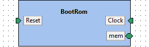

**IP-Xact file:** [BootRom.1.0.xml](../ipxact/tuni.fi/ip/BootRom/1.0/BootRom.1.0.xml)  

## 15.1 Kactus2 attributes <a id="tuni.fi:ip:BootRom:1.0.attributes">  

**Product hierarchy:** Flat  
**Component implementation:** HW  
**Component firmness:** Mutable  

## 15.2 General parameters <a id="tuni.fi:ip:BootRom:1.0.parameters">  

|Name|Type|Value|Resolve|Bit vector left|Bit vector right|Array left|Array right|Description|  
|:----|:----|:----|:----|:----|:----|:----|:----|:----|  
|CONNECTED_AW||32|||||||  
|DATA_WIDTH||32|||||||  
|NUM_WORDS||1024|||||||  
## 15.3 Memory maps <a id="tuni.fi:ip:BootRom:1.0.memoryMaps">  

### 15.3.1 Memory map spRom  

**Address unit bits (AUB):** 8  

### 15.3.1.1 Address block rom  

**Description:**   
**Usage:** memory  
**Base address [AUB]:** 'h0  
**Range [AUB]:** NUM_WORDS*4  
**Width [AUB]:** DATA_WIDTH  
**Access:**   
**Volatile:**   

## 15.4 Ports <a id="tuni.fi:ip:BootRom:1.0.ports">  

|Name|Direction|Left bound|Right bound|Port type|Type definition|Default value|Array left|Array right|Description|  
|:----|:----|:----|:----|:----|:----|:----|:----|:----|:----|  
|clk_i <a id="tuni.fi:ip:BootRom:1.0.port.clk_i">|in|0|0|logic||||||  
|rst_ni <a id="tuni.fi:ip:BootRom:1.0.port.rst_ni">|in|0|0|logic||||||  
|req_i <a id="tuni.fi:ip:BootRom:1.0.port.req_i">|in|0|0|logic||||||  
|we_i <a id="tuni.fi:ip:BootRom:1.0.port.we_i">|in|0|0|logic||||||  
|addr_i <a id="tuni.fi:ip:BootRom:1.0.port.addr_i">|in|CONNECTED_AW-1|0|logic||||||  
|rdata_o <a id="tuni.fi:ip:BootRom:1.0.port.rdata_o">|out|DATA_WIDTH-1|0|logic||||||  
|wdata_i <a id="tuni.fi:ip:BootRom:1.0.port.wdata_i">|in|DATA_WIDTH-1|0|logic||||||  
|be_i <a id="tuni.fi:ip:BootRom:1.0.port.be_i">|in|(DATA_WIDTH/8)-1|0|logic||||||  
## 15.5 Bus interfaces <a id="tuni.fi:ip:BootRom:1.0.interfaces">  

### 15.5.1 Bus interface Clock  

**Description:**   
**Interface mode:** target  
**Bus definition:** tuni.fi:interface:clock:1.0  
**Abstraction definitions:** tuni.fi:interface:clock.absDef:1.0  
**Ports used in this interface:**   

|Name|Direction|Left bound|Right bound|Port type|Type definition|Default value|Array left|Array right|Description|  
|:----|:----|:----|:----|:----|:----|:----|:----|:----|:----|  
|clk_i <a id="tuni.fi:ip:BootRom:1.0.port.clk_i">|in|0|0|logic||||||  
### 15.5.2 Bus interface Reset  

**Description:**   
**Interface mode:** target  
**Bus definition:** tuni.fi:interface:reset:1.0  
**Abstraction definitions:** tuni.fi:interface:reset.absDef:1.0  
**Ports used in this interface:**   

|Name|Direction|Left bound|Right bound|Port type|Type definition|Default value|Array left|Array right|Description|  
|:----|:----|:----|:----|:----|:----|:----|:----|:----|:----|  
|rst_ni <a id="tuni.fi:ip:BootRom:1.0.port.rst_ni">|in|0|0|logic||||||  
### 15.5.3 Bus interface mem  

**Description:**   
**Interface mode:** target  
**Bus definition:** tuni.fi:interface:generic.memory:1.0  
**Abstraction definitions:** tuni.fi:interface:generic.memory.absDef:1.0  
**Ports used in this interface:**   

|Name|Direction|Left bound|Right bound|Port type|Type definition|Default value|Array left|Array right|Description|  
|:----|:----|:----|:----|:----|:----|:----|:----|:----|:----|  
|req_i <a id="tuni.fi:ip:BootRom:1.0.port.req_i">|in|0|0|logic||||||  
|we_i <a id="tuni.fi:ip:BootRom:1.0.port.we_i">|in|0|0|logic||||||  
|addr_i <a id="tuni.fi:ip:BootRom:1.0.port.addr_i">|in|CONNECTED_AW-1|0|logic||||||  
|rdata_o <a id="tuni.fi:ip:BootRom:1.0.port.rdata_o">|out|DATA_WIDTH-1|0|logic||||||  
|wdata_i <a id="tuni.fi:ip:BootRom:1.0.port.wdata_i">|in|DATA_WIDTH-1|0|logic||||||  
|be_i <a id="tuni.fi:ip:BootRom:1.0.port.be_i">|in|(DATA_WIDTH/8)-1|0|logic||||||  
# 16. Component tuni.fi:ip:SS_Ctrl_reg_array:1.0<a id="tuni.fi:ip:SS_Ctrl_reg_array:1.0">  

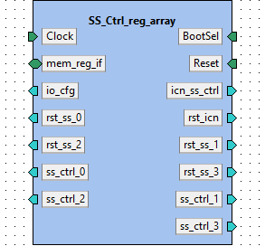

**IP-Xact file:** [SS_Ctrl_reg_array.1.0.xml](../ipxact/tuni.fi/ip/SS_Ctrl_reg_array/1.0/SS_Ctrl_reg_array.1.0.xml)  

## 16.1 Kactus2 attributes <a id="tuni.fi:ip:SS_Ctrl_reg_array:1.0.attributes">  

**Product hierarchy:** Flat  
**Component implementation:** HW  
**Component firmness:** Mutable  

## 16.2 Ports <a id="tuni.fi:ip:SS_Ctrl_reg_array:1.0.ports">  

|Name|Direction|Left bound|Right bound|Port type|Type definition|Default value|Array left|Array right|Description|  
|:----|:----|:----|:----|:----|:----|:----|:----|:----|:----|  
|req_in <a id="tuni.fi:ip:SS_Ctrl_reg_array:1.0.port.req_in">|in|||logic||||||  
|we_in <a id="tuni.fi:ip:SS_Ctrl_reg_array:1.0.port.we_in">|in|||logic||||||  
|addr_in <a id="tuni.fi:ip:SS_Ctrl_reg_array:1.0.port.addr_in">|in|31|0|logic||||||  
|be_in <a id="tuni.fi:ip:SS_Ctrl_reg_array:1.0.port.be_in">|in|3|0|logic||||||  
|rdata_out <a id="tuni.fi:ip:SS_Ctrl_reg_array:1.0.port.rdata_out">|out|31|0|logic||||||  
|wdata_in <a id="tuni.fi:ip:SS_Ctrl_reg_array:1.0.port.wdata_in">|in|31|0|logic||||||  
|ss_ctrl_icn <a id="tuni.fi:ip:SS_Ctrl_reg_array:1.0.port.ss_ctrl_icn">|out|7|0|||||||  
|cell_cfg <a id="tuni.fi:ip:SS_Ctrl_reg_array:1.0.port.cell_cfg">|out|49|0|||||||  
|reset_icn <a id="tuni.fi:ip:SS_Ctrl_reg_array:1.0.port.reset_icn">|out|||||||||  
|reset_ss_0 <a id="tuni.fi:ip:SS_Ctrl_reg_array:1.0.port.reset_ss_0">|out|0|0|||||||  
|reset_ss_1 <a id="tuni.fi:ip:SS_Ctrl_reg_array:1.0.port.reset_ss_1">|out|||||||||  
|reset_ss_2 <a id="tuni.fi:ip:SS_Ctrl_reg_array:1.0.port.reset_ss_2">|out|||||||||  
|reset_ss_3 <a id="tuni.fi:ip:SS_Ctrl_reg_array:1.0.port.reset_ss_3">|out|||||||||  
|ss_ctrl_0 <a id="tuni.fi:ip:SS_Ctrl_reg_array:1.0.port.ss_ctrl_0">|out|7|0|||||||  
|irq_en_0 <a id="tuni.fi:ip:SS_Ctrl_reg_array:1.0.port.irq_en_0">|out|||||||||  
|ss_ctrl_1 <a id="tuni.fi:ip:SS_Ctrl_reg_array:1.0.port.ss_ctrl_1">|out|7|0|||||||  
|irq_en_1 <a id="tuni.fi:ip:SS_Ctrl_reg_array:1.0.port.irq_en_1">|out|||||||||  
|ss_ctrl_2 <a id="tuni.fi:ip:SS_Ctrl_reg_array:1.0.port.ss_ctrl_2">|out|7|0|||||||  
|irq_en_2 <a id="tuni.fi:ip:SS_Ctrl_reg_array:1.0.port.irq_en_2">|out|||||||||  
|ss_ctrl_3 <a id="tuni.fi:ip:SS_Ctrl_reg_array:1.0.port.ss_ctrl_3">|out|7|0|||||||  
|irq_en_3 <a id="tuni.fi:ip:SS_Ctrl_reg_array:1.0.port.irq_en_3">|out|||||||||  
|bootsel <a id="tuni.fi:ip:SS_Ctrl_reg_array:1.0.port.bootsel">|in|||||||||  
|reset <a id="tuni.fi:ip:SS_Ctrl_reg_array:1.0.port.reset">|in|||||||||  
|clk <a id="tuni.fi:ip:SS_Ctrl_reg_array:1.0.port.clk">|in|||||||||  
## 16.3 Bus interfaces <a id="tuni.fi:ip:SS_Ctrl_reg_array:1.0.interfaces">  

### 16.3.1 Bus interface BootSel  

**Description:**   
**Interface mode:** target  
**Bus definition:** tuni.fi:interface:GPIO:1.0  
**Abstraction definitions:** tuni.fi:interface:GPIO.absDef:1.0  
**Ports used in this interface:**   

|Name|Direction|Left bound|Right bound|Port type|Type definition|Default value|Array left|Array right|Description|  
|:----|:----|:----|:----|:----|:----|:----|:----|:----|:----|  
|bootsel <a id="tuni.fi:ip:SS_Ctrl_reg_array:1.0.port.bootsel">|in|||||||||  
### 16.3.2 Bus interface Clock  

**Description:**   
**Interface mode:** target  
**Bus definition:** tuni.fi:interface:clock:1.0  
**Abstraction definitions:** tuni.fi:interface:clock.absDef:1.0  
**Ports used in this interface:**   

|Name|Direction|Left bound|Right bound|Port type|Type definition|Default value|Array left|Array right|Description|  
|:----|:----|:----|:----|:----|:----|:----|:----|:----|:----|  
|clk <a id="tuni.fi:ip:SS_Ctrl_reg_array:1.0.port.clk">|in|||||||||  
### 16.3.3 Bus interface Reset  

**Description:**   
**Interface mode:** target  
**Bus definition:** tuni.fi:interface:reset:1.0  
**Abstraction definitions:** tuni.fi:interface:reset.absDef:1.0  
**Ports used in this interface:**   

|Name|Direction|Left bound|Right bound|Port type|Type definition|Default value|Array left|Array right|Description|  
|:----|:----|:----|:----|:----|:----|:----|:----|:----|:----|  
|reset <a id="tuni.fi:ip:SS_Ctrl_reg_array:1.0.port.reset">|in|||||||||  
### 16.3.4 Bus interface mem_reg_if  

**Description:**   
**Interface mode:** target  
**Bus definition:** tuni.fi:interface:generic.memory:1.0  
**Abstraction definitions:** tuni.fi:interface:generic.memory.absDef:1.0  
**Ports used in this interface:**   

|Name|Direction|Left bound|Right bound|Port type|Type definition|Default value|Array left|Array right|Description|  
|:----|:----|:----|:----|:----|:----|:----|:----|:----|:----|  
|req_in <a id="tuni.fi:ip:SS_Ctrl_reg_array:1.0.port.req_in">|in|||logic||||||  
|we_in <a id="tuni.fi:ip:SS_Ctrl_reg_array:1.0.port.we_in">|in|||logic||||||  
|addr_in <a id="tuni.fi:ip:SS_Ctrl_reg_array:1.0.port.addr_in">|in|31|0|logic||||||  
|be_in <a id="tuni.fi:ip:SS_Ctrl_reg_array:1.0.port.be_in">|in|3|0|logic||||||  
|rdata_out <a id="tuni.fi:ip:SS_Ctrl_reg_array:1.0.port.rdata_out">|out|31|0|logic||||||  
|wdata_in <a id="tuni.fi:ip:SS_Ctrl_reg_array:1.0.port.wdata_in">|in|31|0|logic||||||  
### 16.3.5 Bus interface icn_ss_ctrl  

**Description:**   
**Interface mode:** initiator  
**Bus definition:** tuni.fi:interface:SS_Ctrl:1.0  
**Abstraction definitions:** tuni.fi:interface:SS_Ctrl.absDef:1.0  
**Ports used in this interface:**   

|Name|Direction|Left bound|Right bound|Port type|Type definition|Default value|Array left|Array right|Description|  
|:----|:----|:----|:----|:----|:----|:----|:----|:----|:----|  
|ss_ctrl_icn <a id="tuni.fi:ip:SS_Ctrl_reg_array:1.0.port.ss_ctrl_icn">|out|7|0|||||||  
### 16.3.6 Bus interface io_cfg  

**Description:**   
**Interface mode:** initiator  
**Bus definition:** tuni.fi:interface:io_cell_cfg:1.0  
**Abstraction definitions:** tuni.fi:interface:io_cell_cfg.absDef:1.0  
**Ports used in this interface:**   

|Name|Direction|Left bound|Right bound|Port type|Type definition|Default value|Array left|Array right|Description|  
|:----|:----|:----|:----|:----|:----|:----|:----|:----|:----|  
|cell_cfg <a id="tuni.fi:ip:SS_Ctrl_reg_array:1.0.port.cell_cfg">|out|49|0|||||||  
### 16.3.7 Bus interface rst_icn  

**Description:**   
**Interface mode:** initiator  
**Bus definition:** tuni.fi:interface:reset:1.0  
**Abstraction definitions:** tuni.fi:interface:reset.absDef:1.0  
**Ports used in this interface:**   

|Name|Direction|Left bound|Right bound|Port type|Type definition|Default value|Array left|Array right|Description|  
|:----|:----|:----|:----|:----|:----|:----|:----|:----|:----|  
|reset_icn <a id="tuni.fi:ip:SS_Ctrl_reg_array:1.0.port.reset_icn">|out|||||||||  
### 16.3.8 Bus interface rst_ss_0  

**Description:**   
**Interface mode:** initiator  
**Bus definition:** tuni.fi:interface:reset:1.0  
**Abstraction definitions:** tuni.fi:interface:reset.absDef:1.0  
**Ports used in this interface:**   

|Name|Direction|Left bound|Right bound|Port type|Type definition|Default value|Array left|Array right|Description|  
|:----|:----|:----|:----|:----|:----|:----|:----|:----|:----|  
|reset_ss_0 <a id="tuni.fi:ip:SS_Ctrl_reg_array:1.0.port.reset_ss_0">|out|0|0|||||||  
### 16.3.9 Bus interface rst_ss_1  

**Description:**   
**Interface mode:** initiator  
**Bus definition:** tuni.fi:interface:reset:1.0  
**Abstraction definitions:** tuni.fi:interface:reset.absDef:1.0  
**Ports used in this interface:**   

|Name|Direction|Left bound|Right bound|Port type|Type definition|Default value|Array left|Array right|Description|  
|:----|:----|:----|:----|:----|:----|:----|:----|:----|:----|  
|reset_ss_1 <a id="tuni.fi:ip:SS_Ctrl_reg_array:1.0.port.reset_ss_1">|out|||||||||  
### 16.3.10 Bus interface rst_ss_2  

**Description:**   
**Interface mode:** initiator  
**Bus definition:** tuni.fi:interface:reset:1.0  
**Abstraction definitions:** tuni.fi:interface:reset.absDef:1.0  
**Ports used in this interface:**   

|Name|Direction|Left bound|Right bound|Port type|Type definition|Default value|Array left|Array right|Description|  
|:----|:----|:----|:----|:----|:----|:----|:----|:----|:----|  
|reset_ss_2 <a id="tuni.fi:ip:SS_Ctrl_reg_array:1.0.port.reset_ss_2">|out|||||||||  
### 16.3.11 Bus interface rst_ss_3  

**Description:**   
**Interface mode:** initiator  
**Bus definition:** tuni.fi:interface:reset:1.0  
**Abstraction definitions:** tuni.fi:interface:reset.absDef:1.0  
**Ports used in this interface:**   

|Name|Direction|Left bound|Right bound|Port type|Type definition|Default value|Array left|Array right|Description|  
|:----|:----|:----|:----|:----|:----|:----|:----|:----|:----|  
|reset_ss_3 <a id="tuni.fi:ip:SS_Ctrl_reg_array:1.0.port.reset_ss_3">|out|||||||||  
### 16.3.12 Bus interface ss_ctrl_0  

**Description:**   
**Interface mode:** initiator  
**Bus definition:** tuni.fi:interface:SS_Ctrl:1.0  
**Abstraction definitions:** tuni.fi:interface:SS_Ctrl.absDef:1.0  
**Ports used in this interface:**   

|Name|Direction|Left bound|Right bound|Port type|Type definition|Default value|Array left|Array right|Description|  
|:----|:----|:----|:----|:----|:----|:----|:----|:----|:----|  
|ss_ctrl_0 <a id="tuni.fi:ip:SS_Ctrl_reg_array:1.0.port.ss_ctrl_0">|out|7|0|||||||  
|irq_en_0 <a id="tuni.fi:ip:SS_Ctrl_reg_array:1.0.port.irq_en_0">|out|||||||||  
### 16.3.13 Bus interface ss_ctrl_1  

**Description:**   
**Interface mode:** initiator  
**Bus definition:** tuni.fi:interface:SS_Ctrl:1.0  
**Abstraction definitions:** tuni.fi:interface:SS_Ctrl.absDef:1.0  
**Ports used in this interface:**   

|Name|Direction|Left bound|Right bound|Port type|Type definition|Default value|Array left|Array right|Description|  
|:----|:----|:----|:----|:----|:----|:----|:----|:----|:----|  
|ss_ctrl_1 <a id="tuni.fi:ip:SS_Ctrl_reg_array:1.0.port.ss_ctrl_1">|out|7|0|||||||  
|irq_en_1 <a id="tuni.fi:ip:SS_Ctrl_reg_array:1.0.port.irq_en_1">|out|||||||||  
### 16.3.14 Bus interface ss_ctrl_2  

**Description:**   
**Interface mode:** initiator  
**Bus definition:** tuni.fi:interface:SS_Ctrl:1.0  
**Abstraction definitions:** tuni.fi:interface:SS_Ctrl.absDef:1.0  
**Ports used in this interface:**   

|Name|Direction|Left bound|Right bound|Port type|Type definition|Default value|Array left|Array right|Description|  
|:----|:----|:----|:----|:----|:----|:----|:----|:----|:----|  
|ss_ctrl_2 <a id="tuni.fi:ip:SS_Ctrl_reg_array:1.0.port.ss_ctrl_2">|out|7|0|||||||  
|irq_en_2 <a id="tuni.fi:ip:SS_Ctrl_reg_array:1.0.port.irq_en_2">|out|||||||||  
### 16.3.15 Bus interface ss_ctrl_3  

**Description:**   
**Interface mode:** initiator  
**Bus definition:** tuni.fi:interface:SS_Ctrl:1.0  
**Abstraction definitions:** tuni.fi:interface:SS_Ctrl.absDef:1.0  
**Ports used in this interface:**   

|Name|Direction|Left bound|Right bound|Port type|Type definition|Default value|Array left|Array right|Description|  
|:----|:----|:----|:----|:----|:----|:----|:----|:----|:----|  
|ss_ctrl_3 <a id="tuni.fi:ip:SS_Ctrl_reg_array:1.0.port.ss_ctrl_3">|out|7|0|||||||  
|irq_en_3 <a id="tuni.fi:ip:SS_Ctrl_reg_array:1.0.port.irq_en_3">|out|||||||||  
# 17. Component tuni.fi:lowRISC:ibex:1.0<a id="tuni.fi:lowRISC:ibex:1.0">  

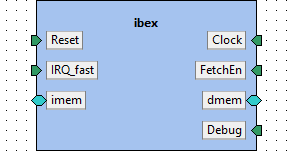

**Description:** IBEX cpu top ipxact interface model. Core by lowRISC. IPXACT by TUNI.

ibex commit sha: 1774cbbbe334dff1e762c8308c911a33b3bda515  

**IP-Xact file:** [ibex.1.0.xml](../tuni.fi/lowRISC/ibex/1.0/ibex.1.0.xml)  

## 17.1 Kactus2 attributes <a id="tuni.fi:lowRISC:ibex:1.0.attributes">  

**Product hierarchy:** Flat  
**Component implementation:** HW  
**Component firmness:** Mutable  

## 17.2 General parameters <a id="tuni.fi:lowRISC:ibex:1.0.parameters">  

|Name|Type|Value|Resolve|Bit vector left|Bit vector right|Array left|Array right|Description|  
|:----|:----|:----|:----|:----|:----|:----|:----|:----|  
|PMPEnable|bit|1'b0|||||||  
|PMPGranularity||0|||||||  
|PMPNumRegions||4|||||||  
|MHPMCounterNum||0|||||||  
|MHPMCounterWidth||40|||||||  
|RV32E|bit|1'b0|||||||  
|RV32M||RV32MNone|||||||  
|RV32B||RV32BNone|||||||  
|RegFile||RegFileFF|||||||  
|BranchTargetALU|bit|1'b0|||||||  
|WritebackStage|bit|1'b0|||||||  
|ICache|bit|1'b0|||||||  
|ICacheECC|bit|1'b0|||||||  
|BranchPredictor|bit|1'b0|||||||  
|DbgTriggerEn|bit|1'b0|||||||  
|DbgHwBreakNum||1|||||||  
|SecureIbex|bit|1'b0|||||||  
|ICacheScramble|bit|1'b0|||||||  
|RndCnstLfsrSeed||RndCnstLfsrSeedDefault|||||||  
|RndCnstLfsrPerm||RndCnstLfsrPermDefault|||||||  
|DmHaltAddr||32'h1A110800|||||||  
|DmExceptionAddr||32'h1A110808|||||||  
|RndCnstIbexKey||128'h14e8cecae3040d5e12286bb3cc113298|||||||  
|RndCnstIbexNonce||64'hf79780bc735f3843|||||||  
|SCRAMBLE_KEY_W|int|128|||||||  
|SCRAMBLE_NONCE_W|int|64|||||||  
## 17.3 Ports <a id="tuni.fi:lowRISC:ibex:1.0.ports">  

|Name|Direction|Left bound|Right bound|Port type|Type definition|Default value|Array left|Array right|Description|  
|:----|:----|:----|:----|:----|:----|:----|:----|:----|:----|  
|clk_i <a id="tuni.fi:lowRISC:ibex:1.0.port.clk_i">|in|||logic||||||  
|rst_ni <a id="tuni.fi:lowRISC:ibex:1.0.port.rst_ni">|in|||logic||||||  
|test_en_i <a id="tuni.fi:lowRISC:ibex:1.0.port.test_en_i">|in|||logic||1'b0|||enable all clock gates for testing|  
|hart_id_i <a id="tuni.fi:lowRISC:ibex:1.0.port.hart_id_i">|in|31|0|logic||1'b0||||  
|boot_addr_i <a id="tuni.fi:lowRISC:ibex:1.0.port.boot_addr_i">|in|31|0|logic||32'h0000_4000||||  
|instr_req_o <a id="tuni.fi:lowRISC:ibex:1.0.port.instr_req_o">|out|||logic||||||  
|instr_gnt_i <a id="tuni.fi:lowRISC:ibex:1.0.port.instr_gnt_i">|in|||logic||||||  
|instr_rvalid_i <a id="tuni.fi:lowRISC:ibex:1.0.port.instr_rvalid_i">|in|||logic||||||  
|instr_addr_o <a id="tuni.fi:lowRISC:ibex:1.0.port.instr_addr_o">|out|31|0|logic||||||  
|instr_rdata_i <a id="tuni.fi:lowRISC:ibex:1.0.port.instr_rdata_i">|in|31|0|logic||||||  
|instr_rdata_intg_i <a id="tuni.fi:lowRISC:ibex:1.0.port.instr_rdata_intg_i">|in|6|0|logic||||||  
|instr_err_i <a id="tuni.fi:lowRISC:ibex:1.0.port.instr_err_i">|in|||logic||||||  
|data_req_o <a id="tuni.fi:lowRISC:ibex:1.0.port.data_req_o">|out|||logic||||||  
|data_gnt_i <a id="tuni.fi:lowRISC:ibex:1.0.port.data_gnt_i">|in|||logic||||||  
|data_rvalid_i <a id="tuni.fi:lowRISC:ibex:1.0.port.data_rvalid_i">|in|||logic||||||  
|data_we_o <a id="tuni.fi:lowRISC:ibex:1.0.port.data_we_o">|out|||logic||||||  
|data_be_o <a id="tuni.fi:lowRISC:ibex:1.0.port.data_be_o">|out|3|0|logic||||||  
|data_addr_o <a id="tuni.fi:lowRISC:ibex:1.0.port.data_addr_o">|out|31|0|logic||||||  
|data_wdata_o <a id="tuni.fi:lowRISC:ibex:1.0.port.data_wdata_o">|out|31|0|logic||||||  
|data_wdata_intg_o <a id="tuni.fi:lowRISC:ibex:1.0.port.data_wdata_intg_o">|out|6|0|logic||||||  
|data_rdata_i <a id="tuni.fi:lowRISC:ibex:1.0.port.data_rdata_i">|in|31|0|logic||||||  
|data_rdata_intg_i <a id="tuni.fi:lowRISC:ibex:1.0.port.data_rdata_intg_i">|in|6|0|logic||||||  
|data_err_i <a id="tuni.fi:lowRISC:ibex:1.0.port.data_err_i">|in|||logic||||||  
|irq_software_i <a id="tuni.fi:lowRISC:ibex:1.0.port.irq_software_i">|in|||logic||1'b0||||  
|irq_timer_i <a id="tuni.fi:lowRISC:ibex:1.0.port.irq_timer_i">|in|||logic||1'b0||||  
|irq_external_i <a id="tuni.fi:lowRISC:ibex:1.0.port.irq_external_i">|in|||logic||1'b0||||  
|irq_fast_i <a id="tuni.fi:lowRISC:ibex:1.0.port.irq_fast_i">|in|14|0|logic||15'd0||||  
|irq_nm_i <a id="tuni.fi:lowRISC:ibex:1.0.port.irq_nm_i">|in|||logic||1'b0|||non-maskeable interrupt|  
|scramble_key_valid_i <a id="tuni.fi:lowRISC:ibex:1.0.port.scramble_key_valid_i">|in|||logic||1'b0||||  
|scramble_key_i <a id="tuni.fi:lowRISC:ibex:1.0.port.scramble_key_i">|in|SCRAMBLE_KEY_W-1|0|logic||128'd0||||  
|scramble_nonce_i <a id="tuni.fi:lowRISC:ibex:1.0.port.scramble_nonce_i">|in|SCRAMBLE_NONCE_W-1|0|logic||64'd0||||  
|scramble_req_o <a id="tuni.fi:lowRISC:ibex:1.0.port.scramble_req_o">|out|||logic||||||  
|debug_req_i <a id="tuni.fi:lowRISC:ibex:1.0.port.debug_req_i">|in|||logic||||||  
|crash_dump_o <a id="tuni.fi:lowRISC:ibex:1.0.port.crash_dump_o">|out|||crash_dump_t||||||  
|double_fault_seen_o <a id="tuni.fi:lowRISC:ibex:1.0.port.double_fault_seen_o">|out|||logic||||||  
|fetch_enable_i <a id="tuni.fi:lowRISC:ibex:1.0.port.fetch_enable_i">|in|||ibex_mubi_t||||||  
|alert_minor_o <a id="tuni.fi:lowRISC:ibex:1.0.port.alert_minor_o">|out|||logic||||||  
|alert_major_internal_o <a id="tuni.fi:lowRISC:ibex:1.0.port.alert_major_internal_o">|out|||logic||||||  
|alert_major_bus_o <a id="tuni.fi:lowRISC:ibex:1.0.port.alert_major_bus_o">|out|||logic||||||  
|core_sleep_o <a id="tuni.fi:lowRISC:ibex:1.0.port.core_sleep_o">|out|||logic||||||  
|scan_rst_ni <a id="tuni.fi:lowRISC:ibex:1.0.port.scan_rst_ni">|in|||logic||1'b1||||  
|ram_cfg_i <a id="tuni.fi:lowRISC:ibex:1.0.port.ram_cfg_i">|in|||prim_ram_1p_pkg::ram_1p_cfg_t||||||  
## 17.4 Bus interfaces <a id="tuni.fi:lowRISC:ibex:1.0.interfaces">  

### 17.4.1 Bus interface Clock  

**Description:**   
**Interface mode:** target  
**Bus definition:** tuni.fi:interface:clock:1.0  
**Abstraction definitions:** tuni.fi:interface:clock.absDef:1.0  
**Ports used in this interface:**   

|Name|Direction|Left bound|Right bound|Port type|Type definition|Default value|Array left|Array right|Description|  
|:----|:----|:----|:----|:----|:----|:----|:----|:----|:----|  
|clk_i <a id="tuni.fi:lowRISC:ibex:1.0.port.clk_i">|in|||logic||||||  
### 17.4.2 Bus interface Reset  

**Description:**   
**Interface mode:** target  
**Bus definition:** tuni.fi:interface:reset:1.0  
**Abstraction definitions:** tuni.fi:interface:reset.absDef:1.0  
**Ports used in this interface:**   

|Name|Direction|Left bound|Right bound|Port type|Type definition|Default value|Array left|Array right|Description|  
|:----|:----|:----|:----|:----|:----|:----|:----|:----|:----|  
|rst_ni <a id="tuni.fi:lowRISC:ibex:1.0.port.rst_ni">|in|||logic||||||  
### 17.4.3 Bus interface FetchEn  

**Description:**   
**Interface mode:** target  
**Bus definition:** tuni.fi:interface:GPIO:1.0  
**Abstraction definitions:** tuni.fi:interface:GPIO.absDef:1.0  
**Ports used in this interface:**   

|Name|Direction|Left bound|Right bound|Port type|Type definition|Default value|Array left|Array right|Description|  
|:----|:----|:----|:----|:----|:----|:----|:----|:----|:----|  
|fetch_enable_i <a id="tuni.fi:lowRISC:ibex:1.0.port.fetch_enable_i">|in|||ibex_mubi_t||||||  
### 17.4.4 Bus interface IRQ_fast  

**Description:**   
**Interface mode:** target  
**Bus definition:** tuni.fi:interface:IRQ:1.0  
**Abstraction definitions:** tuni.fi:interface:IRQ.absDef:1.0  
**Ports used in this interface:**   

|Name|Direction|Left bound|Right bound|Port type|Type definition|Default value|Array left|Array right|Description|  
|:----|:----|:----|:----|:----|:----|:----|:----|:----|:----|  
|irq_fast_i <a id="tuni.fi:lowRISC:ibex:1.0.port.irq_fast_i">|in|14|0|logic||15'd0||||  
### 17.4.5 Bus interface dmem  

**Description:**   
**Interface mode:** initiator  
**Bus definition:** tuni.fi:interface:ibex.memory:1.0  
**Abstraction definitions:** tuni.fi:interface:ibex.memory.absDef:1.0  
**Ports used in this interface:**   

|Name|Direction|Left bound|Right bound|Port type|Type definition|Default value|Array left|Array right|Description|  
|:----|:----|:----|:----|:----|:----|:----|:----|:----|:----|  
|instr_req_o <a id="tuni.fi:lowRISC:ibex:1.0.port.instr_req_o">|out|||logic||||||  
|instr_gnt_i <a id="tuni.fi:lowRISC:ibex:1.0.port.instr_gnt_i">|in|||logic||||||  
|instr_rvalid_i <a id="tuni.fi:lowRISC:ibex:1.0.port.instr_rvalid_i">|in|||logic||||||  
|instr_addr_o <a id="tuni.fi:lowRISC:ibex:1.0.port.instr_addr_o">|out|31|0|logic||||||  
|instr_rdata_i <a id="tuni.fi:lowRISC:ibex:1.0.port.instr_rdata_i">|in|31|0|logic||||||  
|instr_rdata_intg_i <a id="tuni.fi:lowRISC:ibex:1.0.port.instr_rdata_intg_i">|in|6|0|logic||||||  
|instr_err_i <a id="tuni.fi:lowRISC:ibex:1.0.port.instr_err_i">|in|||logic||||||  
### 17.4.6 Bus interface imem  

**Description:**   
**Interface mode:** initiator  
**Bus definition:** tuni.fi:interface:ibex.memory:1.0  
**Abstraction definitions:** tuni.fi:interface:ibex.memory.absDef:1.0  
**Ports used in this interface:**   

|Name|Direction|Left bound|Right bound|Port type|Type definition|Default value|Array left|Array right|Description|  
|:----|:----|:----|:----|:----|:----|:----|:----|:----|:----|  
|data_req_o <a id="tuni.fi:lowRISC:ibex:1.0.port.data_req_o">|out|||logic||||||  
|data_gnt_i <a id="tuni.fi:lowRISC:ibex:1.0.port.data_gnt_i">|in|||logic||||||  
|data_rvalid_i <a id="tuni.fi:lowRISC:ibex:1.0.port.data_rvalid_i">|in|||logic||||||  
|data_we_o <a id="tuni.fi:lowRISC:ibex:1.0.port.data_we_o">|out|||logic||||||  
|data_be_o <a id="tuni.fi:lowRISC:ibex:1.0.port.data_be_o">|out|3|0|logic||||||  
|data_addr_o <a id="tuni.fi:lowRISC:ibex:1.0.port.data_addr_o">|out|31|0|logic||||||  
|data_wdata_o <a id="tuni.fi:lowRISC:ibex:1.0.port.data_wdata_o">|out|31|0|logic||||||  
|data_wdata_intg_o <a id="tuni.fi:lowRISC:ibex:1.0.port.data_wdata_intg_o">|out|6|0|logic||||||  
|data_rdata_i <a id="tuni.fi:lowRISC:ibex:1.0.port.data_rdata_i">|in|31|0|logic||||||  
|data_rdata_intg_i <a id="tuni.fi:lowRISC:ibex:1.0.port.data_rdata_intg_i">|in|6|0|logic||||||  
|data_err_i <a id="tuni.fi:lowRISC:ibex:1.0.port.data_err_i">|in|||logic||||||  
### 17.4.7 Bus interface Debug  

**Description:**   
**Interface mode:** target  
**Bus definition:** tuni.fi:interface:debug_req:1.0  
**Abstraction definitions:** tuni.fi:interface:debug_req.absDef:1.0  
**Ports used in this interface:**   

|Name|Direction|Left bound|Right bound|Port type|Type definition|Default value|Array left|Array right|Description|  
|:----|:----|:----|:----|:----|:----|:----|:----|:----|:----|  
|debug_req_i <a id="tuni.fi:lowRISC:ibex:1.0.port.debug_req_i">|in|||logic||||||  
## 17.5 Views <a id="tuni.fi:lowRISC:ibex:1.0.views">  

### 17.5.1 View: flat_verilog  

#### 17.5.1.1 Component instantiation: verilog_implementation  

**Language:** Verilog  

**Module name:** ibex_top  

**Module parameters:**  

|Name|Type|Value|Data type|Usage type|Resolve|Bit vector left|Bit vector right|Array left|Array right|Description|  
|:----|:----|:----|:----|:----|:----|:----|:----|:----|:----|:----|  
|PMPEnable|bit|PMPEnable|bit|nontyped|||||||  
|PMPGranularity||PMPGranularity|unsigned|nontyped|||||||  
|PMPNumRegions||PMPNumRegions|unsigned|nontyped|||||||  
|MHPMCounterNum||MHPMCounterNum|unsigned|nontyped|||||||  
|MHPMCounterWidth||MHPMCounterWidth|unsigned|nontyped|||||||  
|RV32E|bit|RV32E|bit|nontyped|||||||  
|RV32M||RV32M|rv32m_e|nontyped|||||||  
|RV32B||RV32B|rv32b_e|nontyped|||||||  
|RegFile||RegFile|regfile_e|nontyped|||||||  
|BranchTargetALU|bit|BranchTargetALU|bit|nontyped|||||||  
|WritebackStage|bit|WritebackStage|bit|nontyped|||||||  
|ICache|bit|ICache|bit|nontyped|||||||  
|ICacheECC|bit|ICacheECC|bit|nontyped|||||||  
|BranchPredictor|bit|BranchPredictor|bit|nontyped|||||||  
|DbgTriggerEn|bit|DbgTriggerEn|bit|nontyped|||||||  
|DbgHwBreakNum||DbgHwBreakNum|unsigned|nontyped|||||||  
|SecureIbex|bit|SecureIbex|bit|nontyped|||||||  
|ICacheScramble|bit|ICacheScramble|bit|nontyped|||||||  
|RndCnstLfsrSeed||RndCnstLfsrSeed|lfsr_seed_t|nontyped|||||||  
|RndCnstLfsrPerm||RndCnstLfsrPerm|lfsr_perm_t|nontyped|||||||  
|DmHaltAddr||DmHaltAddr|unsigned|nontyped|||||||  
|DmExceptionAddr||DmExceptionAddr|unsigned|nontyped|||||||  
|RndCnstIbexKey||128'h14e8cecae3040d5e12286bb3cc113298||nontyped|||||||  
|RndCnstIbexNonce||64'hf79780bc735f3843||nontyped|||||||  

# 18. Component tuni.fi:interconnect:ICN_SS:1.0<a id="tuni.fi:interconnect:ICN_SS:1.0">  

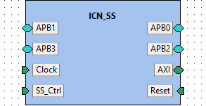

**IP-Xact file:** [ICN_SS.1.0.xml](../ipxact/tuni.fi/interconnect/ICN_SS/1.0/ICN_SS.1.0.xml)  

## 18.1 Kactus2 attributes <a id="tuni.fi:interconnect:ICN_SS:1.0.attributes">  

**Product hierarchy:** IP  
**Component implementation:** HW  
**Component firmness:** Mutable  

## 18.2 Ports <a id="tuni.fi:interconnect:ICN_SS:1.0.ports">  

|Name|Direction|Left bound|Right bound|Port type|Type definition|Default value|Array left|Array right|Description|  
|:----|:----|:----|:----|:----|:----|:----|:----|:----|:----|  
|AR_ADDR <a id="tuni.fi:interconnect:ICN_SS:1.0.port.AR_ADDR">|in|31|0|||||||  
|AR_BURST <a id="tuni.fi:interconnect:ICN_SS:1.0.port.AR_BURST">|in|1|0|||||||  
|AR_CACHE <a id="tuni.fi:interconnect:ICN_SS:1.0.port.AR_CACHE">|in|3|0|||||||  
|AR_SIZE <a id="tuni.fi:interconnect:ICN_SS:1.0.port.AR_SIZE">|in|2|0|||||||  
|AR_USER <a id="tuni.fi:interconnect:ICN_SS:1.0.port.AR_USER">|in|||||||||  
|AR_VALID <a id="tuni.fi:interconnect:ICN_SS:1.0.port.AR_VALID">|in|||||||||  
|AW_ADDR <a id="tuni.fi:interconnect:ICN_SS:1.0.port.AW_ADDR">|in|31|0|||||||  
|AW_ID <a id="tuni.fi:interconnect:ICN_SS:1.0.port.AW_ID">|in|9|0|||||||  
|AW_LEN <a id="tuni.fi:interconnect:ICN_SS:1.0.port.AW_LEN">|in|7|0|||||||  
|AW_LOCK <a id="tuni.fi:interconnect:ICN_SS:1.0.port.AW_LOCK">|in|||||||||  
|AW_PROT <a id="tuni.fi:interconnect:ICN_SS:1.0.port.AW_PROT">|in|2|0|||||||  
|AR_ID <a id="tuni.fi:interconnect:ICN_SS:1.0.port.AR_ID">|in|9|0|||||||  
|AR_LEN <a id="tuni.fi:interconnect:ICN_SS:1.0.port.AR_LEN">|in|7|0|||||||  
|AR_LOCK <a id="tuni.fi:interconnect:ICN_SS:1.0.port.AR_LOCK">|in|||||||||  
|AR_PROT <a id="tuni.fi:interconnect:ICN_SS:1.0.port.AR_PROT">|in|2|0|||||||  
|AR_QOS <a id="tuni.fi:interconnect:ICN_SS:1.0.port.AR_QOS">|in|3|0|||||||  
|AR_READY <a id="tuni.fi:interconnect:ICN_SS:1.0.port.AR_READY">|out|||||||||  
|AR_REGION <a id="tuni.fi:interconnect:ICN_SS:1.0.port.AR_REGION">|in|2|0|||||||  
|AW_ATOP <a id="tuni.fi:interconnect:ICN_SS:1.0.port.AW_ATOP">|in|5|0|||||||  
|AW_BURST <a id="tuni.fi:interconnect:ICN_SS:1.0.port.AW_BURST">|in|1|0|||||||  
|AW_CACHE <a id="tuni.fi:interconnect:ICN_SS:1.0.port.AW_CACHE">|in|3|0|||||||  
|AW_QOS <a id="tuni.fi:interconnect:ICN_SS:1.0.port.AW_QOS">|in|3|0|||||||  
|AW_READY <a id="tuni.fi:interconnect:ICN_SS:1.0.port.AW_READY">|out|||||||||  
|AW_REGION <a id="tuni.fi:interconnect:ICN_SS:1.0.port.AW_REGION">|in|3|0|||||||  
|B_ID <a id="tuni.fi:interconnect:ICN_SS:1.0.port.B_ID">|out|10|0|||||||  
|B_READY <a id="tuni.fi:interconnect:ICN_SS:1.0.port.B_READY">|in|||||||||  
|B_RESP <a id="tuni.fi:interconnect:ICN_SS:1.0.port.B_RESP">|out|1|0|||||||  
|B_USER <a id="tuni.fi:interconnect:ICN_SS:1.0.port.B_USER">|out|||||||||  
|B_VALID <a id="tuni.fi:interconnect:ICN_SS:1.0.port.B_VALID">|out|||||||||  
|R_DATA <a id="tuni.fi:interconnect:ICN_SS:1.0.port.R_DATA">|out|31|0|||||||  
|R_ID <a id="tuni.fi:interconnect:ICN_SS:1.0.port.R_ID">|out|10|0|||||||  
|R_LAST <a id="tuni.fi:interconnect:ICN_SS:1.0.port.R_LAST">|out|||||||||  
|AW_SIZE <a id="tuni.fi:interconnect:ICN_SS:1.0.port.AW_SIZE">|in|2|0|||||||  
|AW_USER <a id="tuni.fi:interconnect:ICN_SS:1.0.port.AW_USER">|in|||||||||  
|AW_VALID <a id="tuni.fi:interconnect:ICN_SS:1.0.port.AW_VALID">|in|||||||||  
|R_READY <a id="tuni.fi:interconnect:ICN_SS:1.0.port.R_READY">|in|||||||||  
|R_RESP <a id="tuni.fi:interconnect:ICN_SS:1.0.port.R_RESP">|out|1|0|||||||  
|R_USER <a id="tuni.fi:interconnect:ICN_SS:1.0.port.R_USER">|out|||||||||  
|W_DATA <a id="tuni.fi:interconnect:ICN_SS:1.0.port.W_DATA">|in|31|0|||||||  
|W_LAST <a id="tuni.fi:interconnect:ICN_SS:1.0.port.W_LAST">|in|||||||||  
|W_READY <a id="tuni.fi:interconnect:ICN_SS:1.0.port.W_READY">|out|||||||||  
|W_STROBE <a id="tuni.fi:interconnect:ICN_SS:1.0.port.W_STROBE">|in|3|0|||||||  
|W_USER <a id="tuni.fi:interconnect:ICN_SS:1.0.port.W_USER">|in|||||||||  
|W_VALID <a id="tuni.fi:interconnect:ICN_SS:1.0.port.W_VALID">|in|||||||||  
|R_VALID <a id="tuni.fi:interconnect:ICN_SS:1.0.port.R_VALID">|out|||||||||  
|clk <a id="tuni.fi:interconnect:ICN_SS:1.0.port.clk">|in|||||||||  
|reset_int <a id="tuni.fi:interconnect:ICN_SS:1.0.port.reset_int">|in|||||||||  
|ss_ctrl_icn <a id="tuni.fi:interconnect:ICN_SS:1.0.port.ss_ctrl_icn">|in|7|0|||||||  
|PADDR <a id="tuni.fi:interconnect:ICN_SS:1.0.port.PADDR">|out|31|0|||||||  
|PENABLE <a id="tuni.fi:interconnect:ICN_SS:1.0.port.PENABLE">|out|||||||||  
|PRDATA <a id="tuni.fi:interconnect:ICN_SS:1.0.port.PRDATA">|in|32*4-1|0|||||||  
|PREADY <a id="tuni.fi:interconnect:ICN_SS:1.0.port.PREADY">|in|3|0|||||||  
|PSEL <a id="tuni.fi:interconnect:ICN_SS:1.0.port.PSEL">|out|3|0|||||||  
|PSELERR <a id="tuni.fi:interconnect:ICN_SS:1.0.port.PSELERR">|in|3|0|||||||  
|PWDATA <a id="tuni.fi:interconnect:ICN_SS:1.0.port.PWDATA">|out|31|0|||||||  
|PWRITE <a id="tuni.fi:interconnect:ICN_SS:1.0.port.PWRITE">|out|||||||||  
## 18.3 Bus interfaces <a id="tuni.fi:interconnect:ICN_SS:1.0.interfaces">  

### 18.3.1 Bus interface APB0  

**Description:**   
**Interface mode:** initiator  
**Bus definition:** tuni.fi:interface:APB:1.0  
**Abstraction definitions:** tuni.fi:interface:APB.absDef:1.0  
**Ports used in this interface:**   

|Name|Direction|Left bound|Right bound|Port type|Type definition|Default value|Array left|Array right|Description|  
|:----|:----|:----|:----|:----|:----|:----|:----|:----|:----|  
|PADDR <a id="tuni.fi:interconnect:ICN_SS:1.0.port.PADDR">|out|31|0|||||||  
|PENABLE <a id="tuni.fi:interconnect:ICN_SS:1.0.port.PENABLE">|out|||||||||  
|PRDATA <a id="tuni.fi:interconnect:ICN_SS:1.0.port.PRDATA">|in|32*4-1|0|||||||  
|PREADY <a id="tuni.fi:interconnect:ICN_SS:1.0.port.PREADY">|in|3|0|||||||  
|PSEL <a id="tuni.fi:interconnect:ICN_SS:1.0.port.PSEL">|out|3|0|||||||  
|PSELERR <a id="tuni.fi:interconnect:ICN_SS:1.0.port.PSELERR">|in|3|0|||||||  
|PWDATA <a id="tuni.fi:interconnect:ICN_SS:1.0.port.PWDATA">|out|31|0|||||||  
|PWRITE <a id="tuni.fi:interconnect:ICN_SS:1.0.port.PWRITE">|out|||||||||  
### 18.3.2 Bus interface APB1  

**Description:**   
**Interface mode:** initiator  
**Bus definition:** tuni.fi:interface:APB:1.0  
**Abstraction definitions:** tuni.fi:interface:APB.absDef:1.0  
**Ports used in this interface:**   

|Name|Direction|Left bound|Right bound|Port type|Type definition|Default value|Array left|Array right|Description|  
|:----|:----|:----|:----|:----|:----|:----|:----|:----|:----|  
|PADDR <a id="tuni.fi:interconnect:ICN_SS:1.0.port.PADDR">|out|31|0|||||||  
|PENABLE <a id="tuni.fi:interconnect:ICN_SS:1.0.port.PENABLE">|out|||||||||  
|PRDATA <a id="tuni.fi:interconnect:ICN_SS:1.0.port.PRDATA">|in|32*4-1|0|||||||  
|PREADY <a id="tuni.fi:interconnect:ICN_SS:1.0.port.PREADY">|in|3|0|||||||  
|PSEL <a id="tuni.fi:interconnect:ICN_SS:1.0.port.PSEL">|out|3|0|||||||  
|PSELERR <a id="tuni.fi:interconnect:ICN_SS:1.0.port.PSELERR">|in|3|0|||||||  
|PWDATA <a id="tuni.fi:interconnect:ICN_SS:1.0.port.PWDATA">|out|31|0|||||||  
|PWRITE <a id="tuni.fi:interconnect:ICN_SS:1.0.port.PWRITE">|out|||||||||  
### 18.3.3 Bus interface APB2  

**Description:**   
**Interface mode:** initiator  
**Bus definition:** tuni.fi:interface:APB:1.0  
**Abstraction definitions:** tuni.fi:interface:APB.absDef:1.0  
**Ports used in this interface:**   

|Name|Direction|Left bound|Right bound|Port type|Type definition|Default value|Array left|Array right|Description|  
|:----|:----|:----|:----|:----|:----|:----|:----|:----|:----|  
|PADDR <a id="tuni.fi:interconnect:ICN_SS:1.0.port.PADDR">|out|31|0|||||||  
|PENABLE <a id="tuni.fi:interconnect:ICN_SS:1.0.port.PENABLE">|out|||||||||  
|PRDATA <a id="tuni.fi:interconnect:ICN_SS:1.0.port.PRDATA">|in|32*4-1|0|||||||  
|PREADY <a id="tuni.fi:interconnect:ICN_SS:1.0.port.PREADY">|in|3|0|||||||  
|PSEL <a id="tuni.fi:interconnect:ICN_SS:1.0.port.PSEL">|out|3|0|||||||  
|PSELERR <a id="tuni.fi:interconnect:ICN_SS:1.0.port.PSELERR">|in|3|0|||||||  
|PWDATA <a id="tuni.fi:interconnect:ICN_SS:1.0.port.PWDATA">|out|31|0|||||||  
|PWRITE <a id="tuni.fi:interconnect:ICN_SS:1.0.port.PWRITE">|out|||||||||  
### 18.3.4 Bus interface APB3  

**Description:**   
**Interface mode:** initiator  
**Bus definition:** tuni.fi:interface:APB:1.0  
**Abstraction definitions:** tuni.fi:interface:APB.absDef:1.0  
**Ports used in this interface:**   

|Name|Direction|Left bound|Right bound|Port type|Type definition|Default value|Array left|Array right|Description|  
|:----|:----|:----|:----|:----|:----|:----|:----|:----|:----|  
|PADDR <a id="tuni.fi:interconnect:ICN_SS:1.0.port.PADDR">|out|31|0|||||||  
|PENABLE <a id="tuni.fi:interconnect:ICN_SS:1.0.port.PENABLE">|out|||||||||  
|PRDATA <a id="tuni.fi:interconnect:ICN_SS:1.0.port.PRDATA">|in|32*4-1|0|||||||  
|PREADY <a id="tuni.fi:interconnect:ICN_SS:1.0.port.PREADY">|in|3|0|||||||  
|PSEL <a id="tuni.fi:interconnect:ICN_SS:1.0.port.PSEL">|out|3|0|||||||  
|PSELERR <a id="tuni.fi:interconnect:ICN_SS:1.0.port.PSELERR">|in|3|0|||||||  
|PWDATA <a id="tuni.fi:interconnect:ICN_SS:1.0.port.PWDATA">|out|31|0|||||||  
|PWRITE <a id="tuni.fi:interconnect:ICN_SS:1.0.port.PWRITE">|out|||||||||  
### 18.3.5 Bus interface AXI  

**Description:**   
**Interface mode:** target  
**Bus definition:** tuni.fi:interface:AXI4:1.0  
**Abstraction definitions:** tuni.fi:interface:AXI4.absDef:1.0  
**Ports used in this interface:**   

|Name|Direction|Left bound|Right bound|Port type|Type definition|Default value|Array left|Array right|Description|  
|:----|:----|:----|:----|:----|:----|:----|:----|:----|:----|  
|AR_ADDR <a id="tuni.fi:interconnect:ICN_SS:1.0.port.AR_ADDR">|in|31|0|||||||  
|AR_BURST <a id="tuni.fi:interconnect:ICN_SS:1.0.port.AR_BURST">|in|1|0|||||||  
|AR_CACHE <a id="tuni.fi:interconnect:ICN_SS:1.0.port.AR_CACHE">|in|3|0|||||||  
|AR_SIZE <a id="tuni.fi:interconnect:ICN_SS:1.0.port.AR_SIZE">|in|2|0|||||||  
|AR_USER <a id="tuni.fi:interconnect:ICN_SS:1.0.port.AR_USER">|in|||||||||  
|AR_VALID <a id="tuni.fi:interconnect:ICN_SS:1.0.port.AR_VALID">|in|||||||||  
|AW_ADDR <a id="tuni.fi:interconnect:ICN_SS:1.0.port.AW_ADDR">|in|31|0|||||||  
|AW_ID <a id="tuni.fi:interconnect:ICN_SS:1.0.port.AW_ID">|in|9|0|||||||  
|AW_LEN <a id="tuni.fi:interconnect:ICN_SS:1.0.port.AW_LEN">|in|7|0|||||||  
|AW_LOCK <a id="tuni.fi:interconnect:ICN_SS:1.0.port.AW_LOCK">|in|||||||||  
|AW_PROT <a id="tuni.fi:interconnect:ICN_SS:1.0.port.AW_PROT">|in|2|0|||||||  
|AR_ID <a id="tuni.fi:interconnect:ICN_SS:1.0.port.AR_ID">|in|9|0|||||||  
|AR_LEN <a id="tuni.fi:interconnect:ICN_SS:1.0.port.AR_LEN">|in|7|0|||||||  
|AR_LOCK <a id="tuni.fi:interconnect:ICN_SS:1.0.port.AR_LOCK">|in|||||||||  
|AR_PROT <a id="tuni.fi:interconnect:ICN_SS:1.0.port.AR_PROT">|in|2|0|||||||  
|AR_QOS <a id="tuni.fi:interconnect:ICN_SS:1.0.port.AR_QOS">|in|3|0|||||||  
|AR_READY <a id="tuni.fi:interconnect:ICN_SS:1.0.port.AR_READY">|out|||||||||  
|AR_REGION <a id="tuni.fi:interconnect:ICN_SS:1.0.port.AR_REGION">|in|2|0|||||||  
|AW_ATOP <a id="tuni.fi:interconnect:ICN_SS:1.0.port.AW_ATOP">|in|5|0|||||||  
|AW_BURST <a id="tuni.fi:interconnect:ICN_SS:1.0.port.AW_BURST">|in|1|0|||||||  
|AW_CACHE <a id="tuni.fi:interconnect:ICN_SS:1.0.port.AW_CACHE">|in|3|0|||||||  
|AW_QOS <a id="tuni.fi:interconnect:ICN_SS:1.0.port.AW_QOS">|in|3|0|||||||  
|AW_READY <a id="tuni.fi:interconnect:ICN_SS:1.0.port.AW_READY">|out|||||||||  
|AW_REGION <a id="tuni.fi:interconnect:ICN_SS:1.0.port.AW_REGION">|in|3|0|||||||  
|B_ID <a id="tuni.fi:interconnect:ICN_SS:1.0.port.B_ID">|out|10|0|||||||  
|B_READY <a id="tuni.fi:interconnect:ICN_SS:1.0.port.B_READY">|in|||||||||  
|B_RESP <a id="tuni.fi:interconnect:ICN_SS:1.0.port.B_RESP">|out|1|0|||||||  
|B_USER <a id="tuni.fi:interconnect:ICN_SS:1.0.port.B_USER">|out|||||||||  
|B_VALID <a id="tuni.fi:interconnect:ICN_SS:1.0.port.B_VALID">|out|||||||||  
|R_DATA <a id="tuni.fi:interconnect:ICN_SS:1.0.port.R_DATA">|out|31|0|||||||  
|R_ID <a id="tuni.fi:interconnect:ICN_SS:1.0.port.R_ID">|out|10|0|||||||  
|R_LAST <a id="tuni.fi:interconnect:ICN_SS:1.0.port.R_LAST">|out|||||||||  
|AW_SIZE <a id="tuni.fi:interconnect:ICN_SS:1.0.port.AW_SIZE">|in|2|0|||||||  
|AW_USER <a id="tuni.fi:interconnect:ICN_SS:1.0.port.AW_USER">|in|||||||||  
|AW_VALID <a id="tuni.fi:interconnect:ICN_SS:1.0.port.AW_VALID">|in|||||||||  
|R_READY <a id="tuni.fi:interconnect:ICN_SS:1.0.port.R_READY">|in|||||||||  
|R_RESP <a id="tuni.fi:interconnect:ICN_SS:1.0.port.R_RESP">|out|1|0|||||||  
|R_USER <a id="tuni.fi:interconnect:ICN_SS:1.0.port.R_USER">|out|||||||||  
|W_DATA <a id="tuni.fi:interconnect:ICN_SS:1.0.port.W_DATA">|in|31|0|||||||  
|W_LAST <a id="tuni.fi:interconnect:ICN_SS:1.0.port.W_LAST">|in|||||||||  
|W_READY <a id="tuni.fi:interconnect:ICN_SS:1.0.port.W_READY">|out|||||||||  
|W_STROBE <a id="tuni.fi:interconnect:ICN_SS:1.0.port.W_STROBE">|in|3|0|||||||  
|W_USER <a id="tuni.fi:interconnect:ICN_SS:1.0.port.W_USER">|in|||||||||  
|W_VALID <a id="tuni.fi:interconnect:ICN_SS:1.0.port.W_VALID">|in|||||||||  
|R_VALID <a id="tuni.fi:interconnect:ICN_SS:1.0.port.R_VALID">|out|||||||||  
### 18.3.6 Bus interface Clock  

**Description:**   
**Interface mode:** target  
**Bus definition:** tuni.fi:interface:clock:1.0  
**Abstraction definitions:** tuni.fi:interface:clock.absDef:1.0  
**Ports used in this interface:**   

|Name|Direction|Left bound|Right bound|Port type|Type definition|Default value|Array left|Array right|Description|  
|:----|:----|:----|:----|:----|:----|:----|:----|:----|:----|  
|clk <a id="tuni.fi:interconnect:ICN_SS:1.0.port.clk">|in|||||||||  
### 18.3.7 Bus interface Reset  

**Description:**   
**Interface mode:** target  
**Bus definition:** tuni.fi:interface:reset:1.0  
**Abstraction definitions:** tuni.fi:interface:reset.absDef:1.0  
**Ports used in this interface:**   

|Name|Direction|Left bound|Right bound|Port type|Type definition|Default value|Array left|Array right|Description|  
|:----|:----|:----|:----|:----|:----|:----|:----|:----|:----|  
|reset_int <a id="tuni.fi:interconnect:ICN_SS:1.0.port.reset_int">|in|||||||||  
### 18.3.8 Bus interface SS_Ctrl  

**Description:**   
**Interface mode:** target  
**Bus definition:** tuni.fi:interface:SS_Ctrl:1.0  
**Abstraction definitions:** tuni.fi:interface:SS_Ctrl.absDef:1.0  
**Ports used in this interface:**   

|Name|Direction|Left bound|Right bound|Port type|Type definition|Default value|Array left|Array right|Description|  
|:----|:----|:----|:----|:----|:----|:----|:----|:----|:----|  
|ss_ctrl_icn <a id="tuni.fi:interconnect:ICN_SS:1.0.port.ss_ctrl_icn">|in|7|0|||||||  
# 19. Component tuni.fi:subsystem.wrapper:Student_SS_0:1.0<a id="tuni.fi:subsystem.wrapper:Student_SS_0:1.0">  

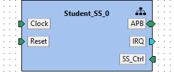

**IP-Xact file:** [Student_SS_0.1.0.xml](../ipxact/tuni.fi/subsystem.wrapper/Student_SS_0/1.0/Student_SS_0.1.0.xml)  

## 19.1 Kactus2 attributes <a id="tuni.fi:subsystem.wrapper:Student_SS_0:1.0.attributes">  

**Product hierarchy:** IP  
**Component implementation:** HW  
**Component firmness:** Mutable  

## 19.2 Ports <a id="tuni.fi:subsystem.wrapper:Student_SS_0:1.0.ports">  

|Name|Direction|Left bound|Right bound|Port type|Type definition|Default value|Array left|Array right|Description|  
|:----|:----|:----|:----|:----|:----|:----|:----|:----|:----|  
|PADDR <a id="tuni.fi:subsystem.wrapper:Student_SS_0:1.0.port.PADDR">|in|31|0|||||||  
|PENABLE <a id="tuni.fi:subsystem.wrapper:Student_SS_0:1.0.port.PENABLE">|in|||||||||  
|PRDATA <a id="tuni.fi:subsystem.wrapper:Student_SS_0:1.0.port.PRDATA">|out|31|0|||||||  
|PREADY <a id="tuni.fi:subsystem.wrapper:Student_SS_0:1.0.port.PREADY">|out|||||||||  
|PSEL <a id="tuni.fi:subsystem.wrapper:Student_SS_0:1.0.port.PSEL">|in|||||||||  
|PSELERR <a id="tuni.fi:subsystem.wrapper:Student_SS_0:1.0.port.PSELERR">|out|||||||||  
|PWDATA <a id="tuni.fi:subsystem.wrapper:Student_SS_0:1.0.port.PWDATA">|in|31|0|||||||  
|PWRITE <a id="tuni.fi:subsystem.wrapper:Student_SS_0:1.0.port.PWRITE">|in|||||||||  
|clk <a id="tuni.fi:subsystem.wrapper:Student_SS_0:1.0.port.clk">|in|||||||||  
|rst <a id="tuni.fi:subsystem.wrapper:Student_SS_0:1.0.port.rst">|in|||||||||  
|irq <a id="tuni.fi:subsystem.wrapper:Student_SS_0:1.0.port.irq">|out|||||||||  
|irq_en <a id="tuni.fi:subsystem.wrapper:Student_SS_0:1.0.port.irq_en">|in|||||||||  
|clk_ctrl <a id="tuni.fi:subsystem.wrapper:Student_SS_0:1.0.port.clk_ctrl">|in|7|0|||||||  
## 19.3 Bus interfaces <a id="tuni.fi:subsystem.wrapper:Student_SS_0:1.0.interfaces">  

### 19.3.1 Bus interface APB  

**Description:**   
**Interface mode:** target  
**Bus definition:** tuni.fi:interface:APB:1.0  
**Abstraction definitions:** tuni.fi:interface:APB.absDef:1.0  
**Ports used in this interface:**   

|Name|Direction|Left bound|Right bound|Port type|Type definition|Default value|Array left|Array right|Description|  
|:----|:----|:----|:----|:----|:----|:----|:----|:----|:----|  
|PADDR <a id="tuni.fi:subsystem.wrapper:Student_SS_0:1.0.port.PADDR">|in|31|0|||||||  
|PENABLE <a id="tuni.fi:subsystem.wrapper:Student_SS_0:1.0.port.PENABLE">|in|||||||||  
|PRDATA <a id="tuni.fi:subsystem.wrapper:Student_SS_0:1.0.port.PRDATA">|out|31|0|||||||  
|PREADY <a id="tuni.fi:subsystem.wrapper:Student_SS_0:1.0.port.PREADY">|out|||||||||  
|PSEL <a id="tuni.fi:subsystem.wrapper:Student_SS_0:1.0.port.PSEL">|in|||||||||  
|PSELERR <a id="tuni.fi:subsystem.wrapper:Student_SS_0:1.0.port.PSELERR">|out|||||||||  
|PWDATA <a id="tuni.fi:subsystem.wrapper:Student_SS_0:1.0.port.PWDATA">|in|31|0|||||||  
|PWRITE <a id="tuni.fi:subsystem.wrapper:Student_SS_0:1.0.port.PWRITE">|in|||||||||  
### 19.3.2 Bus interface Clock  

**Description:**   
**Interface mode:** target  
**Bus definition:** tuni.fi:interface:clock:1.0  
**Abstraction definitions:** tuni.fi:interface:clock.absDef:1.0  
**Ports used in this interface:**   

|Name|Direction|Left bound|Right bound|Port type|Type definition|Default value|Array left|Array right|Description|  
|:----|:----|:----|:----|:----|:----|:----|:----|:----|:----|  
|clk <a id="tuni.fi:subsystem.wrapper:Student_SS_0:1.0.port.clk">|in|||||||||  
### 19.3.3 Bus interface IRQ  

**Description:**   
**Interface mode:** initiator  
**Bus definition:** tuni.fi:interface:IRQ:1.0  
**Abstraction definitions:** tuni.fi:interface:IRQ.absDef:1.0  
**Ports used in this interface:**   

|Name|Direction|Left bound|Right bound|Port type|Type definition|Default value|Array left|Array right|Description|  
|:----|:----|:----|:----|:----|:----|:----|:----|:----|:----|  
|irq <a id="tuni.fi:subsystem.wrapper:Student_SS_0:1.0.port.irq">|out|||||||||  
### 19.3.4 Bus interface Reset  

**Description:**   
**Interface mode:** target  
**Bus definition:** tuni.fi:interface:reset:1.0  
**Abstraction definitions:** tuni.fi:interface:reset.absDef:1.0  
**Ports used in this interface:**   

|Name|Direction|Left bound|Right bound|Port type|Type definition|Default value|Array left|Array right|Description|  
|:----|:----|:----|:----|:----|:----|:----|:----|:----|:----|  
|rst <a id="tuni.fi:subsystem.wrapper:Student_SS_0:1.0.port.rst">|in|||||||||  
### 19.3.5 Bus interface SS_Ctrl  

**Description:**   
**Interface mode:** target  
**Bus definition:** tuni.fi:interface:SS_Ctrl:1.0  
**Abstraction definitions:** tuni.fi:interface:SS_Ctrl.absDef:1.0  
**Ports used in this interface:**   

|Name|Direction|Left bound|Right bound|Port type|Type definition|Default value|Array left|Array right|Description|  
|:----|:----|:----|:----|:----|:----|:----|:----|:----|:----|  
|irq_en <a id="tuni.fi:subsystem.wrapper:Student_SS_0:1.0.port.irq_en">|in|||||||||  
|clk_ctrl <a id="tuni.fi:subsystem.wrapper:Student_SS_0:1.0.port.clk_ctrl">|in|7|0|||||||  
## 19.4 Views <a id="tuni.fi:subsystem.wrapper:Student_SS_0:1.0.views">  

### 19.4.1 View: hierarchical  

#### 19.4.1.1 Design configuration instantiation: _design_configuration  

**Design configuration:** tuni.fi:subsystem.wrapper:Student_SS_0.designcfg:1.0  
**IP-Xact file:** [Student_SS_0.designcfg.1.0.xml](../ipxact/tuni.fi/subsystem.wrapper/Student_SS_0/1.0/Student_SS_0.designcfg.1.0.xml)  
Diagram of design tuni.fi:subsystem.wrapper:Student_SS_0.design:1.0:  
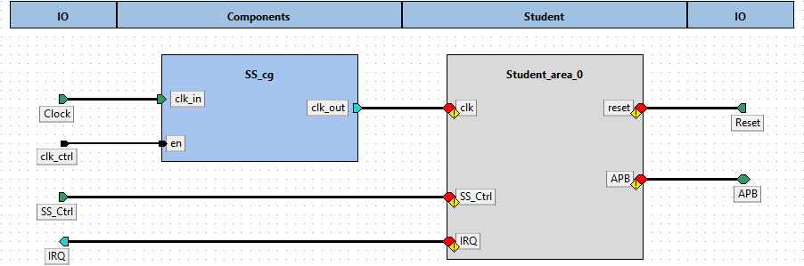  

Component instances within design tuni.fi:subsystem.wrapper:Student_SS_0.design:1.0:  

|Instance name|Component type|Configurable values|Active view|Description|  
|:----|:----|:----|:----|:----|  
|Student_area_0|[ -  -  - ](#:::)|||  
|SS_cg|[tuni.fi - tech - tech_cg - 1.0](#tuni.fi:tech:tech_cg:1.0)||flat_verilog|  
# 20. Component tuni.fi:tech:tech_cg:1.0<a id="tuni.fi:tech:tech_cg:1.0">  

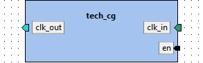

**IP-Xact file:** [tech_cg.1.0.xml](../ipxact/tuni.fi/tech/tech_cg/1.0/tech_cg.1.0.xml)  

## 20.1 Kactus2 attributes <a id="tuni.fi:tech:tech_cg:1.0.attributes">  

**Product hierarchy:** Flat  
**Component implementation:** HW  
**Component firmness:** Fixed  

## 20.2 Ports <a id="tuni.fi:tech:tech_cg:1.0.ports">  

|Name|Direction|Left bound|Right bound|Port type|Type definition|Default value|Array left|Array right|Description|  
|:----|:----|:----|:----|:----|:----|:----|:----|:----|:----|  
|clk <a id="tuni.fi:tech:tech_cg:1.0.port.clk">|in|||||||||  
|en <a id="tuni.fi:tech:tech_cg:1.0.port.en">|in|||||||||  
|clk_out <a id="tuni.fi:tech:tech_cg:1.0.port.clk_out">|out|||||||||  
## 20.3 Bus interfaces <a id="tuni.fi:tech:tech_cg:1.0.interfaces">  

### 20.3.1 Bus interface clk_in  

**Description:**   
**Interface mode:** target  
**Bus definition:** tuni.fi:interface:clock:1.0  
**Abstraction definitions:** tuni.fi:interface:clock.absDef:1.0  
**Ports used in this interface:**   

|Name|Direction|Left bound|Right bound|Port type|Type definition|Default value|Array left|Array right|Description|  
|:----|:----|:----|:----|:----|:----|:----|:----|:----|:----|  
|clk <a id="tuni.fi:tech:tech_cg:1.0.port.clk">|in|||||||||  
### 20.3.2 Bus interface clk_out  

**Description:**   
**Interface mode:** initiator  
**Bus definition:** tuni.fi:interface:clock:1.0  
**Abstraction definitions:** tuni.fi:interface:clock.absDef:1.0  
**Ports used in this interface:**   

|Name|Direction|Left bound|Right bound|Port type|Type definition|Default value|Array left|Array right|Description|  
|:----|:----|:----|:----|:----|:----|:----|:----|:----|:----|  
|clk_out <a id="tuni.fi:tech:tech_cg:1.0.port.clk_out">|out|||||||||  
## 20.4 Views <a id="tuni.fi:tech:tech_cg:1.0.views">  

### 20.4.1 View: flat_verilog  

#### 20.4.1.1 Component instantiation: verilog_implementation  

**Language:** Verilog  

**Module name:** tech_cg  

# 21. Component tuni.fi:subsystem.wrapper:Student_SS_1:1.0<a id="tuni.fi:subsystem.wrapper:Student_SS_1:1.0">  

**IP-Xact file:** [Student_SS_1.1.0.xml](../ipxact/tuni.fi/subsystem.wrapper/Student_SS_1/1.0/Student_SS_1.1.0.xml)  

## 21.1 Kactus2 attributes <a id="tuni.fi:subsystem.wrapper:Student_SS_1:1.0.attributes">  

**Product hierarchy:** Flat  
**Component implementation:** HW  
**Component firmness:** Mutable  

## 21.2 Ports <a id="tuni.fi:subsystem.wrapper:Student_SS_1:1.0.ports">  

|Name|Direction|Left bound|Right bound|Port type|Type definition|Default value|Array left|Array right|Description|  
|:----|:----|:----|:----|:----|:----|:----|:----|:----|:----|  
|PADDR <a id="tuni.fi:subsystem.wrapper:Student_SS_1:1.0.port.PADDR">|in|31|0|||||||  
|PENABLE <a id="tuni.fi:subsystem.wrapper:Student_SS_1:1.0.port.PENABLE">|in|||||||||  
|PRDATA <a id="tuni.fi:subsystem.wrapper:Student_SS_1:1.0.port.PRDATA">|out|31|0|||||||  
|PREADY <a id="tuni.fi:subsystem.wrapper:Student_SS_1:1.0.port.PREADY">|out|||||||||  
|PSEL <a id="tuni.fi:subsystem.wrapper:Student_SS_1:1.0.port.PSEL">|in|||||||||  
|PSELERR <a id="tuni.fi:subsystem.wrapper:Student_SS_1:1.0.port.PSELERR">|out|||||||||  
|PWDATA <a id="tuni.fi:subsystem.wrapper:Student_SS_1:1.0.port.PWDATA">|in|31|0|||||||  
|PWRITE <a id="tuni.fi:subsystem.wrapper:Student_SS_1:1.0.port.PWRITE">|in|||||||||  
|clk <a id="tuni.fi:subsystem.wrapper:Student_SS_1:1.0.port.clk">|in|||||||||  
|irq_1 <a id="tuni.fi:subsystem.wrapper:Student_SS_1:1.0.port.irq_1">|out|||||||||  
|reset_int <a id="tuni.fi:subsystem.wrapper:Student_SS_1:1.0.port.reset_int">|in|||||||||  
|ss_ctrl_1 <a id="tuni.fi:subsystem.wrapper:Student_SS_1:1.0.port.ss_ctrl_1">|in|7|0|||||||  
|irq_en_1 <a id="tuni.fi:subsystem.wrapper:Student_SS_1:1.0.port.irq_en_1">|in|||||||||  
## 21.3 Bus interfaces <a id="tuni.fi:subsystem.wrapper:Student_SS_1:1.0.interfaces">  

### 21.3.1 Bus interface APB  

**Description:**   
**Interface mode:** target  
**Bus definition:** tuni.fi:interface:APB:1.0  
**Abstraction definitions:** tuni.fi:interface:APB.absDef:1.0  
**Ports used in this interface:**   

|Name|Direction|Left bound|Right bound|Port type|Type definition|Default value|Array left|Array right|Description|  
|:----|:----|:----|:----|:----|:----|:----|:----|:----|:----|  
|PADDR <a id="tuni.fi:subsystem.wrapper:Student_SS_1:1.0.port.PADDR">|in|31|0|||||||  
|PENABLE <a id="tuni.fi:subsystem.wrapper:Student_SS_1:1.0.port.PENABLE">|in|||||||||  
|PRDATA <a id="tuni.fi:subsystem.wrapper:Student_SS_1:1.0.port.PRDATA">|out|31|0|||||||  
|PREADY <a id="tuni.fi:subsystem.wrapper:Student_SS_1:1.0.port.PREADY">|out|||||||||  
|PSEL <a id="tuni.fi:subsystem.wrapper:Student_SS_1:1.0.port.PSEL">|in|||||||||  
|PSELERR <a id="tuni.fi:subsystem.wrapper:Student_SS_1:1.0.port.PSELERR">|out|||||||||  
|PWDATA <a id="tuni.fi:subsystem.wrapper:Student_SS_1:1.0.port.PWDATA">|in|31|0|||||||  
|PWRITE <a id="tuni.fi:subsystem.wrapper:Student_SS_1:1.0.port.PWRITE">|in|||||||||  
### 21.3.2 Bus interface Clock  

**Description:**   
**Interface mode:** target  
**Bus definition:** tuni.fi:interface:clock:1.0  
**Abstraction definitions:** tuni.fi:interface:clock.absDef:1.0  
**Ports used in this interface:**   

|Name|Direction|Left bound|Right bound|Port type|Type definition|Default value|Array left|Array right|Description|  
|:----|:----|:----|:----|:----|:----|:----|:----|:----|:----|  
|clk <a id="tuni.fi:subsystem.wrapper:Student_SS_1:1.0.port.clk">|in|||||||||  
### 21.3.3 Bus interface IRQ  

**Description:**   
**Interface mode:** initiator  
**Bus definition:** tuni.fi:interface:IRQ:1.0  
**Abstraction definitions:** tuni.fi:interface:IRQ.absDef:1.0  
**Ports used in this interface:**   

|Name|Direction|Left bound|Right bound|Port type|Type definition|Default value|Array left|Array right|Description|  
|:----|:----|:----|:----|:----|:----|:----|:----|:----|:----|  
|irq_1 <a id="tuni.fi:subsystem.wrapper:Student_SS_1:1.0.port.irq_1">|out|||||||||  
### 21.3.4 Bus interface Reset  

**Description:**   
**Interface mode:** target  
**Bus definition:** tuni.fi:interface:reset:1.0  
**Abstraction definitions:** tuni.fi:interface:reset.absDef:1.0  
**Ports used in this interface:**   

|Name|Direction|Left bound|Right bound|Port type|Type definition|Default value|Array left|Array right|Description|  
|:----|:----|:----|:----|:----|:----|:----|:----|:----|:----|  
|reset_int <a id="tuni.fi:subsystem.wrapper:Student_SS_1:1.0.port.reset_int">|in|||||||||  
### 21.3.5 Bus interface SS_Ctrl  

**Description:**   
**Interface mode:** target  
**Bus definition:** tuni.fi:interface:SS_Ctrl:1.0  
**Abstraction definitions:** tuni.fi:interface:SS_Ctrl.absDef:1.0  
**Ports used in this interface:**   

|Name|Direction|Left bound|Right bound|Port type|Type definition|Default value|Array left|Array right|Description|  
|:----|:----|:----|:----|:----|:----|:----|:----|:----|:----|  
|ss_ctrl_1 <a id="tuni.fi:subsystem.wrapper:Student_SS_1:1.0.port.ss_ctrl_1">|in|7|0|||||||  
|irq_en_1 <a id="tuni.fi:subsystem.wrapper:Student_SS_1:1.0.port.irq_en_1">|in|||||||||  
# 22. Component tuni.fi:subsystem.wrapper:Student_SS_2:1.0<a id="tuni.fi:subsystem.wrapper:Student_SS_2:1.0">  

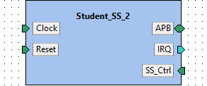

**IP-Xact file:** [Student_SS_2.1.0.xml](../ipxact/tuni.fi/subsystem.wrapper/Student_SS_2/1.0/Student_SS_2.1.0.xml)  

## 22.1 Kactus2 attributes <a id="tuni.fi:subsystem.wrapper:Student_SS_2:1.0.attributes">  

**Product hierarchy:** Flat  
**Component implementation:** HW  
**Component firmness:** Mutable  

## 22.2 Ports <a id="tuni.fi:subsystem.wrapper:Student_SS_2:1.0.ports">  

|Name|Direction|Left bound|Right bound|Port type|Type definition|Default value|Array left|Array right|Description|  
|:----|:----|:----|:----|:----|:----|:----|:----|:----|:----|  
|PADDR <a id="tuni.fi:subsystem.wrapper:Student_SS_2:1.0.port.PADDR">|in|31|0|||||||  
|PENABLE <a id="tuni.fi:subsystem.wrapper:Student_SS_2:1.0.port.PENABLE">|in|||||||||  
|PRDATA <a id="tuni.fi:subsystem.wrapper:Student_SS_2:1.0.port.PRDATA">|out|127|0|||||||  
|PREADY <a id="tuni.fi:subsystem.wrapper:Student_SS_2:1.0.port.PREADY">|out|3|0|||||||  
|PSEL <a id="tuni.fi:subsystem.wrapper:Student_SS_2:1.0.port.PSEL">|in|3|0|||||||  
|PSELERR <a id="tuni.fi:subsystem.wrapper:Student_SS_2:1.0.port.PSELERR">|out|3|0|||||||  
|PWDATA <a id="tuni.fi:subsystem.wrapper:Student_SS_2:1.0.port.PWDATA">|in|31|0|||||||  
|PWRITE <a id="tuni.fi:subsystem.wrapper:Student_SS_2:1.0.port.PWRITE">|in|||||||||  
|clk <a id="tuni.fi:subsystem.wrapper:Student_SS_2:1.0.port.clk">|in|||||||||  
|irq_2 <a id="tuni.fi:subsystem.wrapper:Student_SS_2:1.0.port.irq_2">|out|||||||||  
|reset_int <a id="tuni.fi:subsystem.wrapper:Student_SS_2:1.0.port.reset_int">|in|||||||||  
|ss_ctrl_2 <a id="tuni.fi:subsystem.wrapper:Student_SS_2:1.0.port.ss_ctrl_2">|in|7|0|||||||  
|irq_en_2 <a id="tuni.fi:subsystem.wrapper:Student_SS_2:1.0.port.irq_en_2">|in|||||||||  
## 22.3 Bus interfaces <a id="tuni.fi:subsystem.wrapper:Student_SS_2:1.0.interfaces">  

### 22.3.1 Bus interface APB  

**Description:**   
**Interface mode:** target  
**Bus definition:** tuni.fi:interface:APB:1.0  
**Abstraction definitions:** tuni.fi:interface:APB.absDef:1.0  
**Ports used in this interface:**   

|Name|Direction|Left bound|Right bound|Port type|Type definition|Default value|Array left|Array right|Description|  
|:----|:----|:----|:----|:----|:----|:----|:----|:----|:----|  
|PADDR <a id="tuni.fi:subsystem.wrapper:Student_SS_2:1.0.port.PADDR">|in|31|0|||||||  
|PENABLE <a id="tuni.fi:subsystem.wrapper:Student_SS_2:1.0.port.PENABLE">|in|||||||||  
|PRDATA <a id="tuni.fi:subsystem.wrapper:Student_SS_2:1.0.port.PRDATA">|out|127|0|||||||  
|PREADY <a id="tuni.fi:subsystem.wrapper:Student_SS_2:1.0.port.PREADY">|out|3|0|||||||  
|PSEL <a id="tuni.fi:subsystem.wrapper:Student_SS_2:1.0.port.PSEL">|in|3|0|||||||  
|PSELERR <a id="tuni.fi:subsystem.wrapper:Student_SS_2:1.0.port.PSELERR">|out|3|0|||||||  
|PWDATA <a id="tuni.fi:subsystem.wrapper:Student_SS_2:1.0.port.PWDATA">|in|31|0|||||||  
|PWRITE <a id="tuni.fi:subsystem.wrapper:Student_SS_2:1.0.port.PWRITE">|in|||||||||  
### 22.3.2 Bus interface Clock  

**Description:**   
**Interface mode:** target  
**Bus definition:** tuni.fi:interface:clock:1.0  
**Abstraction definitions:** tuni.fi:interface:clock.absDef:1.0  
**Ports used in this interface:**   

|Name|Direction|Left bound|Right bound|Port type|Type definition|Default value|Array left|Array right|Description|  
|:----|:----|:----|:----|:----|:----|:----|:----|:----|:----|  
|clk <a id="tuni.fi:subsystem.wrapper:Student_SS_2:1.0.port.clk">|in|||||||||  
### 22.3.3 Bus interface IRQ  

**Description:**   
**Interface mode:** initiator  
**Bus definition:** tuni.fi:interface:IRQ:1.0  
**Abstraction definitions:** tuni.fi:interface:IRQ.absDef:1.0  
**Ports used in this interface:**   

|Name|Direction|Left bound|Right bound|Port type|Type definition|Default value|Array left|Array right|Description|  
|:----|:----|:----|:----|:----|:----|:----|:----|:----|:----|  
|irq_2 <a id="tuni.fi:subsystem.wrapper:Student_SS_2:1.0.port.irq_2">|out|||||||||  
### 22.3.4 Bus interface Reset  

**Description:**   
**Interface mode:** target  
**Bus definition:** tuni.fi:interface:reset:1.0  
**Abstraction definitions:** tuni.fi:interface:reset.absDef:1.0  
**Ports used in this interface:**   

|Name|Direction|Left bound|Right bound|Port type|Type definition|Default value|Array left|Array right|Description|  
|:----|:----|:----|:----|:----|:----|:----|:----|:----|:----|  
|reset_int <a id="tuni.fi:subsystem.wrapper:Student_SS_2:1.0.port.reset_int">|in|||||||||  
### 22.3.5 Bus interface SS_Ctrl  

**Description:**   
**Interface mode:** target  
**Bus definition:** tuni.fi:interface:SS_Ctrl:1.0  
**Abstraction definitions:** tuni.fi:interface:SS_Ctrl.absDef:1.0  
**Ports used in this interface:**   

|Name|Direction|Left bound|Right bound|Port type|Type definition|Default value|Array left|Array right|Description|  
|:----|:----|:----|:----|:----|:----|:----|:----|:----|:----|  
|ss_ctrl_2 <a id="tuni.fi:subsystem.wrapper:Student_SS_2:1.0.port.ss_ctrl_2">|in|7|0|||||||  
|irq_en_2 <a id="tuni.fi:subsystem.wrapper:Student_SS_2:1.0.port.irq_en_2">|in|||||||||  
