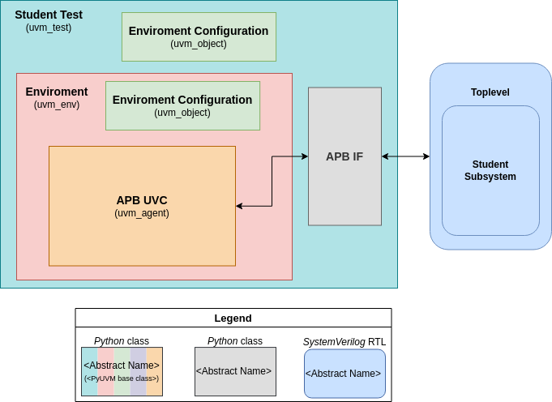

# Testbench Architecture

The following diagram shows an overview of the TB architecture. The diagram is located in the docs folder.

The TB has the following components:

* Test
* Enviroment
* Configuration
* APB UVC

## Test 

The test is responsible for creating the environment, configuration and interfaces needed.
In the connect-phase of the test, the DUT signals are connected to their given interface. 

The run-phase of the test handles the behavior of a given test-case. 

## APB UVC

The TB uses an APB UVC for driving the APB pins.
An instance of the UVC is created in the environment.

The APB UVC can drive and monitor signals follwing the APB protocol as well as collect coverage. 
